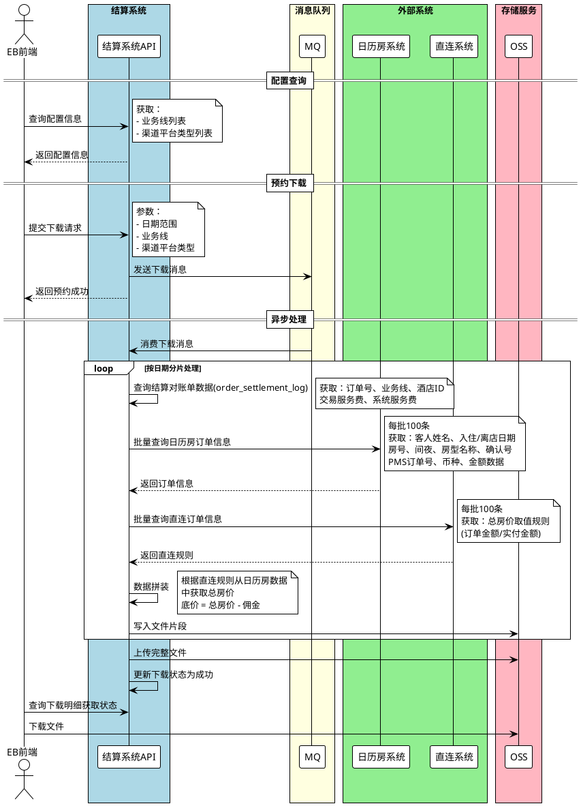
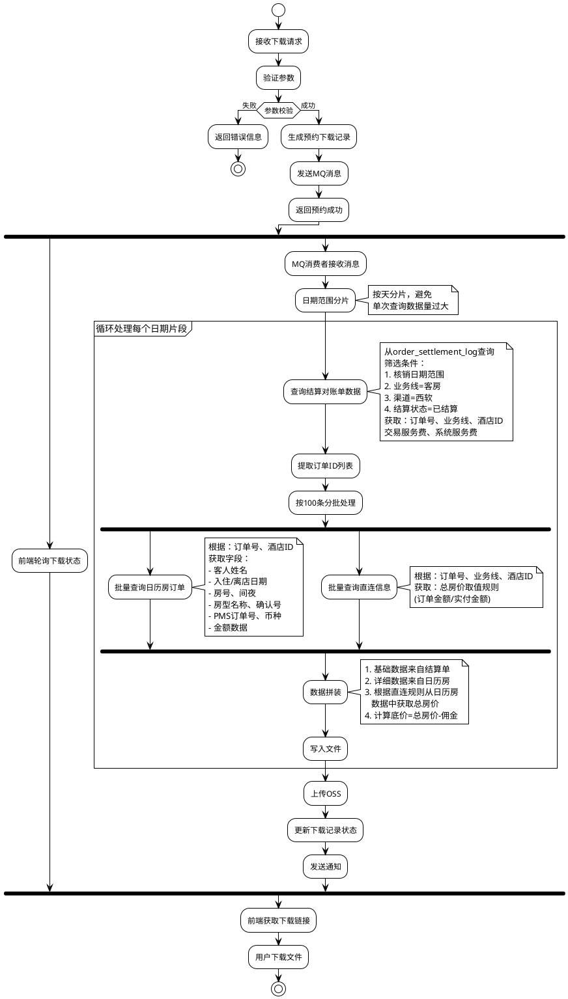
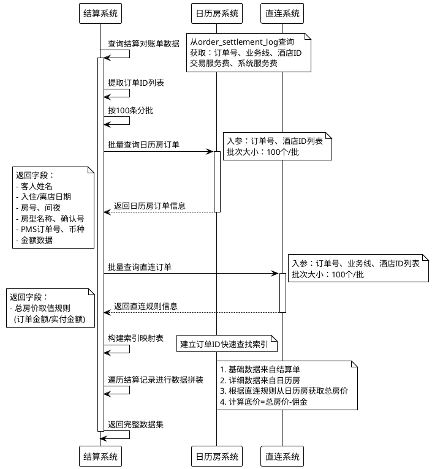
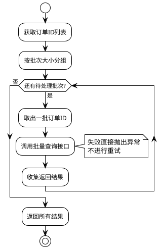
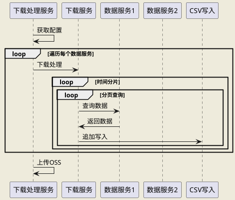
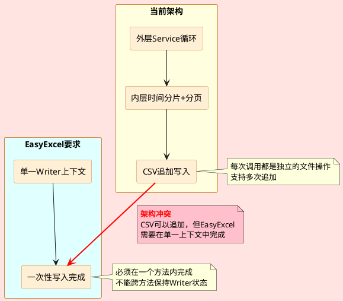
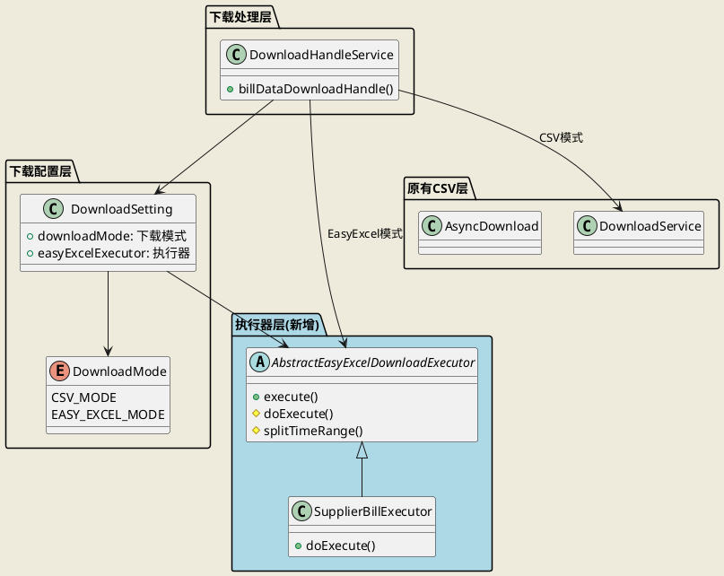
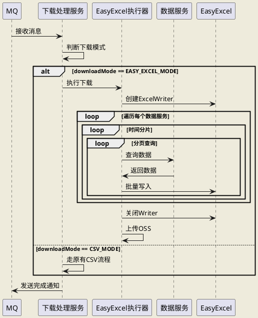
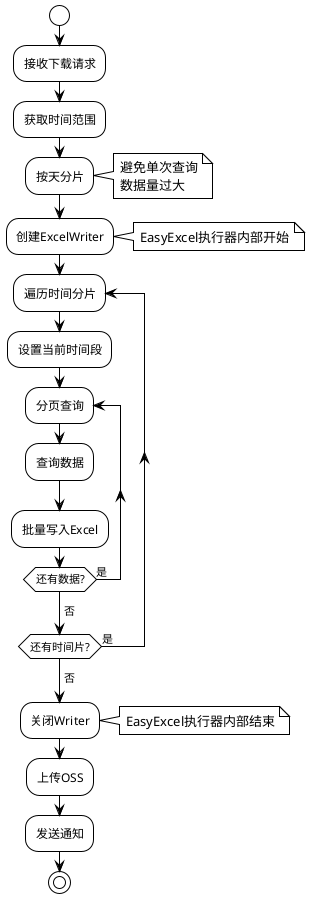

## 1. 需求概述

### 1.1 业务背景

为了实现一体化对账，需要支持直连交易数据的导出，以便在PMS系统内完成对账。系统需要提供PMS直连财务对账单的下载功能，基于日历房结算对账单数据，通过调用外部系统接口获取额外信息进行拼装。

### 1.2 核心目标

1. 提供配置信息查询接口（业务线、渠道平台类型）
2. 提供预约下载接口，支持按日期、业务线、渠道平台类型筛选
3. 基于`order_settlement_log`结算对账单，调用直连系统、日历房系统批量查询接口获取额外字段
4. 支持西软标准格式导出（Excel/CSV）

### 1.3 技术要求

* 复用现有预约下载框架
* 支持日期分片处理
* 批量调用外部系统接口
* 集团主店支持导出所有门店数据

## 2. 系统架构设计

### 2.1 整体架构图



## 3. 核心功能设计

### 3.1 接口设计

#### 3.1.1 配置查询接口

**接口路径**: `GET settlement-api/eb/pms/settlement/bill/config`

**请求参数**: 无

**响应示例**:

```json
{
  "code": "0",
  "message": "成功",
  "data": {
    "businessTypes": [
      {"code": 1003, "name": "日历房"}
    ],
    "channelList": [
      {"code": "XSOFT", "name": "西软"}
    ]
  }
}
```

#### 3.1.2 下载接口

**接口路径**: `POST settlement-data-pump-api/eb/appointment/download/pms/financial/download`

**请求参数**:

```json
{
    "downloadBizType": "61165",
    "startTime": "2025-09-16 00:00:00",
    "endTime": "2025-10-15 23:59:59",
    "searchTypeName": "结账日期",
    "supplierId": 184569,
    "timeType": "check", //结账日期
    "param": {
        "createTimeStart": "2025-09-16 00:00:00",
        "createTimeEnd": "2025-10-15 23:59:59",
        "timeType": "check",
        "hotelId": 184569,
        "businessTypes": [1003],      // 业务线：客房
        "channelPlatform": "XSOFT"     // 渠道平台类型：西软
    }
}
```

**响应示例**:

```json
{
  "code":"0",
  "message":"success",
  "data":1,
  "success":true
}
```

### 3.2 数据流程设计

#### 3.2.1 业务处理流程



#### 3.2.2 数据拼装逻辑



### 3.3 批量查询策略

#### 3.3.1 批量大小控制

| 配置项       | 配置值 | 说明         |
| --------- | --- | ---------- |
| 日历房订单批量大小 | 100 | 每批查询100个订单 |
| 直连订单批量大小  | 100 | 每批查询100个订单 |

#### 3.3.2 批量处理流程



- - -

## 4. 文件导出优化方案

### 4.1 背景说明

当前系统使用CSV格式进行异步下载，虽然支持大批量数据导出，但无法满足复杂格式定制需求（如多样式、合并单元格等）。为支持不同对账单的个性化导出需求，引入EasyExcel作为新的导出方式。

### 4.2 当前架构分析

#### 4.2.1 现有CSV导出架构



**特点：**

* ✅ **内存友好**：CSV支持追加写入，流式处理
* ✅ **大数据支持**：支持百万级数据导出
* ❌ **格式单一**：无法实现复杂Excel样式

#### 4.2.2 EasyExcel架构挑战

EasyExcel要求在单一Writer上下文中完成所有写入，不支持跨方法追加，这与现有的"外层循环写入"架构冲突。



### 4.3 解决方案设计

#### 4.3.1 核心思路

**从"外层循环写入"改为"内层循环查询"**

* **当前架构**：外层for循环Service → 内层时间分片 → 每次循环都写入文件
* **新架构**：单次下载方法 → 内层for循环Service → 内层时间分片 → 一次性写入完成

#### 4.3.2 双模式架构

系统支持CSV和EasyExcel两种导出模式，通过配置灵活切换：



#### 4.3.3 EasyExcel导出流程



### 4.4 架构设计要点

#### 4.4.3 时间分片处理



### 4.5 方案对比

| 对比维度     | CSV模式       | EasyExcel模式      |
| -------- | ----------- | ---------------- |
| **格式能力** | 仅CSV格式      | 支持复杂Excel样式      |
| **循环位置** | 外层Service循环 | 内层Service循环      |
| **写入方式** | 追加写入        | 批量写入             |
| **内存占用** | 低（流式）       | 中（批量）            |
| **扩展性**  | 格式固定        | 可自定义样式           |
| **适用场景** | 大数据量、简单格式   | 中等数据量、复杂格式       |
| **性能表现** | 未测试         | 100万条/23.4秒/60MB |

### 4.6 性能测试

#### 4.6.1 测试环境

**测试配置**：

* 测试数据量：100万条记录
* 导出模式：EasyExcel模式
* 数据内容：PMS直连财务对账单完整字段

#### 4.6.2 测试结果

| 性能指标     | 测试结果             | 说明             |
| -------- | ---------------- | -------------- |
| **数据量**  | 100万条            | 模拟真实对账单数据      |
| **总耗时**  | 23,441ms（约23.4秒） | 不包括查询，仅包括导出    |
| **文件大小** | 60MB             | Excel格式（.xlsx） |
| **平均速度** | ~42,700条/秒       | 包含数据写入         |

#### 4.6.3 性能分析

**性能表现**：

* ✅ **高吞吐量**：每秒处理超过4万条记录，满足大批量导出需求
* ✅ **时效性好**：23秒完成百万级数据导出，满足异步下载场景

**优化建议**：

* 如单次导出超过100万条，建议按时间范围拆分多个文件
* 可根据实际业务需求调整批量查询大小以平衡内存和性能

### 4.7 兼容性设计

**向后兼容**：

* 原有CSV模式保持不变
* 新对账单可选择使用EasyExcel模式
* 通过配置灵活切换
