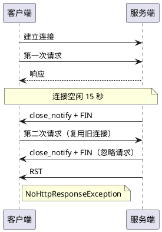

# NoHttpResponse 异常排查及解决记录

## 1. 背景

线上环境出现偶发性 `org.apache.http.NoHttpResponseException` 异常，影响业务稳定性。本文档记录完整的排查过程和解决方案。

**问题描述**：

- **接口**：`accpapi.lianlianpay.com:443`，业务场景为结算余额查询
- **客户端**：Settlement Engine 服务，基于 **Apache HttpClient** 长连接
- **异常现象**：偶发 `NoHttpResponseException`，线上请求偶尔失败但重试即成功

---

## 2. 调查时间线

### 2.1 阶段一：定位异常含义

**现象**：日志多次出现 `accpapi.lianlianpay.com:443 failed to respond`。

**分析**：`NoHttpResponseException` 说明客户端发出请求但未收到任何响应头，常见根因是**服务端提前关闭连接**。

**假设**：服务端可能设置了较短的 **Keep-Alive** 超时时间，空闲连接会被主动断开。

**行动计划**：通过抓包验证服务器是否在请求前关闭连接。

### 2.2 阶段二：本地抓包确认关闭顺序


**动作**：本地启动项目抓取 TLS 流量。

**观察结果**：

- 当连接空闲约 **15 秒**时，服务端发出 `Encrypted Alert`（close_notify）紧接 `FIN, ACK`
- 客户端才被动关闭连接

**结论**：确认服务端存在 **15 秒空闲回收机制**。

**下一步**：在可控环境重现问题，便于精准分析报文。

### 2.3 阶段三：本地复现异常

**动作**：编写循环请求接口，模拟"每 14.5~15.5 秒发一次余额查询"的场景。

**复现代码**：

```java
@RequestMapping(value = "/settle/balance/query/test", method = RequestMethod.POST)
@ApiOperation("余额查询测试")
public AjaxResult<LLPayBalanceQueryResponse> balanceQueryTest(
    @RequestBody @Valid LLPayBalanceQueryRequest request) {
    try {
        Random random = new Random();
        while (true) {
            Channel channel = ChannelRouteBiz.randomRoute(request);
            ChannelResponse response = channel.service().exec(
                ChannelCommandId.BALANCE_QUERY, request);
            // 模拟 14.5~15.5 秒间隔
            Thread.sleep(145 * 100L + 100L * random.nextInt(10));
        }
    } catch (Exception e) {
        LogUtil.logApplicationError("请求连连发生错误", e);
        AjaxResult ajaxResult = new AjaxResult();
        ajaxResult.setMessage(e.getMessage());
        return ajaxResult;
    }
}
```

**结果**：本地日志成功复现 `NoHttpResponseException`，与线上异常一致。

**说明**：此阶段保持现有代码，目的是验证问题可复现。


### 2.4 阶段四：逐帧分析原始抓包


**报文重点**（#10833~#11211）：

- **#10833/#10834**：服务端 close_notify + FIN，开始四次挥手
- **#11204**：客户端发送第二笔请求的 Application Data
- **#11205/#11209**：服务端立即返回 close_notify + FIN，Ack 仍停在 1615，并未读取新请求
- **#11211**：服务端 RST，强制断开

**结论**：请求确实落在服务端关闭窗口内，导致 `NoHttpResponseException`。

**根因**：客户端复用了已被服务器回收的连接。

**行动计划**：思考如何在客户端侧避免复用"即将被回收"的连接。

### 2.5 阶段五：方案调研

**资料调研**：查询到两种解决方案，在构造 `HttpClientConnectionManager` 时：

1. **构造函数指定 timeToLive**：到期即判定连接失效，下一次借用时会新建连接
2. **调用 setValidateAfterInactivity**：在连接空闲超过阈值时做"失效校验"

#### 方案一：setValidateAfterInactivity（无效）

**实验验证**：为复现程序加入 `setValidateAfterInactivity(2000)`：

```java
PoolingHttpClientConnectionManager cm = new PoolingHttpClientConnectionManager(
    socketFactoryRegistry);
// 设置空闲校验时长（ms）
cm.setValidateAfterInactivity(2000);
CloseableHttpClient httpClient = HttpClients.custom()
    .setConnectionManager(cm)
    .build();
```

**抓包结果**：15 秒后客户端依旧复用旧连接，仍然触发 `NoHttpResponseException`。

**原因分析**：该方法只检查本地 socket 状态（是否关闭、输入输出是否可用），**不会发送探测数据给服务器**，因而无法感知对端已发送 FIN。

**结论**：`setValidateAfterInactivity` 对"服务器抢先关闭"的场景无效，必须从生命周期入手。

#### 方案二：timeToLive（有效）

**最终方案**：采用带 TTL 的构造函数，强制连接在 10 秒后淘汰。

```java
// 设置连接的最大存活时间是 10s，超过 10s 的会重新获取 http 连接
PoolingHttpClientConnectionManager cm = new PoolingHttpClientConnectionManager(
    10, TimeUnit.SECONDS);
CloseableHttpClient httpClient = HttpClients.custom()
    .setConnectionManager(cm)
    .build();
```

**预期效果**：客户端在 10 秒左右就会放弃旧连接，下一次请求拿到崭新的连接，从时间上避开服务端 15 秒的关闭窗口。

> **💡 关键点**：通过缩短客户端连接存活期，确保请求始终在"刚创建的连接"上执行。

### 2.6 阶段六：修改后验证与长时间观察


**首轮验证抓包**：

- 如果客户端先发送请求，会主动发送 close_notify + FIN
- 随后立即重新握手，新请求落在新连接上

**长时间运行抓包**：

- 服务端仍可能在 15 秒附近先行发送 close_notify + FIN
- **关键区别**：此时旧连接已经没有未处理请求，客户端随即用新端口 63076 建立连接并发送下一笔请求

**结论**：无论是谁抢先关闭，业务请求都始终在"刚创建的连接"上执行，再未观察到 `NoHttpResponseException`。

### 2.7 阶段七：对比易宝渠道的行为

**动作**：补充抓包易宝渠道的 TLS 会话，验证是否存在类似问题。

**观察结果**：

- 易宝服务器不会在空闲阶段主动发 close_notify/FIN，连接稳定保持
- 客户端会在 60~70 秒时主动断开并重建，会话总是在服务器之前结束

**结论**：由于易宝客户端始终先于服务器关闭连接，发送请求时连接均处于健康状态，因此没有出现被服务器略过或 `NoHttpResponseException` 的情况。

---

## 3. 原因分析

**根本原因**：

1. **服务端空闲回收阈值约 15 秒**，超时后直接发送 close_notify + FIN
2. **客户端重用已闲置 15 秒的连接**，在服务器关闭瞬间发送请求，引发 `NoHttpResponseException`
3. **本质问题**：长连接未做空闲健康检查，导致请求落在 TCP 四次挥手期间

**问题示意图**：



---

## 4. 解决方案

### 4.1 核心方案

**强制缩短客户端连接存活期**：

```java
// 设置连接的最大存活时间为 10 秒
PoolingHttpClientConnectionManager cm = new PoolingHttpClientConnectionManager(
    10, TimeUnit.SECONDS);
CloseableHttpClient httpClient = HttpClients.custom()
    .setConnectionManager(cm)
    .build();
```

**工作原理**：

- 连接在 10 秒后自动失效
- 下一次请求时会创建新连接
- 从时间上避开服务端 15 秒的关闭窗口

### 4.2 可选补强措施

1. **定期清理空闲连接**：
   ```java
   // 定期调用，及时回收僵尸连接
   cm.closeIdleConnections(10, TimeUnit.SECONDS);
   ```

2. **关于 setValidateAfterInactivity**：
   - 已验证无法识别"对端已发送 FIN"场景
   - 此处不再启用，可作为其他业务的参考选项

> **⚠️ 注意事项**：`setValidateAfterInactivity` 只检查本地 socket 状态，无法感知服务端已关闭连接，因此对"服务器抢先关闭"的场景无效。

---

## 5. 总结

### 5.1 问题根因

- **服务端**：15 秒空闲回收机制，主动关闭空闲连接
- **客户端**：复用已闲置 15 秒的连接，在关闭窗口内发送请求
- **结果**：请求落在 TCP 四次挥手期间，触发 `NoHttpResponseException`

### 5.2 解决方案

通过设置连接 **TTL 为 10 秒**，确保请求始终在"刚创建的连接"上执行，从时间上避开服务端关闭窗口。

### 5.3 经验总结

1. **长连接管理**：必须考虑连接生命周期，避免复用"即将被回收"的连接
2. **健康检查**：`setValidateAfterInactivity` 无法感知对端状态，需要从生命周期入手
3. **抓包分析**：通过抓包可以精确定位问题，是排查网络问题的有效手段

> **💡 最佳实践**：在使用 Apache HttpClient 长连接时，建议根据服务端的 Keep-Alive 超时时间，设置合适的连接 TTL，避免请求落在连接关闭窗口内。

---

## 参考资料

- [Apache HttpClient 连接管理文档](https://hc.apache.org/httpcomponents-client-4.5.x/current/tutorial/html/connmgmt.html)
- [TCP 连接关闭机制](https://tools.ietf.org/html/rfc793)
