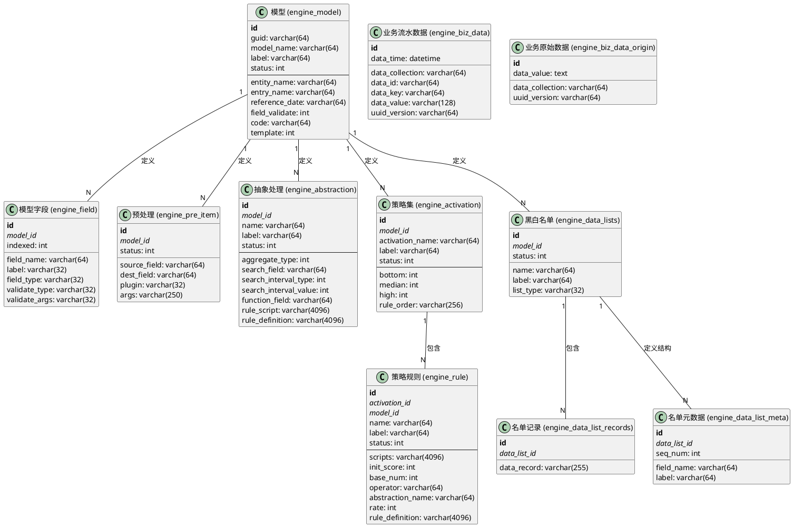
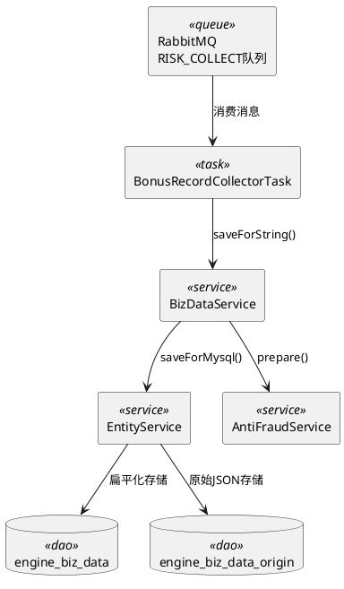
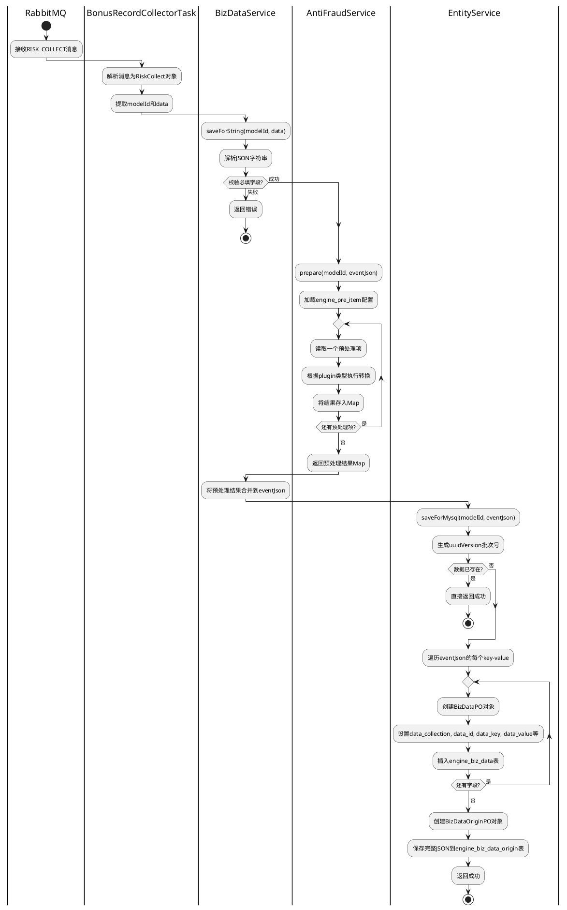
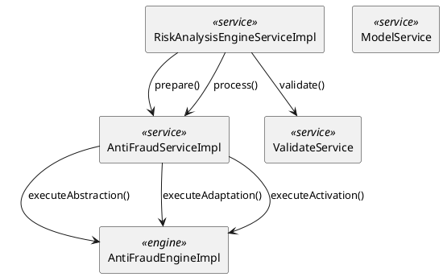
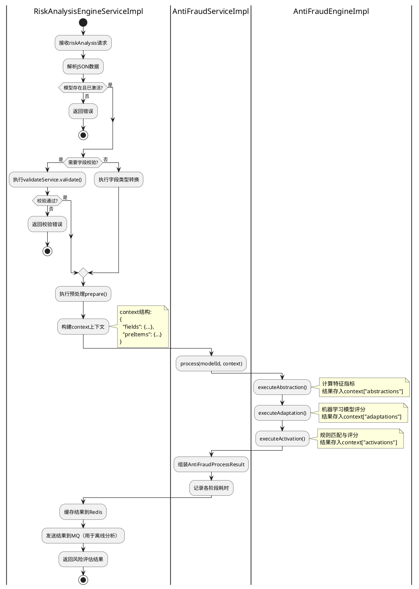
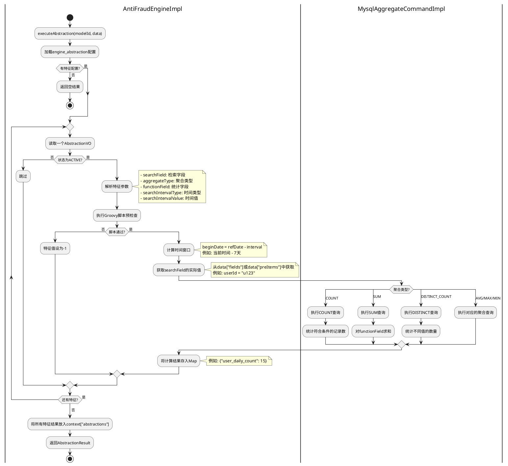
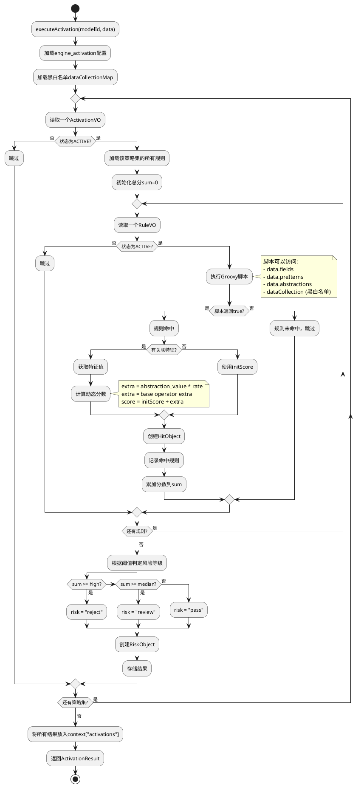
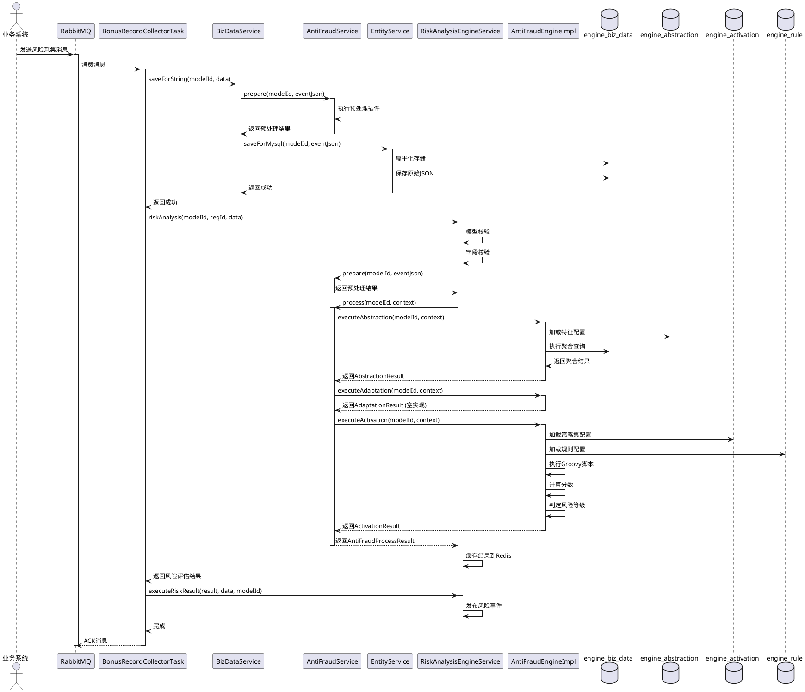

# 风险引擎系统解析
## 1. 概述

本文档提供风险引擎系统的完整技术剖析，深入到**方法级别的实现细节**。我们将通过PlantUML流程图、时序图和活动图，结合源代码分析，全面解析从前端界面配置到后端代码执行，再到数据库存储的完整技术链路。

**文档结构**：
- **模块一**：数据模型与界面配置映射
- **模块二**：消息接收与数据持久化模块
- **模块三**：风险分析引擎核心模块
- **模块四**：特征抽象引擎详解
- **模块五**：策略激活引擎详解
- **模块六**：完整流程时序图

---

## 模块一：数据模型与界面配置映射

### 1.1 完整数据模型ER图



### 1.2 界面配置与数据表详细映射

| 界面模块 | 配置项 | 数据表 | 字段 | 技术说明 |
|:---|:---|:---|:---|:---|
| **模型管理** | 模型名称 | `engine_model` | `model_name` | 唯一标识一个风控场景 |
| | 模型标签 | | `label` | 用于界面显示的友好名称 |
| | 实体主键 | | `entity_name` | 指定哪个字段是业务实体ID（如userId） |
| | 事件主键 | | `entry_name` | 指定哪个字段是事件ID（如订单ID） |
| | 事件时间字段 | | `reference_date` | 用于时间窗口计算的基准时间字段 |
| | 状态 | | `status` | 0=初始化, 1=未激活, 2=激活 |
| **模型字段** | 字段名 | `engine_field` | `field_name` | 必须与JSON中的key一致 |
| | 字段类型 | | `field_type` | STRING/INTEGER/LONG/DOUBLE |
| | 是否索引 | | `indexed` | 决定MongoDB中是否创建索引 |
| | 校验类型 | | `validate_type` | 字段验证规则类型 |
| **预处理** | 源字段 | `engine_pre_item` | `source_field` | 原始字段名，可多个用逗号分隔 |
| | 目标字段 | | `dest_field` | 转换后的字段名 |
| | 转换插件 | | `plugin` | IP2LOCATION/GPS2LOCATION/MOBILE2LOCATION等 |
| | 插件参数 | | `args` | 插件所需的额外参数 |
| **黑白名单** | 名单名称 | `engine_data_lists` | `name` | 在Groovy脚本中引用的名称 |
| | 名单类型 | | `list_type` | BLACK/WHITE/GRAY |
| | 名单记录 | `engine_data_list_records` | `data_record` | 具体的黑白名单值 |
| | 名单字段定义 | `engine_data_list_meta` | `field_name` | 定义名单的字段结构 |
| **抽象处理** | 特征名称 | `engine_abstraction` | `name` | 在规则中引用的特征名 |
| | 聚合类型 | | `aggregate_type` | 1=COUNT, 2=SUM, 3=AVG, 4=MAX, 5=MIN等 |
| | 检索字段 | | `search_field` | 用于关联查询的字段（WHERE条件） |
| | 统计字段 | | `function_field` | 用于聚合计算的字段（如SUM的目标字段） |
| | 时间窗口类型 | | `search_interval_type` | 1=天, 2=月 |
| | 时间窗口值 | | `search_interval_value` | 时间窗口的数值（如7天） |
| | 规则脚本 | | `rule_script` | Groovy脚本，用于预检查 |
| **策略管理** | 策略集名称 | `engine_activation` | `activation_name` | 策略集的唯一标识 |
| | 高风险阈值 | | `high` | 分数>=high则判定为reject |
| | 中风险阈值 | | `median` | 分数>=median则判定为review |
| | 低风险阈值 | | `bottom` | 分数<median则判定为pass |
| | 规则名称 | `engine_rule` | `name` | 规则的唯一标识 |
| | 规则脚本 | | `scripts` | Groovy脚本，判断是否命中规则 |
| | 初始分数 | | `init_score` | 规则命中时的基础分数 |
| | 关联特征 | | `abstraction_name` | 引用的特征名称 |
| | 运算符 | | `operator` | ADD/SUB/MUL/DIV |
| | 比例 | | `rate` | 动态计分的比例系数（百分比） |

---

## 模块二：消息接收与数据持久化模块

### 2.1 模块架构图



### 2.2 核心方法详解

#### 2.2.1 `BonusRecordCollectorTask.execute()`

**文件**: `src/main/java/com/zkt/risk/rabbitmq/impl/BonusRecordCollectorTask.java`

**方法签名**:
```java
public void execute(MessageQueue messageQueue) throws Exception
```

**核心逻辑**:
```java
// 1. 解析消息
String collectMsg = messageQueue.getMessage();
RiskCollect riskCollect = JSON.parseObject(collectMsg, RiskCollect.class);

// 2. 数据校验
if (null == riskCollect || null == riskCollect.getModelId() || 
    StringUtil.isEmpty(riskCollect.getData())) {
    return;
}

// 3. 保存业务数据（关键步骤）
CommonResult commonResult = bizDataService.saveForString(modelId, data);

// 4. 执行风险分析
CommonResult riskResult = riskAnalysisEngineService.riskAnalysis(modelId, req, data);

// 5. 处理风险结果
if (riskResult.isSuccess()) {
    AntiFraudProcessResult risk = (AntiFraudProcessResult) riskResult;
    riskAnalysisEngineService.executeRiskResult(risk, data, modelId);
}
```

**技术要点**:
- 使用FastJSON进行JSON解析
- 数据校验采用早返回模式
- 性能日志记录使用`PerformanceLog`

#### 2.2.2 `BizDataServiceImpl.saveForString()`

**文件**: `src/main/java/com/zkt/risk/serviceimpl/data/BizDataServiceImpl.java`

**方法签名**:
```java
@Transactional(rollbackFor = Exception.class)
public CommonResult saveForString(Long modelId, String message)
```

**核心逻辑**:
```java
// 1. 解析JSON
JSONObject eventJson = JSON.parseObject(message);

// 2. 校验必填字段
if (StringUtil.isEmpty(eventJson.getString(BizDataConst.ENTRY_NAME))) {
    return CommonResult.faild("业务数据主键未找到");
}
if (StringUtil.isEmpty(eventJson.getString(BizDataConst.ENTRY_TIME))) {
    return CommonResult.faild("业务数据时间未找到");
}

// 3. 执行预处理（重要：数据增强）
Map<String, Object> prepare = antiFraudService.prepare(modelId, eventJson);
if (!prepare.isEmpty()) {
    eventJson.putAll(prepare);  // 将预处理结果合并到原始数据
}

// 4. 持久化到MySQL
return entityService.saveForMysql(modelId, eventJson);
```

**技术要点**:
- 使用`@Transactional`保证数据一致性
- `prepare()`方法会执行`engine_pre_item`表中配置的所有预处理插件
- 预处理结果会合并回原始JSON，一起存储

#### 2.2.3 `AntiFraudServiceImpl.prepare()`

**文件**: `src/main/java/com/zkt/risk/serviceimpl/engine/AntiFraudServiceImpl.java`

**方法签名**:
```java
public Map<String, Object> prepare(Long modelId, Map<String, Object> jsonInfo)
```

**核心逻辑**:
```java
// 1. 加载预处理配置
List<PreItemVO> preItemList = preItemService.listPreItem(modelId);
Map<String, Object> result = new HashMap<>();

// 2. 遍历每个预处理项
for (PreItemVO item : preItemList) {
    if (!item.getStatus().equals(StatusType.ACTIVE.getKey())) {
        continue;
    }
    
    String[] sourceField = item.getSourceField().split(",");
    PluginType plugin = Enum.valueOf(PluginType.class, item.getPlugin());
    Object transfer = "";
    
    // 3. 根据插件类型执行不同的转换
    switch (plugin) {
        case IP2LOCATION:
            transfer = pluginService.ip2location(jsonInfo.get(sourceField[0]).toString());
            break;
        case GPS2LOCATION:
            transfer = pluginService.gps2location(
                jsonInfo.get(sourceField[0]).toString(),
                jsonInfo.get(sourceField[1]).toString()
            );
            break;
        case MOBILE2LOCATION:
            transfer = pluginService.mobile2location(jsonInfo.get(sourceField[0]).toString());
            break;
        case SUBSTRING:
            String[] args = item.getArgs().split(",");
            transfer = pluginService.subString(
                jsonInfo.get(sourceField[0]).toString(), 
                Integer.parseInt(args[0]), 
                Integer.parseInt(args[1])
            );
            break;
        // ... 其他插件类型
    }
    
    // 4. 将转换结果存入结果Map
    result.put(item.getDestField(), transfer);
}
return result;
```

**支持的预处理插件**:
- `IP2LOCATION`: IP地址转地理位置
- `GPS2LOCATION`: GPS坐标转地理位置
- `MOBILE2LOCATION`: 手机号归属地查询
- `ALLINONE`: 多字段拼接
- `SUBSTRING`: 字符串截取
- `SENSITIVE_TIME`: 敏感时间段判断
- `DATEFORMAT`: 日期格式化
- `HTTP_UTIL`: HTTP请求调用外部服务

#### 2.2.4 `EntityServiceImpl.saveForMysql()`

**文件**: `src/main/java/com/zkt/risk/serviceimpl/model/EntityServiceImpl.java`

**方法签名**:
```java
@Transactional(rollbackFor = Exception.class)
public CommonResult saveForMysql(Long modelId, JSONObject eventJson)
```

**核心逻辑**:
```java
// 1. 准备基础信息
String collection = DataCollectionEnum.getCollectionByModelId(modelId.toString());
String uuidVersion = UUIDGenerator.getUUID();  // 批次号
String dataId = eventJson.getString(BizDataConst.ENTRY_NAME);
Long dataTime = eventJson.getLong(BizDataConst.ENTRY_TIME);
Date date = new Date(dataTime);

// 2. 去重检查
Example example = new Example(BizDataPO.class);
example.createCriteria().andEqualTo("dataId", dataId);
int count = bizDataMapper.selectCountByExample(example);
if (count > 0) {
    return CommonResult.success(null);  // 已存在，直接返回
}

// 3. 扁平化存储：将JSON的每个key-value转换为一行记录
for (Map.Entry<String, Object> entry : eventJson.entrySet()) {
    BizDataPO bizDataPO = new BizDataPO();
    bizDataPO.setDataCollection(collection);
    bizDataPO.setUuidVersion(uuidVersion);
    bizDataPO.setDataId(dataId);
    bizDataPO.setDataTime(date);
    bizDataPO.setDataKey(entry.getKey());
    
    String value = String.valueOf(entry.getValue());
    if (value != null) {
        value = value.length() > 64 ? value.substring(0, 63) : value;
        bizDataPO.setDataValue(value);
    }
    
    bizDataMapper.insertSelective(bizDataPO);
}

// 4. 保存原始JSON（用于审计和回溯）
BizDataOriginPO bizDataOriginPO = new BizDataOriginPO();
bizDataOriginPO.setDataCollection(collection);
bizDataOriginPO.setUuidVersion(uuidVersion);
String jsonString = eventJson.toJSONString();
if (jsonString != null) {
    bizDataOriginPO.setDataValue(
        jsonString.length() > 64 ? jsonString.substring(0, 63) : jsonString
    );
}
bizDataOriginMapper.insertSelective(bizDataOriginPO);

return CommonResult.success(null);
```

**数据存储示例**:

原始JSON:
```json
{
  "userId": "u123",
  "orderId": "order_456",
  "amount": 500,
  "ip": "1.2.3.4",
  "orderTime": 1699999999000,
  "ip_location": "北京市"  // 预处理插件生成
}
```

存入`engine_biz_data`表:

| id | data_collection | data_id | data_key | data_value | data_time | uuid_version |
|:---|:---|:---|:---|:---|:---|:---|
| 1 | model_1 | order_456 | userId | u123 | 2023-11-15 10:00:00 | uuid-001 |
| 2 | model_1 | order_456 | orderId | order_456 | 2023-11-15 10:00:00 | uuid-001 |
| 3 | model_1 | order_456 | amount | 500 | 2023-11-15 10:00:00 | uuid-001 |
| 4 | model_1 | order_456 | ip | 1.2.3.4 | 2023-11-15 10:00:00 | uuid-001 |
| 5 | model_1 | order_456 | orderTime | 1699999999000 | 2023-11-15 10:00:00 | uuid-001 |
| 6 | model_1 | order_456 | ip_location | 北京市 | 2023-11-15 10:00:00 | uuid-001 |

**技术要点**:
- **扁平化存储的优势**: 可以对任意字段进行高效的聚合查询，无需预先定义表结构
- **uuid_version**: 同一批次的数据共享同一个UUID，便于追踪
- **去重机制**: 基于`data_id`（事件主键）进行去重
- **数据截断**: `data_value`字段限制64字符，超长数据会被截断

### 2.3 数据持久化流程图



---

## 模块三：风险分析引擎核心模块

### 3.1 模块架构图



### 3.2 核心方法详解

#### 3.2.1 `RiskAnalysisEngineServiceImpl.riskAnalysis()`

**文件**: `src/main/java/com/zkt/risk/serviceimpl/core/RiskAnalysisEngineServiceImpl.java`

**方法签名**:
```java
public CommonResult riskAnalysis(Long modelId, String reqId, String jsonInfo)
```

**完整流程**:
```java
public CommonResult riskAnalysis(Long modelId, String reqId, String jsonInfo) {
    CommonResult result = new CommonResult();
    Map<String, Map<String, ?>> context = new HashMap<>();
    ModelVO model = null;
    
    try {
        // ========== 步骤1: 模型校验 ==========
        JSONObject eventJson = JSON.parseObject(jsonInfo);
        model = modelService.getModelById(modelId);
        
        if (model == null) {
            result.setMsg("模型不存在!");
            return result;
        }
        
        if (model.getStatus() != StatusType.ACTIVE.getKey()) {
            result.setMsg("模型未激活");
            return result;
        }
        
        // ========== 步骤2: 字段校验 ==========
        if (model.getFieldValidate()) {
            Map<String, Object> vldMap = validateService.validate(model.getId(), eventJson);
            if (vldMap.size() > 0) {
                result.setData(vldMap);
                result.setMsg("参数校验不通过");
                return result;
            }
        } else {
            // 字段类型转换
            List<FieldVO> fieldList = fieldService.listField(model.getId());
            eventJson = POVOUtils.convertProperty(eventJson, fieldList);
        }
        
        // ========== 步骤3: 预处理 ==========
        Map<String, Object> preItemMap = antiFraudService.prepare(model.getId(), eventJson);
        
        // ========== 步骤4: 构建上下文 ==========
        context.put("fields", eventJson);       // 原始字段
        context.put("preItems", preItemMap);    // 预处理字段
        
        // ========== 步骤5: 执行风险分析（核心） ==========
        result = antiFraudService.process(model.getId(), context);
        
        // ========== 步骤6: 时间格式化（用于ES存储） ==========
        Long eventTimeMillis = (Long) eventJson.get(model.getReferenceDate());
        String timeStr = DateUtils.formatDate(
            new Date(eventTimeMillis), 
            "yyyy-MM-dd'T'HH:mm:ssZ"
        );
        preItemMap.put("radar_ref_datetime", timeStr);
        
    } catch (Exception e) {
        Logs.APPLICATION.error("风险评测发生异常", e);
        result.setMsg("数据异常!");
    }
    
    // ========== 步骤7: 缓存结果 ==========
    cacheService.saveAntiFraudResult(model.getGuid(), reqId, result);
    
    // ========== 步骤8: 发送结果（用于离线分析） ==========
    sendResult(model.getGuid(), reqId, JSON.toJSONString(context));
    
    return result;
}
```

**技术要点**:
- **context结构**: `Map<String, Map<String, ?>>` 是整个引擎的数据载体
  - `fields`: 原始业务字段
  - `preItems`: 预处理生成的字段
  - `abstractions`: 特征抽象计算的结果
  - `adaptations`: 模型适配的结果
  - `activations`: 策略激活的结果
- **字段校验**: 可选功能，根据`engine_field`表的配置进行校验
- **结果缓存**: 使用Redis缓存，支持通过`reqId`查询历史结果

#### 3.2.2 `AntiFraudServiceImpl.process()`

**文件**: `src/main/java/com/zkt/risk/serviceimpl/engine/AntiFraudServiceImpl.java`

**方法签名**:
```java
public CommonResult process(Long modelId, Map<String, Map<String, ?>> context)
```

**完整流程**:
```java
public CommonResult process(Long modelId, Map<String, Map<String, ?>> context) {
    AntiFraudProcessResult analysisResult = new AntiFraudProcessResult();
    long start, end;
    
    // ========== 阶段1: 特征抽象 ==========
    Logs.APPLICATION.info("start abstraction...");
    start = System.currentTimeMillis();
    AbstractionResult absResult = antiFraudEngine.executeAbstraction(modelId, context);
    end = System.currentTimeMillis();
    analysisResult.getRespTimes().put("abstractions", end - start);
    
    if (!absResult.isSuccess()) {
        analysisResult.setMsg("abstraction 异常:" + absResult.getMsg());
        return analysisResult;
    } else {
        analysisResult.setAbstractions(context.get("abstractions"));
    }
    
    // ========== 阶段2: 模型适配 ==========
    Logs.APPLICATION.debug("start adaptation...");
    start = System.currentTimeMillis();
    AdaptationResult adaptResult = antiFraudEngine.executeAdaptation(modelId, context);
    end = System.currentTimeMillis();
    analysisResult.getRespTimes().put("adaptations", end - start);
    
    if (!adaptResult.isSuccess()) {
        analysisResult.setMsg("adaptation 异常");
        return analysisResult;
    } else {
        analysisResult.setAdaptations(context.get("adaptations"));
    }
    
    // ========== 阶段3: 策略激活 ==========
    Logs.APPLICATION.debug("start activation...");
    start = System.currentTimeMillis();
    ActivationResult actResult = antiFraudEngine.executeActivation(modelId, context);
    end = System.currentTimeMillis();
    analysisResult.getRespTimes().put("activations", end - start);
    
    if (!actResult.isSuccess()) {
        analysisResult.setMsg("Activation 异常");
        return analysisResult;
    } else {
        analysisResult.setActivations(context.get("activations"));
        analysisResult.setHitsDetail(actResult.getHitRulesMap());
    }
    
    // 为ElasticSearch准备数据
    context.put("hitsDetail", actResult.getHitRulesMap2());
    
    analysisResult.setSuccess(true);
    return analysisResult;
}
```

**性能监控**:
- 每个阶段都记录了执行时间
- 结果中包含`respTimes` Map，可以分析性能瓶颈

### 3.3 风险分析流程图



---

## 模块四：特征抽象引擎详解

### 4.1 特征抽象核心原理

特征抽象是风险引擎的**核心能力**，它通过对历史数据的聚合计算，生成用于风险判断的统计特征。

**核心思想**: 将`engine_biz_data`表中的扁平化数据，通过SQL聚合查询，计算出各种维度的统计指标。

### 4.2 `AntiFraudEngineImpl.executeAbstraction()`详解

**文件**: `src/main/java/com/zkt/risk/serviceimpl/engine/AntiFraudEngineImpl.java`

**方法签名**:
```java
public AbstractionResult executeAbstraction(Long modelId, Map<String, Map<String, ?>> data)
```

**完整实现分析**:

```java
public AbstractionResult executeAbstraction(Long modelId, Map<String, Map<String, ?>> data) {
    AbstractionResult result = new AbstractionResult();
    
    // ========== 步骤1: 加载特征配置 ==========
    List<AbstractionVO> abstractions = abstractionService.listAbstraction(modelId);
    
    if (abstractions == null || abstractions.size() == 0) {
        data.put("abstractions", result.getAbstractionMap());
        result.setSuccess(true);
        return result;
    }
    
    // ========== 步骤2: 遍历每个特征定义 ==========
    for (AbstractionVO abs : abstractions) {
        
        // 跳过未激活的特征
        if (!abs.getStatus().equals(StatusType.ACTIVE.getKey())) {
            continue;
        }
        
        // ========== 步骤3: 解析特征参数 ==========
        String searchField = abs.getSearchField().replace("fields.", "").replace("preItems.", "");
        Integer aggregateType = abs.getAggregateType();
        Integer dateType = abs.getSearchIntervalType();
        Integer interval = abs.getSearchIntervalValue();
        String functionField = abs.getFunctionField().replace("fields.", "").replace("preItems.", "");
        String ruleScript = abs.getRuleScript();
        
        // ========== 步骤4: Groovy脚本预检查 ==========
        Map<String, Object> dataCollectionMap = dataListsService.getDataListMap(modelId);
        boolean matched = checkAbstractionScript(ruleScript, data, dataCollectionMap);
        if (!matched) {
            Logs.APPLICATION.warn("特征脚本检查不通过，过滤该abstraction");
            result.getAbstractionMap().put(abs.getName(), -1);
            continue;
        }
        
        // ========== 步骤5: 计算时间窗口 ==========
        ModelVO model = modelService.getModelById(modelId);
        String refDateFieldName = model.getReferenceDate();
        Date refDate, beginDate;
        
        try {
            Long refDatetimeMills = (Long) data.get("fields").get(refDateFieldName);
            Calendar c = Calendar.getInstance();
            c.setTimeInMillis(refDatetimeMills);
            refDate = c.getTime();
        } catch (Exception e) {
            Logs.APPLICATION.error("时间不正确", e);
            result.getAbstractionMap().put(abs.getName(), -1);
            continue;
        }
        
        // 根据dateType调整时间边界
        if (Integer.valueOf(DateType.DAY).equals(dateType)) {
            refDate = DateUtil.getEndDay(refDate);  // 当天23:59:59
        } else if (Integer.valueOf(DateType.MONTH).equals(dateType)) {
            refDate = DateUtil.getMonthEndTime(refDate);  // 月末23:59:59
        }
        
        beginDate = DateUtils.addDate(refDate, dateType, interval * -1).getTime();
        
        // ========== 步骤6: 获取检索字段的值 ==========
        Object searchFieldVal = data.get("fields").get(searchField);
        if (searchFieldVal == null) {
            searchFieldVal = data.get("preItems").get(searchField);
        }
        if (searchFieldVal == null) {
            Logs.APPLICATION.error("search field value eq null!");
            result.getAbstractionMap().put(abs.getName(), -1);
            continue;
        }
        
        // ========== 步骤7: 获取统计字段的类型 ==========
        FieldType functionFieldType = null;
        if (!StringUtils.isEmpty(functionField)) {
            List<FieldVO> fields = fieldService.listField(modelId);
            for (FieldVO field : fields) {
                if (field.getFieldName().equals(functionField)) {
                    functionFieldType = FieldType.valueOf(field.getFieldType());
                    break;
                }
            }
        }
        
        // ========== 步骤8: 执行聚合计算 ==========
        Object calResult = null;
        switch (aggregateType) {
            case AggregateType.COUNT:
                calResult = aggregateCommand.count(
                    modelId.toString(), searchField, searchFieldVal,
                    refDateFieldName, beginDate, refDate
                );
                break;
            case AggregateType.DISTINCT_COUNT:
                calResult = aggregateCommand.distinctCount(
                    modelId.toString(), searchField, searchFieldVal,
                    refDateFieldName, beginDate, refDate, functionField
                );
                break;
            case AggregateType.SUM:
                calResult = aggregateCommand.sum(
                    modelId.toString(), searchField, searchFieldVal,
                    refDateFieldName, beginDate, refDate, functionField
                );
                break;
            case AggregateType.AVERAGE:
                calResult = aggregateCommand.average(
                    modelId.toString(), searchField, searchFieldVal,
                    refDateFieldName, beginDate, refDate, functionField
                );
                break;
            case AggregateType.MAX:
                calResult = aggregateCommand.max(
                    modelId.toString(), searchField, searchFieldVal,
                    refDateFieldName, beginDate, refDate, functionField
                );
                break;
            case AggregateType.MIN:
                calResult = aggregateCommand.min(
                    modelId.toString(), searchField, searchFieldVal,
                    refDateFieldName, beginDate, refDate, functionField
                );
                break;
            // ... 其他聚合类型
        }
        
        // ========== 步骤9: 存储计算结果 ==========
        if (calResult instanceof BigDecimal) {
            result.getAbstractionMap().put(abs.getName(), ((BigDecimal) calResult).doubleValue());
        } else {
            result.getAbstractionMap().put(abs.getName(), calResult);
        }
    }
    
    // ========== 步骤10: 将结果放入上下文 ==========
    data.put("abstractions", result.getAbstractionMap());
    result.setSuccess(true);
    return result;
}
```

### 4.3 聚合计算实现 (`MysqlAggregateCommandImpl`)

**文件**: `src/main/java/com/zkt/risk/serviceimpl/engine/MysqlAggregateCommandImpl.java`

#### 4.3.1 COUNT聚合

```java
@Override
public Long count(String modelId, String searchField, Object searchFieldValue,
                  String refDateName, Date begin, Date end) {
    Long count = jdbcTemplate.queryForObject(COUNT, new Object[]{
        DataCollectionEnum.getCollectionByModelId(modelId),
        searchField, 
        searchFieldValue, 
        begin, 
        end
    }, Long.class);
    return count;
}
```

**SQL模板**:
```sql
select count(1) from engine_biz_data 
where data_collection = ?
  and data_key = ? 
  and data_value = ? 
  and data_time BETWEEN ? and ?
```

**实际执行示例**:
```sql
-- 计算用户u123在过去7天的交易次数
select count(1) from engine_biz_data 
where data_collection = 'model_1'
  and data_key = 'userId' 
  and data_value = 'u123' 
  and data_time BETWEEN '2023-11-08 00:00:00' and '2023-11-15 23:59:59'
```

#### 4.3.2 SUM聚合

```java
@Override
public BigDecimal sum(String modelId, String searchField, Object searchFieldValue,
                      String refDateName, Date begin, Date end, String funcField) {
    return jdbcTemplate.queryForObject(SUM, new Object[]{
        DataCollectionEnum.getCollectionByModelId(modelId),
        searchField, 
        searchFieldValue, 
        begin, 
        end, 
        funcField
    }, BigDecimal.class);
}
```

**SQL模板**:
```sql
select IFNULL(sum(IFNULL(data_value,0)),0) from engine_biz_data 
where data_id in (
    SELECT data_id FROM engine_biz_data 
    WHERE data_collection= ? 
      AND data_key = ? 
      and data_value= ? 
      AND data_time BETWEEN ? AND ?
) and data_key= ?
```

**实际执行示例**:
```sql
-- 计算用户u123在过去7天的累计交易金额
select IFNULL(sum(IFNULL(data_value,0)),0) from engine_biz_data 
where data_id in (
    SELECT data_id FROM engine_biz_data 
    WHERE data_collection= 'model_1' 
      AND data_key = 'userId' 
      and data_value= 'u123' 
      AND data_time BETWEEN '2023-11-08 00:00:00' AND '2023-11-15 23:59:59'
) and data_key= 'amount'
```

**SQL执行逻辑**:
1. 内层查询：找到符合条件的所有`data_id`（交易ID）
2. 外层查询：对这些交易ID的`amount`字段求和

#### 4.3.3 DISTINCT_COUNT聚合

```java
@Override
public Integer distinctCount(String modelId, String searchField, Object searchFieldValue,
                              String refDateName, Date begin, Date end, String distinctBy) {
    List longs = jdbcTemplate.queryForList(DISTINCT_COUNT, new Object[]{
        DataCollectionEnum.getCollectionByModelId(modelId),
        searchField, 
        searchFieldValue, 
        begin, 
        end, 
        distinctBy
    });
    return longs.size();
}
```

**SQL模板**:
```sql
select DISTINCT data_value from engine_biz_data 
where data_id in (
    SELECT data_id FROM engine_biz_data 
    WHERE data_collection= ? 
      AND data_key = ? 
      and data_value= ? 
      AND data_time BETWEEN ? AND ?
) and data_key= ?
```

**实际执行示例**:
```sql
-- 计算用户u123在过去7天使用了多少个不同的IP地址
select DISTINCT data_value from engine_biz_data 
where data_id in (
    SELECT data_id FROM engine_biz_data 
    WHERE data_collection= 'model_1' 
      AND data_key = 'userId' 
      and data_value= 'u123' 
      AND data_time BETWEEN '2023-11-08 00:00:00' AND '2023-11-15 23:59:59'
) and data_key= 'ip'
```

### 4.4 特征抽象流程图



### 4.5 特征配置示例

**界面配置**:
- 特征名称: `user_7day_order_count`
- 特征标签: "用户7天内下单次数"
- 聚合类型: `COUNT` (1)
- 检索字段: `userId`
- 时间窗口类型: `DAY` (1)
- 时间窗口值: `7`
- 规则脚本: 
```groovy
def check(data, dataCollection) {
    // 只对金额大于100的订单进行统计
    return data.fields.amount > 100
}
```

**对应SQL**:
```sql
select count(1) from engine_biz_data 
where data_collection = 'model_1'
  and data_key = 'userId' 
  and data_value = 'u123'  -- 当前用户ID
  and data_time BETWEEN '2023-11-08 00:00:00' AND '2023-11-15 23:59:59'
```

**计算结果**:
```json
{
  "user_7day_order_count": 15
}
```

---

## 模块五：策略激活引擎详解

### 5.1 策略激活核心原理

策略激活引擎负责：
1. 执行Groovy规则脚本，判断是否命中规则
2. 计算命中规则的分数
3. 累加总分并根据阈值判定风险等级

### 5.2 `AntiFraudEngineImpl.executeActivation()`详解

**文件**: `src/main/java/com/zkt/risk/serviceimpl/engine/AntiFraudEngineImpl.java`

**方法签名**:
```java
public ActivationResult executeActivation(Long modelId, Map<String, Map<String, ?>> data)
```

**完整实现分析**:

```java
public ActivationResult executeActivation(Long modelId, Map<String, Map<String, ?>> data) {
    ActivationResult result = new ActivationResult();
    
    // ========== 步骤1: 加载策略集配置 ==========
    List<ActivationVO> activations = activationService.listActivation(modelId);
    
    // ========== 步骤2: 加载黑白名单 ==========
    Map<String, Object> dataCollectionMap = dataListsService.getDataListMap(modelId);
    
    // ========== 步骤3: 遍历每个策略集 ==========
    for (ActivationVO act : activations) {
        if (!act.getStatus().equals(StatusType.ACTIVE.getKey())) {
            continue;
        }
        
        // 初始化结果容器
        result.getHitRulesMap().put(act.getActivationName(), new ArrayList<>());
        result.getHitRulesMap2().put(act.getActivationName(), new HashMap<>());
        
        // ========== 步骤4: 加载规则列表 ==========
        List<RuleVO> rules = ruleService.listRule(act.getId());
        BigDecimal sum = BigDecimal.ZERO;
        
        // ========== 步骤5: 遍历每条规则 ==========
        for (RuleVO rule : rules) {
            if (!rule.getStatus().equals(StatusType.ACTIVE.getKey())) {
                continue;
            }
            
            // ========== 步骤6: 执行Groovy脚本 ==========
            String scripts = rule.getScripts();
            boolean matched = checkActivationScript(scripts, data, dataCollectionMap);
            
            // ========== 步骤7: 规则命中，计算分数 ==========
            if (matched) {
                String opt = rule.getOperator();
                Operator operator = Enum.valueOf(Operator.class, opt);
                BigDecimal initScore = new BigDecimal(rule.getInitScore());
                BigDecimal rate = new BigDecimal(rule.getRate() * 0.01);
                BigDecimal base = new BigDecimal(rule.getBaseNum());
                BigDecimal extra = BigDecimal.ZERO;
                
                // ========== 步骤8: 动态计分 ==========
                String by = rule.getAbstractionName();
                if (!StringUtils.isEmpty(by)) {
                    Object abs = data.get("abstractions").get(rule.getAbstractionName());
                    if (abs != null) {
                        extra = new BigDecimal(abs.toString());
                    }
                }
                
                extra = extra.multiply(rate);
                
                switch (operator) {
                    case ADD:
                        extra = base.add(extra);
                        break;
                    case SUB:
                        extra = base.subtract(extra);
                        break;
                    case MUL:
                        extra = base.multiply(extra);
                        break;
                    case DIV:
                        extra = base.divide(extra, 2, 4);
                        break;
                    default:
                }
                
                BigDecimal account = initScore.add(extra);
                
                // ========== 步骤9: 记录命中规则 ==========
                HitObject hit = new HitObject();
                hit.setKey(rule.getId().toString());
                hit.setDesc(rule.getLabel());
                hit.setValue(account.setScale(2, 4).doubleValue());
                
                result.getHitRulesMap().get(act.getActivationName()).add(hit);
                result.getHitRulesMap2().get(act.getActivationName()).put("rule_" + hit.getKey(), hit);
                
                // ========== 步骤10: 累加分数 ==========
                sum = sum.add(account);
            }
        }
        
        sum = sum.setScale(0, 4);
        
        // ========== 步骤11: 根据阈值判定风险等级 ==========
        BigDecimal high = new BigDecimal(act.getHigh());
        BigDecimal median = new BigDecimal(act.getMedian());
        BigDecimal bottom = new BigDecimal(act.getBottom());
        String risk = "pass";
        
        if (sum.compareTo(high) >= 0) {
            risk = "reject";
        } else if (sum.compareTo(median) >= 0) {
            risk = "review";
        } else {
            risk = "pass";
        }
        
        // ========== 步骤12: 存储结果 ==========
        RiskObject riskObj = new RiskObject();
        riskObj.setRisk(risk);
        riskObj.setScore(sum.intValue());
        result.getActivationMap().put(act.getActivationName(), riskObj);
    }
    
    // ========== 步骤13: 将结果放入上下文 ==========
    data.put("activations", result.getActivationMap());
    result.setSuccess(true);
    return result;
}
```

### 5.3 Groovy脚本执行机制

**方法**: `checkActivationScript()`

```java
private Boolean checkActivationScript(String ruleScript, Map data, Map<String, Object> dataCollectionMap) {
    Object[] args = {data, dataCollectionMap};
    Boolean ret = false;
    try {
        ret = (Boolean) GroovyScriptUtil.invokeMethod(ruleScript, "check", args);
    } catch (Exception e) {
        Logs.APPLICATION.info("rule:{}", ruleScript);
        Logs.APPLICATION.error("checkActivationScript", e);
    }
    return ret;
}
```

**Groovy脚本示例**:

```groovy
// 规则1: 用户7天内交易次数超过10次
def check(data, dataCollection) {
    return data.abstractions.user_7day_order_count > 10
}
```

```groovy
// 规则2: IP在黑名单中
def check(data, dataCollection) {
    def ip = data.fields.ip
    return dataCollection.ip_blacklist.containsKey(ip)
}
```

```groovy
// 规则3: 复杂组合条件
def check(data, dataCollection) {
    def amount = data.fields.amount
    def userCount = data.abstractions.user_7day_order_count
    def ipCount = data.abstractions.ip_7day_distinct_user_count
    
    // 大额订单 + 新用户 + IP关联多个用户
    return amount > 5000 && userCount < 3 && ipCount > 5
}
```

**脚本参数说明**:
- `data`: 包含`fields`, `preItems`, `abstractions`的完整上下文
- `dataCollection`: 黑白名单Map，结构为`Map<名单名称, Map<记录值, "">>`

### 5.4 动态计分公式

**公式**: `最终分数 = initScore + (base operator (abstraction_value * rate))`

**示例1**: 基础计分
- `initScore`: 50
- `operator`: 无
- 结果: 50分

**示例2**: 动态加分
- `initScore`: 50
- `abstraction_name`: `user_7day_order_count`
- `abstraction_value`: 15 (用户7天下单15次)
- `rate`: 10 (10%)
- `base`: 0
- `operator`: ADD
- 计算: `50 + (0 + (15 * 0.1)) = 50 + 1.5 = 51.5`

**示例3**: 复杂动态计分
- `initScore`: 80
- `abstraction_name`: `user_7day_sum_amount`
- `abstraction_value`: 10000 (用户7天累计交易10000元)
- `rate`: 5 (5%)
- `base`: 100
- `operator`: MUL
- 计算: `80 + (100 * (10000 * 0.05)) = 80 + (100 * 500) = 80 + 50000 = 50080`

### 5.5 策略激活流程图



### 5.6 策略配置示例

**策略集配置**:
- 策略集名称: `high_risk_transaction`
- 高风险阈值: 100
- 中风险阈值: 60
- 低风险阈值: 0

**规则1配置**:
- 规则名称: `rule_frequent_user`
- 规则标签: "高频用户"
- 初始分数: 30
- 规则脚本:
```groovy
def check(data, dataCollection) {
    return data.abstractions.user_7day_order_count > 10
}
```

**规则2配置**:
- 规则名称: `rule_large_amount`
- 规则标签: "大额交易"
- 初始分数: 50
- 关联特征: `user_7day_sum_amount`
- 运算符: `ADD`
- 基数: 0
- 比例: 1 (1%)
- 规则脚本:
```groovy
def check(data, dataCollection) {
    return data.fields.amount > 5000
}
```

**规则3配置**:
- 规则名称: `rule_ip_blacklist`
- 规则标签: "IP黑名单"
- 初始分数: 100
- 规则脚本:
```groovy
def check(data, dataCollection) {
    def ip = data.fields.ip
    return dataCollection.ip_blacklist.containsKey(ip)
}
```

**计算示例**:

假设当前交易:
- `amount`: 6000
- `user_7day_order_count`: 12
- `user_7day_sum_amount`: 15000
- `ip`: "1.2.3.4" (不在黑名单)

执行结果:
- 规则1命中: +30分
- 规则2命中: 50 + (0 + 15000 * 0.01) = 50 + 150 = 200分
- 规则3未命中: 0分
- 总分: 230分
- 风险等级: `reject` (>= 100)

---

## 模块六：完整流程时序图

### 6.1 端到端时序图



### 6.2 数据流转图

```plantuml
@startuml
!define RECTANGLE rectangle

skinparam rectangle {
  BackgroundColor<<input>> #E1F5FE
  BackgroundColor<<process>> #FFF9C4
  BackgroundColor<<storage>> #C8E6C9
  BackgroundColor<<output>> #FFE0B2
}

RECTANGLE "原始JSON\n{userId, amount, ip, ...}" as Input <<input>>
RECTANGLE "预处理\n{ip_location, ...}" as PreProcess <<process>>
RECTANGLE "扁平化存储\nengine_biz_data" as FlatStorage <<storage>>
RECTANGLE "特征计算\n{user_7day_count, ...}" as Feature <<process>>
RECTANGLE "规则匹配\nGroovy脚本执行" as Rule <<process>>
RECTANGLE "分数计算\nsum = 230" as Score <<process>>
RECTANGLE "风险判定\nrisk = reject" as Decision <<output>>

Input --> PreProcess
PreProcess --> FlatStorage
FlatStorage --> Feature
Feature --> Rule
Rule --> Score
Score --> Decision

note right of PreProcess
  执行engine_pre_item配置
  - IP2LOCATION
  - MOBILE2LOCATION
  - ...
end note

note right of FlatStorage
  每个key-value一行
  便于聚合查询
end note

note right of Feature
  执行engine_abstraction配置
  - COUNT
  - SUM
  - DISTINCT_COUNT
  - ...
end note

note right of Rule
  执行engine_rule配置
  - 黑白名单检查
  - 特征阈值判断
  - 复杂组合条件
end note

note right of Score
  动态计分公式:
  score = initScore + 
    (base operator 
    (abstraction * rate))
end note

note right of Decision
  根据阈值判定:
  - >= high: reject
  - >= median: review
  - < median: pass
end note

@enduml
```



---

## 7. 总结

### 7.1 核心技术要点

1.  **扁平化存储**: `engine_biz_data`表的设计是整个系统的基石，它将非结构化的JSON转换为可聚合查询的行式存储。

2.  **预处理插件**: 通过`engine_pre_item`配置，系统可以在数据入库前进行数据增强，如IP归属地查询、手机号归属地等。

3.  **特征工程**: `engine_abstraction`配置 + `MysqlAggregateCommandImpl`实现了强大的历史数据聚合能力，是风控策略的核心。

4.  **Groovy脚本**: 在特征预检和规则匹配中使用Groovy脚本，提供了极大的灵活性，业务人员可以通过界面配置复杂的逻辑。

5.  **动态计分**: 规则的分数可以关联特征值进行动态计算，使得评分更加精准。

6.  **分层架构**: Service层、Engine层、DAL层职责清晰，易于维护和扩展。

### 7.2 性能优化建议

1.  **索引优化**: `engine_biz_data`表的索引至关重要，建议对`(data_collection, data_key, data_value, data_time)`建立联合索引。

2.  **缓存策略**: 
    - 模型配置、规则配置可以缓存到Redis
    - 黑白名单可以缓存到本地内存

3.  **异步处理**: 数据持久化和风险分析可以异步执行，提高吞吐量。

4.  **批量查询**: 对于多个特征的计算，可以考虑批量查询优化。

### 7.3 扩展性分析

1.  **新增聚合类型**: 在`AggregateType`枚举和`MysqlAggregateCommandImpl`中添加新的聚合方法。

2.  **新增预处理插件**: 在`PluginType`枚举和`PluginService`中添加新的插件实现。

3.  **机器学习集成**: 在`executeAdaptation`方法中集成机器学习模型，实现更智能的风险评分。

4.  **多数据源支持**: 可以扩展`AggregateSupport`接口，支持MongoDB、ElasticSearch等其他数据源的聚合查询。

希望这份深度技术文档能够帮助你彻底理解风险引擎的每一个技术细节！
