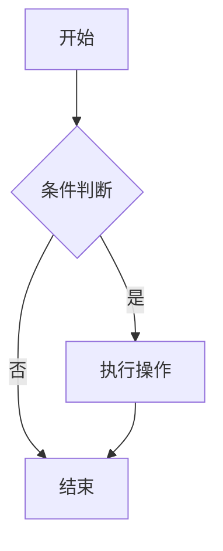

> 一份全面、美观的 Markdown 语法参考文档

---

## 📋 目录

- [标题](#标题)
- [段落与换行](#段落与换行)
- [文本格式](#文本格式)
- [列表](#列表)
- [链接](#链接)
- [图片](#图片)
- [代码](#代码)
- [表格](#表格)
- [引用](#引用)
- [水平线](#水平线)
- [任务列表](#任务列表)
- [脚注](#脚注)
- [数学公式](#数学公式)
- [图表](#图表)
- [最佳实践](#最佳实践)

---

## 标题

Markdown 支持 6 级标题，使用 `#` 符号：

```markdown
# 一级标题
## 二级标题
### 三级标题
#### 四级标题
##### 五级标题
###### 六级标题
```

**渲染效果：**

# 一级标题
## 二级标题
### 三级标题
#### 四级标题
##### 五级标题
###### 六级标题

---

## 段落与换行

### 段落

段落之间用一个空行分隔：

```markdown
这是第一个段落。

这是第二个段落。
```

### 换行

在行尾添加两个空格或使用反斜杠：

```markdown
这是第一行  
这是第二行

或者：
这是第一行\
这是第二行
```

---

## 文本格式

### 粗体

```markdown
**粗体文本** 或 __粗体文本__
```

**渲染效果：** **粗体文本**

### 斜体

```markdown
*斜体文本* 或 _斜体文本_
```

**渲染效果：** *斜体文本*

### 粗斜体

```markdown
***粗斜体文本*** 或 ___粗斜体文本___
```

**渲染效果：** ***粗斜体文本***

### 删除线

```markdown
~~删除线文本~~
```

**渲染效果：** ~~删除线文本~~

### 高亮

```markdown
==高亮文本==
```

**渲染效果：** ==高亮文本==

### 下标和上标

```markdown
H~2~O 和 x^2^
```

**渲染效果：** H~2~O 和 x^2^

---

## 列表

### 无序列表

```markdown
- 项目一
- 项目二
  - 子项目一
  - 子项目二
- 项目三

或者：
* 项目一
* 项目二
+ 项目三
```

**渲染效果：**
- 项目一
- 项目二
  - 子项目一
  - 子项目二
- 项目三

### 有序列表

```markdown
1. 第一项
2. 第二项
   1. 子项一
   2. 子项二
3. 第三项
```

**渲染效果：**
1. 第一项
2. 第二项
   1. 子项一
   2. 子项二
3. 第三项

### 混合列表

```markdown
1. 第一项
   - 子项一
   - 子项二
2. 第二项
   - 子项三
```

**渲染效果：**
1. 第一项
   - 子项一
   - 子项二
2. 第二项
   - 子项三

---

## 链接

### 行内链接

```markdown
[GitHub](https://github.com)
```

**渲染效果：** [GitHub](https://github.com)

### 引用链接

```markdown
这是 [GitHub][1] 的链接，还有 [Google][2]。

[1]: https://github.com
[2]: https://google.com "Google 搜索"
```

**渲染效果：**
这是 [GitHub][1] 的链接，还有 [Google][2]。

[1]: https://github.com
[2]: https://google.com "Google 搜索"

### 自动链接

```markdown
<https://github.com>
<email@example.com>
```

**渲染效果：**
<https://github.com>
<email@example.com>

---

## 图片

### 基本语法

```markdown

```

### 示例

```markdown

```

### 带链接的图片

```markdown
[](https://daringfireball.net/projects/markdown/)
```

---

## 代码

### 行内代码

```markdown
使用 `console.log()` 打印信息。
```

**渲染效果：** 使用 `console.log()` 打印信息。

### 代码块

#### 基本代码块

````markdown
```
function hello() {
  console.log("Hello, World!");
}
```
````

#### 语法高亮

```javascript
function hello() {
  console.log("Hello, World!");
}
```

```python
def hello():
    print("Hello, World!")
```

```html
<!DOCTYPE html>
<html>
<head>
    <title>Hello World</title>
</head>
<body>
    <h1>Hello, World!</h1>
</body>
</html>
```

---

## 表格

### 基本表格

```markdown
| 姓名 | 年龄 | 城市 |
|------|------|------|
| 张三 | 25   | 北京 |
| 李四 | 30   | 上海 |
| 王五 | 28   | 广州 |
```

**渲染效果：**

| 姓名 | 年龄 | 城市 |
|------|------|------|
| 张三 | 25   | 北京 |
| 李四 | 30   | 上海 |
| 王五 | 28   | 广州 |

### 对齐方式

```markdown
| 左对齐 | 居中对齐 | 右对齐 |
|:-------|:--------:|-------:|
| 文本   | 文本     | 文本   |
| 数据   | 数据     | 数据   |
```

**渲染效果：**

| 左对齐 | 居中对齐 | 右对齐 |
|:-------|:--------:|-------:|
| 文本   | 文本     | 文本   |
| 数据   | 数据     | 数据   |

---

## 引用

### 基本引用

```markdown
> 这是一个引用块。
> 可以包含多行内容。
>
> 这是引用中的新段落。
```

**渲染效果：**

> 这是一个引用块。
> 可以包含多行内容。
>
> 这是引用中的新段落。

### 嵌套引用

```markdown
> 第一层引用
>> 第二层引用
>>> 第三层引用
```

**渲染效果：**

> 第一层引用
>> 第二层引用
>>> 第三层引用

### 引用中的其他元素

```markdown
> ## 引用中的标题
> 
> - 引用中的列表项
> - 另一个列表项
> 
> `代码` 和 **粗体** 也可以用在引用中。
```

**渲染效果：**

> ## 引用中的标题
> 
> - 引用中的列表项
> - 另一个列表项
> 
> `代码` 和 **粗体** 也可以用在引用中。

---

## 水平线

```markdown
---

***

___
```

**渲染效果：**

---

***

___

---

## 任务列表

```markdown
- [x] 已完成的任务
- [ ] 未完成的任务
- [ ] 另一个未完成的任务
```

**渲染效果：**

- [x] 已完成的任务
- [ ] 未完成的任务
- [ ] 另一个未完成的任务

---

## 脚注

```markdown
这是带有脚注的文本[^1]。

这是另一个脚注[^note]。

[^1]: 这是第一个脚注的内容。
[^note]: 这是命名脚注的内容。
```

**渲染效果：**

这是带有脚注的文本[^1]。

这是另一个脚注[^note]。

[^1]: 这是第一个脚注的内容。
[^note]: 这是命名脚注的内容。

---

## 数学公式

### 行内公式

```markdown
勾股定理：$a^2 + b^2 = c^2$
```

**渲染效果：** 勾股定理：$a^2 + b^2 = c^2$

### 块级公式

```markdown
$$
\int_{-\infty}^{\infty} e^{-x^2} dx = \sqrt{\pi}
$$
```

**渲染效果：**

$$
\int_{-\infty}^{\infty} e^{-x^2} dx = \sqrt{\pi}
$$

---

## 图表（Mermaid）

````markdown

````

**渲染效果：**


---

## 转义字符

```markdown
\* 星号
\# 井号
\_ 下划线
\` 反引号
\~ 波浪线
\[ 左方括号
\] 右方括号
```

**渲染效果：**

\* 星号
\# 井号
\_ 下划线
\` 反引号
\~ 波浪线
\[ 左方括号
\] 右方括号

---

## 最佳实践

### 1. 标题层级
- 使用一致的标题层级结构
- 避免跳过标题级别（如从 H1 直接到 H3）

### 2. 列表格式
- 使用 `-` 作为无序列表符号
- 保持缩进一致
- 列表项之间使用空行分隔

### 3. 代码块
- 为代码块指定语言以获得语法高亮
- 保持代码缩进一致
- 避免过长的代码行

### 4. 表格
- 对齐表格列以提高可读性
- 避免过于复杂的表格结构
- 为表格添加适当的标题或说明

### 5. 链接管理
- 使用引用链接保持文档整洁
- 为链接添加有意义的描述文本

### 6. 图片优化
- 为所有图片添加替代文本
- 控制图片大小以避免影响加载速度
- 使用相对路径或稳定可靠的图片链接

### 7. 文档结构
- 使用目录提高导航性
- 合理使用水平线分隔不同章节
- 保持一致的格式和风格

---

## 🎯 总结

Markdown 是一种轻量级标记语言，具有以下优点：

- ✅ **简单易学**：语法直观，学习成本低
- ✅ **跨平台兼容**：几乎所有平台都支持
- ✅ **专注内容**：让作者专注于写作而非格式
- ✅ **版本控制友好**：纯文本格式，适合 Git 等工具
- ✅ **灵活扩展**：支持表格、数学公式、图表等

通过掌握这些语法和最佳实践，您可以创建出专业、美观的文档！

---

*最后更新：2025年11月13日*  
*文档版本：v1.0*
