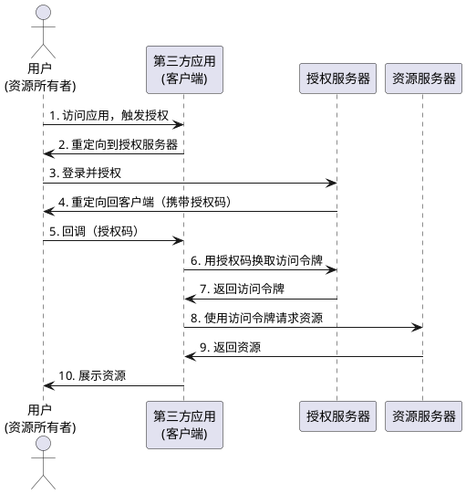

# OAuth2.0详解：从原理到实践

## 1. 概述

**OAuth2.0** 是一个开放标准的授权协议，允许用户授权第三方应用访问他们在其他服务提供者上存储的私密资源，而无需将用户名和密码提供给第三方应用。

**核心价值**：

- **安全性**：用户无需向第三方应用暴露密码
- **便捷性**：用户可以通过授权快速使用第三方服务
- **可控性**：用户可以随时撤销授权，保护隐私

> **💡 提示**：OAuth2.0 是一个授权协议，不是认证协议。它解决的是"授权"问题，即"允许谁访问什么资源"。

---

## 2. 产生背景

### 2.1 传统方式的困境

在 OAuth2.0 出现之前，第三方应用要访问用户在其他服务上的资源，通常需要用户提供用户名和密码：

**传统方式的问题**：

- **密码泄露风险**：用户需要将密码交给第三方应用，存在严重的安全隐患
- **权限过大**：第三方应用获得密码后，可以访问用户的所有资源，无法精确控制权限
- **难以撤销**：用户修改密码才能撤销授权，影响其他正常使用
- **责任不清**：一旦出现问题，难以确定是用户、第三方应用还是服务提供者的责任

### 2.2 OAuth2.0 的解决方案

OAuth2.0 通过引入**授权服务器**和**访问令牌**的概念，完美解决了上述问题：

- **无需密码**：用户只需在授权服务器上登录，无需向第三方应用提供密码
- **精确授权**：可以精确控制第三方应用可以访问哪些资源
- **易于撤销**：用户可以随时在授权服务器上撤销授权
- **责任清晰**：授权服务器负责认证，资源服务器负责授权，职责分明

---

## 3. 核心角色

OAuth2.0 协议涉及四个核心角色，我们可以通过**银行取钱**的类比来理解：

### 3.1 资源所有者（Resource Owner）

**类比**：需要取钱的**客户本人**

**定义**：拥有被保护资源所有权的实体，通常是用户。

**职责**：
- 决定是否授权第三方应用访问自己的资源
- 可以随时撤销授权

**示例**：用户想要使用某个应用访问自己的微信好友列表，用户就是资源所有者。

### 3.2 客户端（Client）

**类比**：帮客户取钱的**朋友**

**定义**：请求访问受保护资源的第三方应用。

**职责**：
- 向授权服务器请求授权
- 使用访问令牌访问资源服务器

**示例**：某个第三方应用想要访问用户的微信好友列表，这个应用就是客户端。

### 3.3 授权服务器（Authorization Server）

**类比**：银行的**前台职员**

**定义**：在成功认证资源所有者并获得授权后，向客户端颁发访问令牌的服务器。

**职责**：
- 验证用户身份（认证）
- 获取用户授权
- 颁发访问令牌（Access Token）
- 管理令牌的生命周期

**示例**：微信的授权服务器，负责验证用户身份并颁发访问令牌。

### 3.4 资源服务器（Resource Server）

**类比**：银行的**金库管理员**

**定义**：托管受保护资源的服务器，能够接受并使用访问令牌来响应受保护资源的请求。

**职责**：
- 验证访问令牌的有效性
- 根据令牌权限返回相应资源

**示例**：微信的资源服务器，存储用户的微信好友列表，根据访问令牌决定是否返回数据。

---

## 4. 授权流程详解

OAuth2.0 的授权流程可以分为六个步骤，我们继续用**银行取钱**的类比来理解：

### 4.1 第一步：客户端请求授权

**类比场景**：朋友（客户端）对客户（资源所有者）说："我想帮你从银行取 1000 元，可以吗？"

**实际流程**：

客户端将用户重定向到授权服务器的授权端点，请求授权。

**关键参数**：

| 参数 | 说明 | 示例 |
|:---|:---|:---|
| `response_type` | 授权类型，固定为 `code` | `code` |
| `client_id` | 客户端标识符 | `my_app_123` |
| `redirect_uri` | 授权后的回调地址 | `https://myapp.com/callback` |
| `scope` | 请求的权限范围 | `read:friends` |
| `state` | 防 CSRF 攻击的随机字符串 | `xyz123` |

**示例 URL**：

```
https://authorization-server.com/authorize?
  response_type=code&
  client_id=my_app_123&
  redirect_uri=https://myapp.com/callback&
  scope=read:friends&
  state=xyz123
```

> **💡 提示**：`state` 参数用于防止 CSRF 攻击，客户端应该验证回调中的 `state` 值是否与请求时一致。

### 4.2 第二步：用户认证和授权

**类比场景**：客户（资源所有者）来到银行前台（授权服务器），前台职员验证客户身份（检查身份证、密码等），然后询问客户："你的朋友要帮你取 1000 元，你同意吗？"

**实际流程**：

1. **用户认证**：授权服务器要求用户登录，验证用户身份
2. **展示授权页面**：授权服务器向用户展示授权页面，说明客户端请求的权限
3. **用户决策**：用户选择同意或拒绝授权

**授权页面示例**：

```
应用 "我的应用" 请求以下权限：
- 读取你的好友列表
- 读取你的基本信息

[同意] [拒绝]
```

> **⚠️ 警告**：用户应该仔细检查授权页面，确认请求的权限是否合理。

### 4.3 第三步：授权服务器颁发授权码

**类比场景**：客户同意后，前台职员（授权服务器）给朋友（客户端）一张**临时凭证**（授权码），说："拿着这个凭证，去金库管理员那里换取取款凭证。"

**实际流程**：

如果用户同意授权，授权服务器将用户重定向回客户端，并在 URL 中携带授权码。

**回调 URL 示例**：

```
https://myapp.com/callback?
  code=AUTHORIZATION_CODE_123&
  state=xyz123
```

**关键点**：

- **授权码是临时的**：通常有效期只有几分钟
- **授权码只能使用一次**：使用后立即失效
- **授权码不包含资源信息**：只是一个临时凭证

> **💡 提示**：授权码通过 URL 参数传递，因此应该使用 HTTPS 协议确保安全。

### 4.4 第四步：客户端用授权码换取访问令牌

**类比场景**：朋友（客户端）拿着临时凭证（授权码）来到前台（授权服务器），前台职员验证凭证有效后，给朋友一张**正式的取款凭证**（访问令牌）。

**实际流程**：

客户端使用授权码向授权服务器的令牌端点请求访问令牌。

**请求示例**：

```http
POST /token HTTP/1.1
Host: authorization-server.com
Content-Type: application/x-www-form-urlencoded

grant_type=authorization_code&
code=AUTHORIZATION_CODE_123&
redirect_uri=https://myapp.com/callback&
client_id=my_app_123&
client_secret=my_app_secret_456
```

**响应示例**：

```json
{
  "access_token": "ACCESS_TOKEN_789",
  "token_type": "Bearer",
  "expires_in": 3600,
  "refresh_token": "REFRESH_TOKEN_ABC",
  "scope": "read:friends"
}
```

**关键参数说明**：

| 参数 | 说明 |
|:---|:---|
| `access_token` | 访问令牌，用于访问资源 |
| `token_type` | 令牌类型，通常是 `Bearer` |
| `expires_in` | 令牌有效期（秒） |
| `refresh_token` | 刷新令牌，用于获取新的访问令牌 |
| `scope` | 令牌的权限范围 |

> **💡 提示**：`client_secret` 是客户端的密钥，应该保密，不能暴露在前端代码中。

### 4.5 第五步：客户端使用访问令牌访问资源

**类比场景**：朋友（客户端）拿着正式的取款凭证（访问令牌）来到金库（资源服务器），金库管理员（资源服务器）验证凭证有效后，允许朋友取走 1000 元（返回资源）。

**实际流程**：

客户端在请求头中携带访问令牌，向资源服务器请求资源。

**请求示例**：

```http
GET /api/friends HTTP/1.1
Host: resource-server.com
Authorization: Bearer ACCESS_TOKEN_789
```

**响应示例**：

```json
{
  "friends": [
    {
      "id": "user_001",
      "name": "张三",
      "avatar": "https://example.com/avatar1.jpg"
    },
    {
      "id": "user_002",
      "name": "李四",
      "avatar": "https://example.com/avatar2.jpg"
    }
  ]
}
```

**关键点**：

- **Bearer 令牌**：访问令牌通过 `Authorization: Bearer <token>` 头传递
- **令牌验证**：资源服务器需要验证令牌的有效性、过期时间和权限范围
- **权限检查**：资源服务器根据令牌的 `scope` 决定是否返回资源

> **⚠️ 警告**：访问令牌应该保密，不能暴露在 URL 参数或日志中。

### 4.6 第六步：资源服务器返回资源

**类比场景**：金库管理员（资源服务器）验证凭证有效后，将 1000 元（资源）交给朋友（客户端）。

**实际流程**：

资源服务器验证访问令牌后，根据令牌的权限范围返回相应的资源。

**验证步骤**：

1. **验证令牌签名**：确保令牌未被篡改
2. **检查令牌过期时间**：确保令牌未过期
3. **验证权限范围**：确保请求的资源在令牌的 `scope` 范围内
4. **返回资源**：验证通过后返回请求的资源

---

## 5. 完整流程图

以下是 OAuth2.0 授权码模式的完整流程：



**流程说明**：

1. **用户触发授权**：用户在第三方应用中点击"使用微信登录"
2. **重定向到授权服务器**：应用将用户重定向到微信授权服务器
3. **用户登录和授权**：用户在授权服务器上登录并同意授权
4. **返回授权码**：授权服务器将用户重定向回应用，URL 中携带授权码
5. **应用接收授权码**：应用从回调 URL 中提取授权码
6. **换取访问令牌**：应用使用授权码和客户端密钥向授权服务器换取访问令牌
7. **获得访问令牌**：授权服务器返回访问令牌和刷新令牌
8. **访问资源**：应用使用访问令牌向资源服务器请求资源
9. **返回资源**：资源服务器验证令牌后返回资源
10. **展示资源**：应用将资源展示给用户

---

## 6. 各步骤的意义

### 6.1 为什么需要授权码？

**类比**：为什么不能直接给朋友取款凭证，而是先给临时凭证？

**原因**：

- **安全性**：授权码通过浏览器传递，即使被截获，攻击者也无法直接使用（需要客户端密钥）
- **一次性**：授权码只能使用一次，使用后立即失效
- **时效性**：授权码有效期很短（通常几分钟），降低泄露风险

### 6.2 为什么需要访问令牌？

**类比**：为什么不能直接用授权码访问资源？

**原因**：

- **权限控制**：访问令牌包含明确的权限范围（`scope`），资源服务器可以根据权限精确控制访问
- **生命周期管理**：访问令牌有明确的过期时间，可以定期更新
- **撤销机制**：可以随时撤销访问令牌，无需用户修改密码

### 6.3 为什么需要刷新令牌？

**类比**：如果取款凭证过期了怎么办？可以用刷新令牌换取新的取款凭证。

**原因**：

- **用户体验**：访问令牌过期后，可以使用刷新令牌获取新的访问令牌，用户无需重新授权
- **安全性**：刷新令牌通常有更长的有效期，但只能用于获取新的访问令牌，不能直接访问资源

---

## 7. 授权模式

OAuth2.0 定义了四种授权模式，适用于不同的场景：

### 7.1 授权码模式（Authorization Code）

**适用场景**：有后端的 Web 应用、移动应用

**特点**：
- 最安全的模式
- 需要客户端密钥
- 通过授权码换取访问令牌

**流程图**：见第 5 节

### 7.2 简化模式（Implicit）

**适用场景**：纯前端应用（SPA）

**特点**：
- 直接返回访问令牌
- 不需要客户端密钥
- 安全性较低（令牌通过 URL 传递）

> **⚠️ 警告**：简化模式已被 OAuth2.1 废弃，推荐使用授权码模式 + PKCE。

### 7.3 密码模式（Resource Owner Password Credentials）

**适用场景**：高度信任的客户端（如官方应用）

**特点**：
- 用户直接提供用户名和密码
- 客户端直接换取访问令牌
- 安全性最低

> **⚠️ 警告**：密码模式已被 OAuth2.1 废弃，不推荐使用。

### 7.4 客户端凭证模式（Client Credentials）

**适用场景**：服务端到服务端的调用

**特点**：
- 不需要用户参与
- 客户端使用自己的凭证获取令牌
- 适用于 API 调用场景

---

## 8. 安全考虑

### 8.1 常见安全威胁

**CSRF 攻击**：

- **威胁**：攻击者诱导用户点击恶意链接，使用用户的授权码
- **防护**：使用 `state` 参数，客户端验证回调中的 `state` 值

**令牌泄露**：

- **威胁**：访问令牌被泄露，攻击者可以访问用户资源
- **防护**：使用 HTTPS、设置合理的过期时间、及时撤销泄露的令牌

**重定向 URI 验证**：

- **威胁**：攻击者使用恶意重定向 URI 窃取授权码
- **防护**：授权服务器验证重定向 URI 是否在客户端注册的白名单中

### 8.2 最佳实践

**客户端**：

- 使用 HTTPS 协议
- 安全存储客户端密钥和令牌
- 验证 `state` 参数
- 及时刷新过期的访问令牌

**授权服务器**：

- 验证重定向 URI
- 设置合理的令牌过期时间
- 支持令牌撤销
- 记录授权和令牌使用日志

**资源服务器**：

- 验证令牌签名和过期时间
- 检查权限范围
- 记录资源访问日志

---

## 9. 实际应用场景

### 9.1 第三方登录

**场景**：用户使用微信账号登录第三方应用

**流程**：
1. 用户在第三方应用中点击"微信登录"
2. 应用重定向到微信授权服务器
3. 用户登录并授权
4. 应用获得访问令牌，可以获取用户基本信息

### 9.2 数据同步

**场景**：第三方应用同步用户的微信好友列表

**流程**：
1. 用户授权应用访问好友列表
2. 应用使用访问令牌定期同步好友数据
3. 用户可以在授权服务器上随时撤销授权

### 9.3 API 调用

**场景**：第三方服务调用微信 API

**流程**：
1. 使用客户端凭证模式获取访问令牌
2. 使用访问令牌调用微信 API
3. 定期刷新访问令牌

---

## 10. 总结

OAuth2.0 通过引入**授权服务器**和**访问令牌**的概念，完美解决了第三方应用访问用户资源的安全问题。

**核心优势**：

1. **安全性**：用户无需向第三方应用提供密码
2. **可控性**：用户可以精确控制第三方应用的权限范围
3. **便捷性**：用户可以随时撤销授权，无需修改密码
4. **标准化**：统一的授权流程，降低开发成本

**关键要点**：

- OAuth2.0 是授权协议，不是认证协议
- 授权码模式是最安全、最常用的模式
- 访问令牌应该保密，通过 HTTPS 传输
- 客户端应该验证 `state` 参数，防止 CSRF 攻击

---
