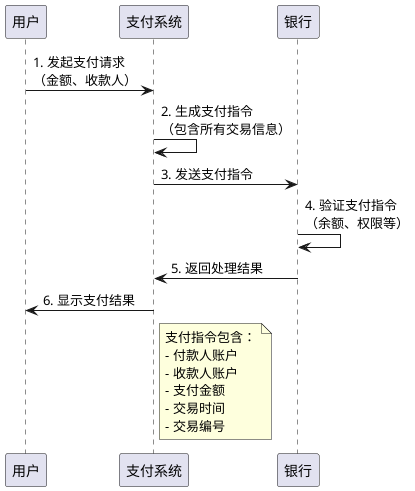
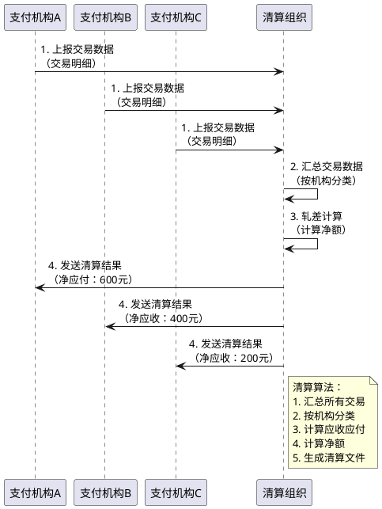
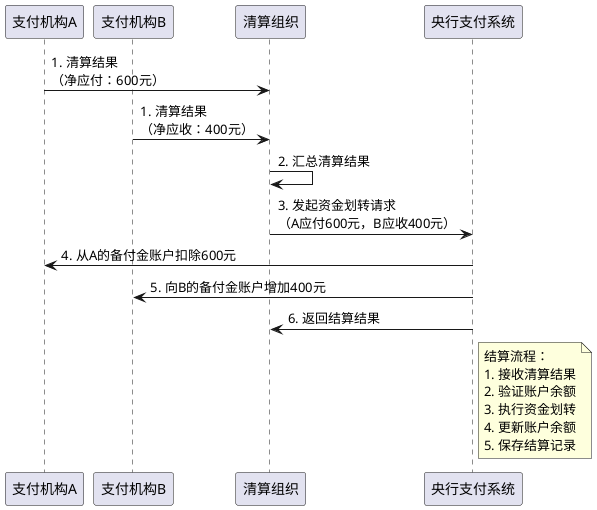
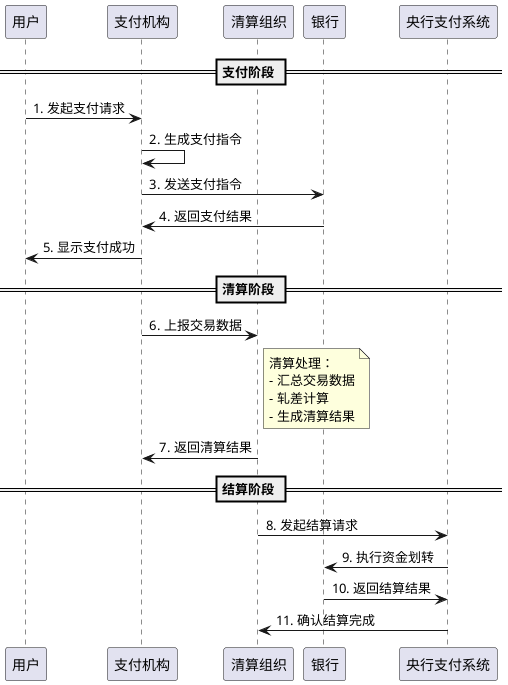
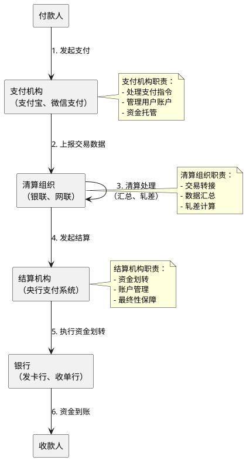

# 支付、清算、结算的本质与原理

> **📖 阅读提示**：本文约 10000 字，预计阅读时间 20 分钟。建议按顺序阅读，每个概念都建立在前一个概念的基础上。本文是支付清结算系列的第一篇，将为你建立完整的知识基础。

## 📑 文章目录

1. [引言：从生活场景开始](#引言从生活场景开始)
2. [支付的本质](#支付的本质)
3. [清算的原理](#清算的原理)
4. [结算的原理](#结算的原理)
5. [三者的关系：完整链路](#三者的关系完整链路)
6. [支付参与者的角色定位](#支付参与者的角色定位)
7. [总结与预告](#总结与预告)

---

## 引言：从生活场景开始

想象一下，你给朋友转账 100 元。你打开手机银行，输入朋友的账号，点击确认。几秒钟后，朋友收到了钱。

这个看似简单的过程，背后却涉及了三个核心环节：**支付**、**清算**、**结算**。

**支付**：你发起了转账，银行收到了你的支付指令。

**清算**：银行需要计算，今天有多少笔类似的转账，谁该给谁多少钱。

**结算**：银行实际把钱从你的账户转到朋友的账户。

这三个环节，构成了完整的资金流转链路。理解这三个环节，是理解整个支付清结算体系的基础。

---

## 支付的本质

> **📍 当前位置**：第一章 - 支付的本质  
> **📊 阅读进度**：第 1/7 章（约 14%）  
> **⏱️ 预计剩余时间**：17 分钟

### 第一层：生活化类比

想象一下，你在商店买东西。你拿出钱包，递给收银员 100 元现金。收银员收下钱，把商品给你。

这个过程，就是最原始的"支付"。

**支付是什么？**

支付就是**资金从一个人转移到另一个人的过程**。无论是现金交易、银行转账，还是移动支付，本质上都是资金的转移。

### 第二层：通俗概念解释

**支付（Payment）** 是资金转移的过程，包括两个层面：

1. **物理过程**：资金的实际转移（如现金交付）
2. **信息过程**：支付指令的生成与传递（如银行转账）

在现代支付体系中，大部分支付都是**信息过程**。你不需要真的把钱拿在手里，只需要发送一个支付指令，系统就会帮你完成资金转移。

**支付的核心要素**：

- **付款人**：谁付钱（你）
- **收款人**：谁收钱（商家）
- **金额**：付多少钱（100 元）
- **支付指令**：如何付钱（转账、刷卡、扫码等）

### 第三层：技术原理解析

#### 支付指令的生成

当你点击"确认支付"时，系统会生成一个**支付指令**。这个指令包含：

- 付款人信息（你的账户）
- 收款人信息（商家的账户）
- 支付金额
- 支付时间
- 交易编号



#### 支付授权与验证机制

支付指令生成后，系统需要进行**授权验证**：

1. **身份验证**：确认你是账户的合法使用者（密码、指纹、人脸识别等）
2. **余额验证**：确认你的账户有足够的余额
3. **权限验证**：确认你有权限进行这笔支付（限额、风控等）

只有通过所有验证，支付指令才会被执行。

#### 支付指令的传递

支付指令需要在多个系统之间传递：

- **用户端** → **支付系统**：用户发起支付
- **支付系统** → **银行系统**：支付系统向银行发送指令
- **银行系统** → **支付系统**：银行返回处理结果
- **支付系统** → **用户端**：用户看到支付结果

### 第四层：实际应用场景

**场景一：线下购物**

你在超市买东西，用手机扫码支付。你打开支付 App，扫描商家的收款码，输入金额，确认支付。几秒钟后，商家收到收款通知。

**场景二：线上购物**

你在电商平台买东西，选择支付方式，输入密码，确认支付。系统处理支付请求，商家收到订单支付成功的通知。

**场景三：转账**

你给朋友转账，输入朋友的账号和金额，确认转账。银行处理转账请求，朋友收到到账通知。

**本章小结**：

- **支付的定义**：资金转移的过程，包括物理过程和信息过程
- **支付的核心**：支付指令的生成、传递、授权和验证
- **支付的特点**：实时性、不可逆性、安全性
- **支付的形式**：现金支付、银行转账、移动支付等

> **💡 思考**：理解了支付后，你是否想过，如果每笔支付都立即结算，会发生什么？这就是我们下一章要讨论的"清算"。

---

## 清算的原理

> **📍 当前位置**：第二章 - 清算的原理  
> **📊 阅读进度**：第 2/7 章（约 29%）  
> **⏱️ 预计剩余时间**：14 分钟  
> **📌 相关章节**：[支付的本质](#支付的本质) | [结算的原理](#结算的原理)

### 第一层：生活化类比

想象一下，你和几个朋友一起聚餐，每个人都付了一些钱。最后要 AA 制，大家需要算清楚：

- 总共花了多少钱？
- 每个人应该付多少钱？
- 谁多付了？谁少付了？

这个过程，在支付行业里就叫做**清算**。

### 第二层：通俗概念解释

**清算（Clearing）** 是支付机构之间对交易数据进行汇总、轧差，计算应收应付金额的过程。

**通俗解释**：清算就是把所有交易记录汇总起来，算出谁该给谁多少钱的过程。就像朋友聚餐 AA 制，每个人先记录自己付了多少钱，最后统一算账，看谁该给谁多少钱。

**类比说明**：

- **生活类比**：朋友聚餐 AA 制
- **业务类比**：银行每天对账
- **技术类比**：数据库汇总查询

**为什么需要清算？**

如果每笔交易都单独结算，就像每次聚餐都要当场算账一样，效率太低了。通过清算，可以把一天的所有交易汇总起来，一次性算清楚，效率大大提高。

### 第三层：技术原理解析

#### 清算的定义：轧差计算与净额结算

**轧差（Netting）** 是清算的核心算法。轧差就是计算应收应付的差额。

**举个例子**：

假设今天发生了以下交易：

- 银行 A 向银行 B 支付了 1000 元
- 银行 B 向银行 A 支付了 600 元
- 银行 A 向银行 C 支付了 500 元
- 银行 C 向银行 A 支付了 300 元

如果每笔交易都单独结算，需要 4 次资金划转。

通过轧差计算：

- 银行 A 应收：600 + 300 = 900 元
- 银行 A 应付：1000 + 500 = 1500 元
- 银行 A 净应付：1500 - 900 = 600 元

- 银行 B 应收：1000 元
- 银行 B 应付：600 元
- 银行 B 净应收：1000 - 600 = 400 元

- 银行 C 应收：500 元
- 银行 C 应付：300 元
- 银行 C 净应收：500 - 300 = 200 元

最终只需要 2 次资金划转：
- 银行 A → 银行 B：400 元
- 银行 A → 银行 C：200 元

**轧差的优势**：

1. **减少资金划转次数**：从 4 次减少到 2 次
2. **降低资金占用**：不需要每笔交易都占用资金
3. **提高效率**：批量处理，一次性完成

#### 清算的时机：实时清算 vs 批量清算

**实时清算（Real-time Clearing）**：

- **定义**：交易完成后立即清算
- **特点**：时效性高，但系统压力大
- **适用场景**：大额交易、紧急交易

**批量清算（Batch Clearing）**：

- **定义**：把很多交易汇总后一起清算
- **特点**：效率高，系统压力小
- **适用场景**：小额交易、日常交易

**日切（Day Cut）**：

批量清算通常在每天结束后的固定时间进行，这个时间点叫做**日切**。就像商店每天打烊的时间，清算系统会在日切时间点汇总当天的所有交易，进行清算。

#### 清算的数据结构：交易明细、轧差结果

**交易明细**：

清算需要收集所有交易记录，包括：

- 交易编号
- 付款人信息
- 收款人信息
- 交易金额
- 交易时间
- 交易状态

**轧差结果**：

清算完成后，生成轧差结果，包括：

- 参与机构
- 应收金额
- 应付金额
- 净额（应收 - 应付）
- 清算时间



#### 清算的算法：双边清算、多边清算

**双边清算（Bilateral Clearing）**：

- **定义**：两个机构之间直接清算
- **特点**：简单直接，但需要 N×N 的连接
- **适用场景**：机构数量少的情况

**多边清算（Multilateral Clearing）**：

- **定义**：通过清算组织进行统一清算
- **特点**：效率高，连接简单（星型拓扑）
- **适用场景**：机构数量多的情况（如银联、网联）

**多边清算的优势**：

假设有 10 个支付机构：

- **双边清算**：需要 10×9÷2 = 45 个连接
- **多边清算**：只需要 10 个连接（每个机构连接清算组织）

### 第四层：实际应用场景

**场景一：银联清算**

银联每天汇总所有银行卡交易，计算各银行之间的资金差额。这个过程通常在每天结束后的固定时间（日切时间）进行。

**场景二：网联清算**

网联实时汇总网络支付交易，计算各支付机构之间的资金差额。网联支持实时清算，7×24 小时运行。

**场景三：企业内部清算**

大型企业内部可能有多个账户，每天结束时会进行内部清算，计算各账户之间的资金差额。

**本章小结**：

- **清算的定义**：交易数据汇总、轧差计算、生成清算文件
- **清算的核心**：轧差算法，减少资金划转次数
- **清算的时机**：实时清算 vs 批量清算
- **清算的算法**：双边清算 vs 多边清算

> **💡 思考**：清算完成后，资金还没有实际划转。那么，资金是如何实际划转的呢？这就是我们下一章要讨论的"结算"。

---

## 结算的原理

> **📍 当前位置**：第三章 - 结算的原理  
> **📊 阅读进度**：第 3/7 章（约 43%）  
> **⏱️ 预计剩余时间**：11 分钟  
> **📌 相关章节**：[支付的本质](#支付的本质) | [清算的原理](#清算的原理)

### 第一层：生活化类比

清算完成后，我们知道了谁该给谁多少钱。但是，这只是"算账"，还没有"给钱"。

**结算**就是实际把钱转过去的过程。

就像朋友聚餐 AA 制，算完账后，大家需要实际把钱转给对方。这个过程就是结算。

### 第二层：通俗概念解释

**结算（Settlement）** 是资金的实际划转过程，是清算结果的最终执行。

**通俗解释**：结算就是实际把钱从付款方账户转到收款方账户的过程。就像算完账后，实际把钱转给对方。

**类比说明**：

- **生活类比**：算完账后，实际转账给对方
- **业务类比**：银行实际划转资金
- **技术类比**：数据库事务提交

**为什么需要结算？**

清算只是"算账"，知道了谁该给谁多少钱。但资金还没有实际划转。结算就是执行清算结果，实际完成资金划转。

### 第三层：技术原理解析

#### 结算的定义：资金的实际划转

**结算**是清算结果的执行，包括：

1. **资金划转**：从付款方账户扣除资金，向收款方账户增加资金
2. **账户更新**：更新相关账户的余额
3. **记录保存**：保存结算记录，用于对账和审计

#### 结算的账户体系：备付金账户、清算账户

**备付金账户（Reserve Fund Account）**：

**备付金**是支付机构为办理客户委托的支付业务而实际收到的预收待付货币资金。

**通俗解释**：备付金就是支付机构暂时保管的客户资金。就像你买东西时先付的押金，等交易完成后，再决定是退给你还是给商家。

**为什么需要备付金？**

因为支付不是瞬间完成的。从你付款到商家收到钱，中间需要时间。在这段时间里，钱需要有个地方存放，这就是备付金账户。

**备付金的管理**：

为了保障资金安全，监管要求支付机构把备付金存放在专门的银行账户里，由央行统一监管。这就像把你的押金放在银行的保险箱里，而不是放在商家的抽屉里。

**清算账户（Clearing Account）**：

清算账户是清算组织用于资金清算的账户。清算完成后，资金通过清算账户进行划转。

**央行支付系统（Central Bank Payment System）**：

**央行支付系统**是中国人民银行建设的支付清算基础设施，负责银行之间的资金划转。

**通俗解释**：央行支付系统就是银行之间转账的"高速公路"。就像快递公司的分拣中心，所有银行的资金划转都要通过这个系统。

**类比说明**：
- **生活类比**：银行之间的"高速公路"
- **业务类比**：快递公司的分拣中心
- **技术类比**：中央路由器，连接所有银行

**央行支付系统的组成**：

央行支付系统包括三个主要系统：

1. **大额支付系统（HVPS - High Value Payment System）**：
   - **定义**：处理银行间大额资金划转的系统
   - **特点**：实时处理，金额较大
   - **适用场景**：银行间大额转账、证券交易等

2. **小额支付系统（BEPS - Bulk Electronic Payment System）**：
   - **定义**：处理银行间小额资金划转的系统
   - **特点**：批量处理，金额较小
   - **适用场景**：工资发放、水电费缴纳等

3. **网上支付跨行清算系统（IBPS - Internet Banking Payment System）**：
   - **定义**：处理网上支付跨行清算的系统
   - **特点**：支持7×24小时运行
   - **适用场景**：网上银行转账、第三方支付清算等

**为什么需要央行支付系统？**

银行之间需要互相转账，但不可能每个银行都与其他银行直接连接。央行支付系统就像"中央枢纽"，所有银行都连接到这个系统，通过它完成资金划转。



#### 结算的时效性：T+0、T+1、D+1的含义

**T+0（当天结算）**：

- **定义**：交易当天完成结算
- **特点**：时效性最高，资金到账快
- **适用场景**：大额交易、紧急交易

**T+1（次日结算）**：

- **定义**：交易次日完成结算
- **特点**：标准模式，平衡效率和成本
- **适用场景**：日常交易（银行卡支付、网络支付等）

**D+1（自然日+1结算）**：

- **定义**：自然日+1完成结算（不包括节假日）
- **特点**：考虑节假日因素
- **适用场景**：部分特殊业务

**时效性对比**：

| 结算方式 | 时效性 | 成本 | 适用场景 |
|:---|:---|:---|:---|
| **T+0** | 最高 | 较高 | 大额交易、紧急交易 |
| **T+1** | 较高 | 适中 | 日常交易（标准模式） |
| **D+1** | 一般 | 较低 | 部分特殊业务 |

#### 结算的最终性：不可撤销性

**结算最终性（Settlement Finality）** 是指结算完成后，资金划转不可撤销。

**为什么需要结算最终性？**

如果结算可以撤销，会导致：

1. **资金风险**：收款方可能已经使用了资金，但付款方撤销了结算
2. **系统风险**：可能导致整个支付系统的混乱
3. **法律风险**：无法确定资金的所有权

**结算最终性的保障**：

1. **法律保障**：相关法律法规规定结算的不可撤销性
2. **技术保障**：系统设计确保结算的不可逆性
3. **流程保障**：严格的结算流程，确保结算的准确性

### 第四层：实际应用场景

在讲解具体场景之前，我们先理解两个重要的概念：

**发卡行（Issuer Bank）**：

**发卡行**是向持卡人发行银行卡的银行，负责管理持卡人的账户和资金。

**通俗解释**：发卡行就是你的银行卡所属的银行。就像你的身份证是由某个公安局颁发的，你的银行卡是由某个银行发行的。

**类比说明**：
- **生活类比**：你的银行卡所属的银行
- **业务类比**：持卡人的银行账户管理者
- **技术类比**：账户数据的拥有者

**发卡行的职责**：
- 发行银行卡给持卡人
- 管理持卡人的账户和资金
- 验证支付请求并扣款
- 向持卡人提供账户服务

**收单行（Acquirer Bank）**：

**收单行**是商户的银行，负责接收商户的收款，为商户提供收单服务。

**通俗解释**：收单行就是商户的收款账户所属的银行。就像商家在银行开了一个收款账户，这个银行就是收单行。

**类比说明**：
- **生活类比**：商户的收款账户所属的银行
- **业务类比**：商户的收款服务提供者
- **技术类比**：商户账户数据的管理者

**收单行的职责**：
- 为商户提供收单服务
- 接收商户的收款
- 管理商户的账户和资金
- 向商户提供结算服务

**场景一：银行卡支付结算**

你刷卡消费 100 元。清算完成后，**发卡行**（你的银行卡所属的银行）需要向**收单行**（商户的银行）支付 100 元。结算时，通过央行支付系统，从发卡行的账户扣除 100 元，向收单行的账户增加 100 元。

**场景二：网络支付结算**

你通过微信支付向商家付款 100 元。清算完成后，微信支付需要向商家的银行账户划转 100 元。结算时，通过网联和央行支付系统，完成资金划转。

**场景三：跨行转账结算**

你从银行 A 向银行 B 转账 1000 元。清算完成后，银行 A 需要向银行 B 支付 1000 元。结算时，通过央行支付系统，完成资金划转。

**本章小结**：

- **结算的定义**：资金的实际划转，是清算结果的执行
- **结算的账户**：备付金账户、清算账户
- **结算的时效性**：T+0、T+1、D+1
- **结算的最终性**：不可撤销性

> **💡 思考**：现在我们已经理解了支付、清算、结算三个环节。那么，它们之间是什么关系？如何构成完整的资金流转链路？

---

## 三者的关系：完整链路

> **📍 当前位置**：第四章 - 三者的关系  
> **📊 阅读进度**：第 4/7 章（约 57%）  
> **⏱️ 预计剩余时间**：9 分钟  
> **📌 相关章节**：[支付的本质](#支付的本质) | [清算的原理](#清算的原理) | [结算的原理](#结算的原理)

### 支付→清算→结算的完整链路

支付、清算、结算构成了完整的资金流转链路：

```
支付 → 清算 → 结算
```

**完整流程**：

1. **支付阶段**：用户发起支付，支付指令生成和传递
2. **清算阶段**：交易数据汇总，轧差计算，生成清算结果
3. **结算阶段**：执行清算结果，实际完成资金划转



### 时间顺序与依赖关系

**时间顺序**：

1. **支付**：最先发生，用户发起支付
2. **清算**：支付完成后，进行清算（实时或批量）
3. **结算**：清算完成后，进行结算（T+0 或 T+1）

**依赖关系**：

- **清算依赖支付**：没有支付，就没有交易数据，无法清算
- **结算依赖清算**：没有清算结果，无法知道谁该给谁多少钱，无法结算

**时间线示例**：

假设你在 2025 年 11 月 15 日 10:00 发起支付：

- **10:00**：支付阶段（实时完成）
- **10:00-23:59**：交易数据收集
- **00:00（次日）**：清算阶段（日切时间）
- **00:00-02:00**：结算阶段（T+1，次日完成）

### 各环节的技术实现要点

#### 支付环节的技术要点

1. **支付指令生成**：包含完整的交易信息
2. **身份验证**：确保支付的安全性
3. **实时处理**：支付需要实时完成
4. **异常处理**：支付失败时的回滚机制

#### 清算环节的技术要点

1. **数据汇总**：高效收集和汇总交易数据
2. **轧差算法**：准确计算应收应付差额
3. **批量处理**：支持大规模交易的批量清算
4. **对账机制**：确保清算结果的准确性

#### 结算环节的技术要点

1. **资金划转**：通过央行支付系统完成资金划转
2. **账户管理**：管理备付金账户和清算账户
3. **时效控制**：支持 T+0、T+1 等不同时效性
4. **最终性保障**：确保结算的不可撤销性

### 完整链路示例：银行卡支付

**场景**：你在超市刷卡消费 100 元

在讲解完整流程之前，我们先理解一个重要的设备：

**POS 机（Point of Sale）**：

**POS 机**是商户用于刷卡支付的终端设备，可以读取银行卡信息并处理支付请求。

**通俗解释**：POS 机就是商家用来刷卡的机器。就像超市的收银机，你刷卡时，POS 机会读取你的银行卡信息，然后处理支付。

**类比说明**：
- **生活类比**：超市的刷卡机器
- **业务类比**：商户的支付终端
- **技术类比**：支付指令的采集设备

**POS 机的功能**：
- 读取银行卡信息（磁条、芯片、NFC）
- 输入支付金额
- 验证支付密码
- 发送支付请求到银行系统

**完整流程**：

1. **支付阶段**（实时）：
   - 你刷卡，POS 机读取卡片信息
   - 输入密码，验证身份
   - 支付指令发送到收单行
   - 收单行通过银联转发到发卡行
   - 发卡行验证并扣款
   - 返回支付成功

2. **清算阶段**（T+1，次日）：
   - 银联汇总当天的所有银行卡交易
   - 计算各银行之间的资金差额
   - 生成清算文件
   - 发送清算结果给各银行

3. **结算阶段**（T+1，次日）：
   - 银联通过央行支付系统发起结算
   - 从发卡行的账户扣除资金
   - 向收单行的账户增加资金
   - 完成资金划转

**时间线**：

- **11 月 15 日 10:00**：支付完成（实时）
- **11 月 16 日 00:00**：清算完成（日切时间）
- **11 月 16 日 02:00**：结算完成（T+1）

**本章小结**：

- **完整链路**：支付 → 清算 → 结算
- **时间顺序**：支付最先，清算其次，结算最后
- **依赖关系**：清算依赖支付，结算依赖清算
- **技术要点**：每个环节都有其技术实现要点

> **💡 思考**：在整个支付清结算体系中，有哪些参与者？他们各自扮演什么角色？

---

## 支付参与者的角色定位

> **📍 当前位置**：第五章 - 支付参与者的角色定位  
> **📊 阅读进度**：第 5/7 章（约 71%）  
> **⏱️ 预计剩余时间**：6 分钟

### 付款人、收款人：资金流转的起点与终点

**付款人（Payer）**：

- **定义**：支付资金的发起方
- **角色**：资金流转的起点
- **职责**：发起支付指令，授权资金转移

**收款人（Payee）**：

- **定义**：接收资金的接收方
- **角色**：资金流转的终点
- **职责**：接收资金，确认收款

**持卡人（Cardholder）**：

**持卡人**是拥有并使用银行卡进行支付的个人或机构。

**通俗解释**：持卡人就是拥有银行卡的人。就像你有身份证，你就是身份证的持有人；你有银行卡，你就是持卡人。

**类比说明**：
- **生活类比**：拥有银行卡的人
- **业务类比**：支付资金的发起方
- **技术类比**：支付指令的发起者

**商户（Merchant）**：

**商户**是接受支付并提供商品或服务的商家。

**通俗解释**：商户就是接受支付的商家。就像超市、餐厅、网店等，它们接受你的支付，然后给你提供商品或服务。

**类比说明**：
- **生活类比**：接受支付的商家
- **业务类比**：接收资金的接收方
- **技术类比**：支付指令的接收者

**资金流转路径**：

```
付款人（持卡人） → 支付机构 → 清算组织 → 银行 → 收款人（商户）
```

### 支付机构：支付指令的处理者

**支付机构（Payment Institution）** 是持有支付牌照，可以处理支付业务的公司。

**通俗解释**：支付机构就是帮你处理支付的公司，就像支付宝、微信支付。

**角色定位**：

- **支付处理**：接收和处理支付指令
- **账户管理**：管理用户的支付账户
- **资金托管**：暂时保管客户的资金（备付金）

**技术职责**：

- 支付指令的生成和传递
- 身份验证和风险控制
- 交易数据的收集和上报
- 与清算组织的对接

**典型代表**：

- **支付宝**：阿里巴巴旗下的支付机构
- **微信支付**：腾讯旗下的支付机构（财付通）
- **银联商务**：银联旗下的支付机构

### 清算组织：交易数据的汇总与轧差

**清算组织（Clearing Organization）** 是负责交易转接和清算的机构。

**通俗解释**：清算组织就是负责"算账"的机构，就像朋友聚餐 AA 制的组织者，负责算清楚谁该给谁多少钱。

**角色定位**：

- **交易转接**：转发支付指令，连接支付机构和银行
- **数据汇总**：收集和汇总所有交易数据
- **轧差计算**：计算各机构之间的资金差额
- **清算文件生成**：生成清算结果文件

**技术职责**：

- 交易路由和转接
- 交易数据的汇总和存储
- 轧差算法的实现
- 清算文件的生成和分发

**典型代表**：

- **银联（UnionPay）**：银行卡清算组织
- **网联（Non-bank Payment Institution Network）**：网络支付清算组织

### 结算机构：资金的实际划转执行者

**结算机构（Settlement Institution）** 是负责资金实际划转的机构。

**通俗解释**：结算机构就是负责"给钱"的机构，就像银行，实际把钱从付款方账户转到收款方账户。

**角色定位**：

- **资金划转**：执行清算结果，实际完成资金划转
- **账户管理**：管理各机构的清算账户和备付金账户
- **最终性保障**：确保结算的不可撤销性

**技术职责**：

- 通过央行支付系统完成资金划转
- 管理各机构的账户余额
- 确保结算的准确性和安全性

**典型代表**：

- **央行支付系统**：由中国人民银行建设，包括三个主要系统：
  - **大额支付系统（HVPS - High Value Payment System）**：处理银行间大额资金划转，实时处理，适用于大额转账、证券交易等
  - **小额支付系统（BEPS - Bulk Electronic Payment System）**：处理银行间小额资金划转，批量处理，适用于工资发放、水电费缴纳等
  - **网上支付跨行清算系统（IBPS - Internet Banking Payment System）**：处理网上支付跨行清算，支持7×24小时运行，适用于网上银行转账、第三方支付清算等

### 银行：资金账户的托管者

**银行（Bank）** 是资金账户的托管者。

**角色定位**：

- **账户托管**：为用户和机构提供账户服务
- **资金保管**：保管客户的资金
- **资金划转**：执行资金划转指令

**技术职责**：

- 账户的开立和管理
- 资金的存取和划转
- 与支付机构和清算组织的对接

**典型代表**：

- **发卡行（Issuer）**：持卡人的银行，负责发卡和管理账户
- **收单行（Acquirer）**：商户的银行，负责接收商户的收款

### 完整参与者关系图



**本章小结**：

- **付款人、收款人**：资金流转的起点与终点
- **支付机构**：支付指令的处理者，账户和资金的管理者
- **清算组织**：交易数据的汇总与轧差，连接支付机构和银行
- **结算机构**：资金的实际划转执行者，确保结算的最终性
- **银行**：资金账户的托管者，提供账户和资金服务

---

## 总结与预告

> **📊 阅读进度**：第 7/7 章（100%）  
> **🎉 恭喜完成阅读！**

### 核心要点回顾

通过本文，我们深入理解了支付清结算体系的三个核心环节：

1. **支付（Payment）**：
   - 资金转移的过程，包括物理过程和信息过程
   - 支付指令的生成、传递、授权和验证
   - 实时完成，是资金流转的起点

2. **清算（Clearing）**：
   - 交易数据汇总、轧差计算、生成清算结果
   - 通过轧差算法，减少资金划转次数
   - 支持实时清算和批量清算

3. **结算（Settlement）**：
   - 资金的实际划转，是清算结果的执行
   - 通过央行支付系统完成资金划转
   - 支持 T+0、T+1 等不同时效性

4. **完整链路**：
   - 支付 → 清算 → 结算
   - 时间顺序：支付最先，清算其次，结算最后
   - 依赖关系：清算依赖支付，结算依赖清算

5. **参与者角色**：
   - 付款人、收款人：资金流转的起点与终点
   - 支付机构：支付指令的处理者
   - 清算组织：交易数据的汇总与轧差
   - 结算机构：资金的实际划转执行者
   - 银行：资金账户的托管者

### 关键概念速查

| 概念 | 英文 | 通俗解释 | 核心要点 |
|:---|:---|:---|:---|
| **支付** | Payment | 资金转移的过程 | 支付指令的生成和传递 |
| **清算** | Clearing | 算账的过程 | 轧差计算，减少资金划转 |
| **结算** | Settlement | 给钱的过程 | 实际完成资金划转 |
| **轧差** | Netting | 计算差额 | 应收 - 应付 = 净额 |
| **备付金** | Reserve Fund | 暂时保管的资金 | 支付机构暂时保管的客户资金 |
| **日切** | Day Cut | 每天结束的时间点 | 清算系统汇总交易的时间点 |
| **T+0** | T+0 | 当天结算 | 时效性最高 |
| **T+1** | T+1 | 次日结算 | 标准模式 |

### 下篇预告

在下一篇文章中，我们将深入解析**银行卡支付的技术原理**，包括：

- **银行卡的技术原理**：磁条卡、IC 卡、NFC 的技术差异
- **POS 机的工作原理**：交易流程、ISO8583 协议详解
- **四方模式详解**：持卡人、商户、收单机构、发卡机构的角色
- **跨行交易的技术挑战**：为什么需要清算网络？

通过下一篇文章，你将深入理解银行卡支付的技术实现，掌握四方模式的运作机制。

---

## 参考资料

1. **官方资料**：
   - 中国人民银行《非金融机构支付服务管理办法》
   - 银联技术规范
   - 网联技术规范

2. **技术文档**：
   - 支付清算系统技术架构
   - 央行支付系统技术文档

3. **行业报告**：
   - 中国支付清算行业发展报告
   - 第三方支付市场分析

---

**最后更新**：2025-11-15  
**系列文章**：[中国线上支付与清结算体系深度解析系列](#)  
**下一篇**：[银行卡支付的技术原理](#)（即将发布）

