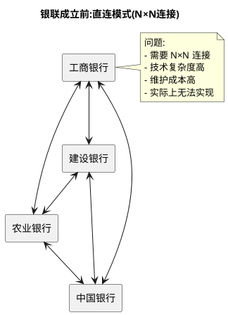
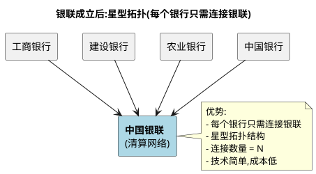
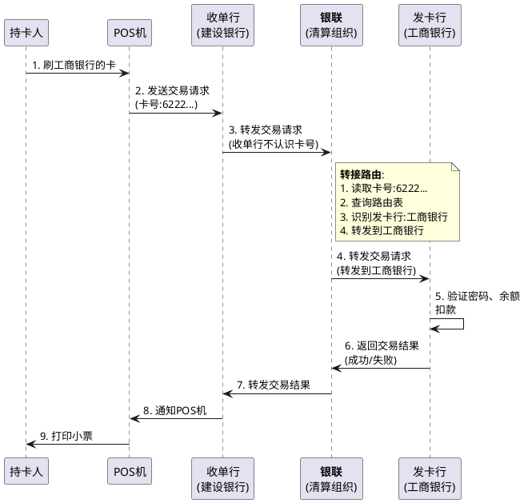
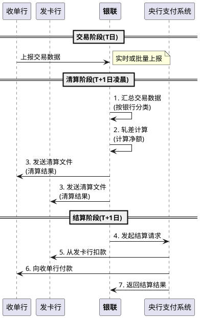
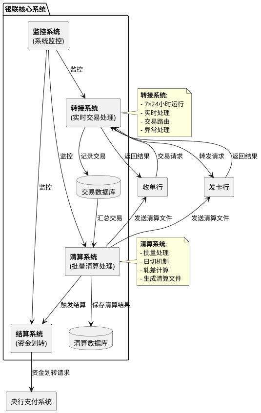

# 中国银联的清算原理与技术架构

> **📖 阅读提示**:本文约 12000 字,预计阅读时间 25 分钟。建议按顺序阅读,每个概念都建立在前一个概念的基础上。本文是支付清结算系列的第三篇,建议先阅读第一篇《支付、清算、结算的本质与原理》和第二篇《银行卡支付的技术原理》。

## 📑 文章目录

1. [引言:从支付困境说起](#引言从支付困境说起)
2. [银联成立的背景](#银联成立的背景)
3. [银联的定位与职责](#银联的定位与职责)
4. [银联清算的技术架构](#银联清算的技术架构)
5. [银联清算的时效性](#银联清算的时效性)
6. [银联卡的技术标准](#银联卡的技术标准)
7. [银联在支付产业链中的位置](#银联在支付产业链中的位置)
8. [总结与预告](#总结与预告)

---

## 引言:从支付困境说起

> **📍 当前位置**:第一章 - 引言  
> **📊 阅读进度**:第 1/8 章(约 12%)  
> **⏱️ 预计剩余时间**:22 分钟

在前两篇文章中,我们理解了支付、清算、结算的本质,以及银行卡支付的四方模式。现在,让我们聚焦一个关键问题:**为什么需要银联?**

想象一下 2002 年之前的中国,你拥有一张工商银行的银行卡。

- 在工商银行的 ATM 机上,你可以取钱、查询余额
- 在工商银行合作的商户 POS 机上,你可以刷卡消费
- 但是,在建设银行的 ATM 机上,你无法取钱
- 在只接受建设银行卡的商户,你无法刷卡

**这就是当时的支付困境**:各银行独立发卡,跨行交易无法进行。

如果你想在全国各地都能使用银行卡,你需要在不同银行办理不同的银行卡:

- 工商银行卡:在工行网点使用
- 建设银行卡:在建行网点使用
- 农业银行卡:在农行网点使用
- ...

这种情况显然不合理。就像你的手机只能给同一个运营商的用户打电话,不能给其他运营商的用户打电话一样。

**银联的诞生,就是为了解决这个问题。**

---

## 银联成立的背景

> **📍 当前位置**:第二章 - 银联成立的背景  
> **📊 阅读进度**:第 2/8 章(约 25%)  
> **⏱️ 预计剩余时间**:19 分钟  
> **📌 相关章节**:[银联的定位与职责](#银联的定位与职责)

### 第一层:生活化类比

想象一下,你住在一个小区,每栋楼都有自己的快递柜。

**问题是**:

- 1 号楼的快递只能放在 1 号楼的快递柜里,你只能在 1 号楼取快递
- 2 号楼的快递只能放在 2 号楼的快递柜里,你只能在 2 号楼取快递
- 如果你住在 3 号楼,但快递放在 1 号楼的快递柜里,你无法取到快递

**解决方案**:

小区建立一个**统一的快递中转站**。所有快递都先送到中转站,然后再分发到各个楼的快递柜。这样,无论快递最初送到哪里,都能通过中转站分发到正确的楼。

**银联就是银行卡支付领域的"统一快递中转站"。**

### 第二层:通俗概念解释

**2002 年成立前的支付困境**:

在银联成立之前,中国的银行卡支付体系存在严重的互联互通问题:

1. **各银行独立发卡**:
   - 每个银行都发行自己的银行卡
   - 不同银行的卡无法跨行使用
   - 用户需要办理多张银行卡

2. **跨行交易无法进行**:
   - 工商银行的卡无法在建设银行的 ATM 上取钱
   - 建设银行的卡无法在农业银行的 POS 机上刷卡
   - 不同银行之间没有统一的交易通道

3. **支付场景受限**:
   - 用户只能在自己银行的网点和合作商户使用银行卡
   - 出差、旅行时需要携带多张银行卡
   - 支付体验极差

**为什么会出现这种情况?**

因为各银行之间没有统一的清算网络。就像前面讲过的,如果要实现跨行交易,每个银行都需要与其他所有银行直接连接,这就是**直连模式**的 N×N 问题。

假设有 10 个银行,如果每个银行都要与其他银行直接连接:

- 需要的连接数量 = 10 × 9 ÷ 2 = 45 个连接
- 每个银行需要维护 9 个连接
- 技术复杂度和成本都非常高

所以,各银行选择了最简单的方式:**不互联互通**。

### 第三层:技术原理解析

#### 银联成立的时间节点

**2002 年 3 月 26 日**:中国银联股份有限公司正式成立,由中国人民银行批准成立。

**成立背景**:

1. **国家政策推动**:
   - 央行推动银行卡联网通用
   - 建立统一的银行卡清算网络
   - 提升支付效率和用户体验

2. **市场需求**:
   - 用户需要跨行使用银行卡
   - 商户需要接受所有银行的卡
   - 银行需要降低互联互通成本

3. **技术成熟**:
   - 转接清算技术成熟
   - 通信网络基础设施完善
   - 安全技术得到保障

#### 银联的股东结构

**银联是谁的?**

中国银联是由中国各家银行共同发起成立的股份制公司:

- **股东**:包括中国工商银行、中国农业银行、中国银行、中国建设银行等全国性商业银行,以及部分区域性商业银行
- **性质**:股份制公司,非营利性质
- **监管**:中国人民银行监管

**通俗解释**:

银联不是某一家银行的,而是所有银行共同拥有的。就像小区的快递中转站不是某一栋楼的,而是整个小区共同建设的。

#### 银联解决了什么问题?

**核心问题**:跨行交易的技术障碍

**解决方案**:建立统一的转接清算网络





**对比**:

|| 直连模式 | 银联模式 |
|:---|:---|:---|
| **连接数量** | N×N(45 个,假设 10 家银行) | N(10 个) |
| **技术复杂度** | 极高 | 低 |
| **维护成本** | 极高 | 低 |
| **扩展性** | 差(新增银行需要与所有银行连接) | 好(新增银行只需连接银联) |

### 第四层:实际应用场景

**场景一:跨行 ATM 取款**

在银联成立后,你拥有一张工商银行的银行卡,可以在建设银行的 ATM 机上取钱。

**交易流程**:

1. 你在建设银行的 ATM 机上插入工商银行的卡
2. ATM 机读取卡号,发现是工商银行的卡
3. 建设银行将交易请求发送到银联
4. 银联识别卡号,将请求转发到工商银行
5. 工商银行验证密码、余额,返回结果给银联
6. 银联将结果转发给建设银行
7. ATM 机出钱,交易完成

**场景二:跨行 POS 刷卡**

你拥有一张农业银行的银行卡,在超市刷卡消费,超市的收单行是中国银行。

**交易流程**:

1. 你在 POS 机上刷农业银行的卡
2. POS 机读取卡号,发现是农业银行的卡
3. 中国银行(收单行)将交易请求发送到银联
4. 银联识别卡号,将请求转发到农业银行(发卡行)
5. 农业银行验证密码、余额,扣款,返回结果给银联
6. 银联将结果转发给中国银行
7. 中国银行通知 POS 机,POS 机打印小票,交易完成

**本章小结**:

- **银联成立前的困境**:各银行独立发卡,跨行交易无法进行
- **直连模式的问题**:N×N 连接复杂度高,实际无法实现
- **银联的解决方案**:建立统一的转接清算网络,星型拓扑结构
- **银联成立时间**:2002 年 3 月 26 日
- **银联的性质**:各家银行共同发起的股份制公司

> **💡 思考**:银联解决了跨行交易的互联互通问题。那么,银联在支付体系中扮演什么角色?它的具体职责是什么?

---

## 银联的定位与职责

> **📍 当前位置**:第三章 - 银联的定位与职责  
> **📊 阅读进度**:第 3/8 章(约 37%)  
> **⏱️ 预计剩余时间**:16 分钟  
> **📌 相关章节**:[银联成立的背景](#银联成立的背景) | [银联清算的技术架构](#银联清算的技术架构)

### 第一层:生活化类比

我们继续用快递中转站的类比。

**快递中转站的职责是什么?**

1. **转发快递**:
   - 接收来自不同快递公司的快递
   - 根据地址,转发到正确的目的地
   - 确保快递准确送达

2. **登记记录**:
   - 记录每个快递的信息(发件人、收件人、时间等)
   - 统计每个快递公司的快递数量
   - 生成账单(如果快递公司需要支付中转费用)

3. **制定规则**:
   - 制定快递包装标准
   - 制定快递标签格式
   - 制定中转流程规范

**银联在银行卡支付领域的职责,与快递中转站类似。**

### 第二层:通俗概念解释

**银联的定位**:

**银行卡清算组织(Card Network)**

**通俗解释**:银联是银行卡支付领域的"中转站",负责转发交易请求、汇总清算数据、制定行业标准。

**类比说明**:
- **生活类比**:快递中转站,负责转发快递、登记记录、制定规则
- **业务类比**:电话总机,负责转接电话、记录通话、制定通话规范
- **技术类比**:网络路由器,负责转发数据包、记录流量、制定路由规则

**银联的英文名称**:UnionPay

**相关概念**:清算组织、转接清算、银行卡网络

### 第三层:技术原理解析

#### 银联的核心职责

银联作为银行卡清算组织,主要有四大职责:

##### 1. 转接清算:交易路由与数据转发

**转接(Switching)**是银联的核心功能,负责将交易请求从收单行转发到发卡行。

**什么是转接?**

**转接**是指清算组织接收交易请求后,根据卡号识别发卡行,并将交易请求转发到正确的发卡行的过程。

**通俗解释**:转接就像快递中转站根据地址转发快递一样,银联根据卡号转发交易请求。

**转接流程**:



**转接的关键技术:交易路由**

**交易路由(Transaction Routing)**是银联根据卡号识别发卡行,并将交易请求转发到正确的发卡行的算法。

**交易路由的实现**:

1. **读取卡号**:从交易请求中读取银行卡号
2. **识别 BIN 码**:银行卡号的前 6 位是 BIN 码(Bank Identification Number),用于识别发卡行
3. **查询路由表**:根据 BIN 码查询路由表,找到对应的发卡行
4. **转发请求**:将交易请求转发到发卡行

**示例**:

| 卡号 | BIN 码 | 发卡行 |
|:---|:---|:---|
| 6222 0000 1234 5678 | 622200 | 工商银行 |
| 6227 0000 1234 5678 | 622700 | 建设银行 |
| 6228 0000 1234 5678 | 622800 | 农业银行 |

当银联接收到一笔交易请求,卡号为 `6222 0000 1234 5678` 时:

1. 读取卡号:6222 0000 1234 5678
2. 提取 BIN 码:622200
3. 查询路由表:622200 → 工商银行
4. 转发到工商银行

##### 2. 清算数据处理:汇总、轧差、生成清算文件

在第一篇文章中,我们理解了清算的原理:汇总交易数据、轧差计算、生成清算结果。

银联作为清算组织,负责汇总所有银行卡交易,计算各银行之间的资金差额。

**清算处理流程**:

1. **交易数据汇总**:
   - 每天结束时(日切时间),银联汇总当天的所有交易
   - 按发卡行、收单行分类
   - 生成交易明细文件

2. **轧差计算**:
   - 计算各银行之间的应收应付金额
   - 计算净额(应收 - 应付)
   - 生成清算结果

3. **生成清算文件**:
   - 生成清算文件(CUP 格式)
   - 发送给各银行
   - 各银行根据清算文件进行结算

**清算流程时序图**:



##### 3. 品牌建设:UnionPay 品牌推广

**UnionPay**是中国银联的品牌,代表中国的银行卡支付网络。

**品牌职责**:

- 推广 UnionPay 品牌,提升国际认知度
- 与国际卡组织(Visa、Mastercard)竞争
- 拓展海外市场,支持中国银行卡在全球使用

**成果**:

- UnionPay 已在全球 180 多个国家和地区开通使用
- 成为全球发卡量最大的银行卡品牌
- 与 Visa、Mastercard 并列为全球三大银行卡组织

##### 4. 标准制定:技术规范与业务规则

银联作为行业组织,负责制定银行卡的技术规范和业务规则。

**技术规范**:

- 银行卡卡号规则(62 开头)
- 芯片卡技术标准(PBOC 标准)
- 交易报文格式(ISO 8583)
- 安全技术标准(加密算法、密钥管理)

**业务规则**:

- 交易手续费率
- 清算结算周期
- 异常处理流程
- 争议解决机制

### 第四层:实际应用场景

**场景一:跨行转接**

你在超市刷工商银行的卡,超市的收单行是建设银行。

1. **转接**:银联接收建设银行的交易请求,识别卡号,转发到工商银行
2. **清算**:银联汇总当天的所有交易,计算建设银行和工商银行之间的资金差额
3. **结算**:银联通过央行支付系统,从工商银行划转资金到建设银行

**场景二:清算文件生成**

每天结束时,银联进行清算处理:

1. **汇总**:汇总当天的所有银行卡交易
2. **轧差**:计算各银行之间的资金差额
3. **生成清算文件**:生成 CUP 格式的清算文件,发送给各银行

**场景三:海外使用**

你持有 UnionPay 卡,在日本旅游,在商店刷卡消费。

1. **转接**:日本收单行将交易请求发送到银联
2. **清算**:银联汇总跨境交易,计算资金差额
3. **结算**:银联通过跨境支付系统,完成资金划转

**本章小结**:

- **银联的定位**:银行卡清算组织(Card Network)
- **银联的四大职责**:
  1. **转接清算**:交易路由与数据转发
  2. **清算数据处理**:汇总、轧差、生成清算文件
  3. **品牌建设**:UnionPay 品牌推广
  4. **标准制定**:技术规范与业务规则
- **转接的核心**:交易路由算法,根据 BIN 码识别发卡行
- **清算的流程**:汇总交易→轧差计算→生成清算文件

> **💡 思考**:我们理解了银联的职责。那么,银联的技术架构是如何实现这些职责的?银联的核心系统是如何设计的?

---

## 银联清算的技术架构

> **📍 当前位置**:第四章 - 银联清算的技术架构  
> **📊 阅读进度**:第 4/8 章(约 50%)  
> **⏱️ 预计剩余时间**:12 分钟  
> **📌 相关章节**:[银联的定位与职责](#银联的定位与职责) | [银联清算的时效性](#银联清算的时效性)

### 第一层:生活化类比

继续用快递中转站的类比。

一个现代化的快递中转站,需要哪些系统?

1. **接收系统**:接收来自不同快递公司的快递
2. **分拣系统**:根据地址,分拣到不同的区域
3. **转发系统**:将快递转发到正确的目的地
4. **记录系统**:记录每个快递的信息,生成账单
5. **监控系统**:监控中转站的运行状态,处理异常

**银联的技术架构,与快递中转站的系统类似。**

### 第二层:通俗概念解释

银联作为清算组织,需要处理海量的银行卡交易。银联的核心系统需要满足以下要求:

1. **高可用性**:7×24 小时运行,不能宕机
2. **高性能**:每秒处理数万笔交易
3. **安全性**:保障交易数据和资金安全
4. **准确性**:清算结果必须准确无误
5. **可扩展性**:支持新增银行、新增业务

**银联核心系统的组成**:

- **转接系统**:处理实时交易请求,转发到发卡行
- **清算系统**:汇总交易数据,计算清算结果
- **结算系统**:与央行支付系统对接,完成资金划转
- **监控系统**:监控系统运行状态,处理异常

### 第三层:技术原理解析

#### 银联核心系统架构



#### 交易转接流程详解

转接系统是银联的核心,负责实时处理交易请求。

**转接流程**:

1. **接收交易请求**:
   - 收单行发送交易请求到银联
   - 交易请求包含:卡号、金额、商户信息等
   - 报文格式:ISO 8583

2. **交易路由**:
   - 读取卡号,提取 BIN 码
   - 查询路由表,识别发卡行
   - 确定转发目标

3. **转发到发卡行**:
   - 将交易请求转发到发卡行
   - 发卡行验证密码、余额
   - 发卡行返回交易结果

4. **返回交易结果**:
   - 银联接收发卡行的返回结果
   - 转发给收单行
   - 收单行通知 POS 机

5. **记录交易数据**:
   - 将交易记录保存到交易数据库
   - 用于后续清算处理

**交易路由表示例**:

| BIN 码 | 发卡行 | 路由地址 |
|:---|:---|:---|
| 622200 | 工商银行 | ip:192.168.1.10:8080 |
| 622700 | 建设银行 | ip:192.168.1.20:8080 |
| 622800 | 农业银行 | ip:192.168.1.30:8080 |

**异常处理机制**:

银联需要处理各种异常情况:

1. **发卡行不可达**:
   - 如果发卡行系统宕机或网络故障
   - 银联返回"发卡行不可达"错误
   - 交易失败,不扣款

2. **超时处理**:
   - 设置超时时间(如 30 秒)
   - 如果发卡行在超时时间内未返回结果
   - 银联返回"交易超时"错误

3. **重复交易**:
   - 如果收到重复的交易请求
   - 银联检查交易编号,避免重复处理

#### 清算数据处理详解

清算系统在每天的日切时间,汇总当天的所有交易,计算清算结果。

**日切(Day Cut)**:

**日切**是清算系统汇总交易、进行清算处理的时间点。

**通俗解释**:日切就是每天的"结账时间"。就像商店每天打烊后要盘点账目一样,银联每天在日切时间点汇总交易,进行清算。

**类比说明**:
- **生活类比**:商店每天打烊后的盘点时间
- **业务类比**:银行每天结束营业后的对账时间
- **技术类比**:数据库的定时批处理任务

**日切时间**:

银联的日切时间通常在**晚上 11:59:59** 或**凌晨 00:00:00**。

**日切处理流程**:

1. **停止接收新交易**(可选,实际上银联 7×24 小时运行,不停机)
2. **汇总交易数据**:
   - 从交易数据库读取当天的所有交易
   - 按发卡行、收单行分类
   - 按交易类型分类(消费、取现、退货等)

3. **轧差计算**:
   - 计算各银行之间的应收应付金额
   - 计算净额(应收 - 应付)
   - 生成轧差结果

4. **生成清算文件**:
   - 生成 CUP 格式的清算文件
   - 包含清算结果、交易明细、手续费等
   - 发送给各银行

**清算文件格式(CUP 格式)**:

清算文件包含以下信息:

- **清算日期**:T 日(交易日)
- **银行信息**:发卡行、收单行
- **交易汇总**:
  - 交易笔数
  - 交易总金额
  - 交易类型(消费、取现、退货等)
- **清算结果**:
  - 应收金额
  - 应付金额
  - 净额
- **手续费信息**:
  - 转接费
  - 清算费

**清算文件示例**(简化):

```
清算日期: 2025-11-19
发卡行: 工商银行(622200)
收单行: 建设银行(622700)

交易汇总:
- 消费交易: 1000 笔, 金额: 5000000 元
- 取现交易: 50 笔, 金额: 100000 元

清算结果:
- 应收金额: 5100000 元
- 应付金额: 0 元(假设建设银行持卡人没有在工商银行POS上消费)
- 净额: 5100000 元(工商银行应付给建设银行)

手续费:
- 转接费: 5000 元
- 清算费: 2000 元
```

#### 结算资金划转

结算系统负责与央行支付系统对接,完成实际的资金划转。

**结算流程**:

1. **接收清算结果**:
   - 清算系统完成轧差计算后
   - 将清算结果传递给结算系统

2. **生成结算指令**:
   - 根据清算结果,生成结算指令
   - 结算指令包含:付款方、收款方、金额等

3. **发起结算请求**:
   - 结算系统向央行支付系统发起结算请求
   - 通过大额支付系统(HVPS)完成资金划转

4. **执行资金划转**:
   - 央行支付系统从付款行的清算账户扣款
   - 向收款行的清算账户付款
   - 完成资金划转

5. **返回结算结果**:
   - 央行支付系统返回结算结果
   - 银联通知各银行结算完成

**备付金账户**:

在前面的文章中,我们介绍了备付金账户的概念。在银联清算体系中:

- **银行在央行的清算账户**:各银行在央行开设清算账户,用于银行间资金划转
- **银联的清算账户**:银联也在央行开设清算账户,用于手续费等资金划转

### 第四层:实际应用场景

**场景:完整的清算结算流程**

假设 2025 年 11 月 19 日,发生了以下交易:

- 工商银行持卡人在建设银行 POS 机消费:1000 笔,金额 500 万元
- 建设银行持卡人在工商银行 POS 机消费:800 笔,金额 300 万元

**T 日(11 月 19 日)**:

- 白天:交易实时处理,银联转接 1800 笔交易
- 晚上 23:59:59:日切时间,开始清算处理

**T+1 日(11 月 20 日凌晨)**:

1. **清算阶段**(00:00-02:00):
   - 汇总交易数据
   - 轧差计算:
     - 工商银行应付:500 万元
     - 工商银行应收:300 万元
     - 工商银行净应付:200 万元
   - 生成清算文件,发送给工商银行和建设银行

2. **结算阶段**(02:00-04:00):
   - 银联向央行支付系统发起结算请求
   - 从工商银行的清算账户扣除 200 万元
   - 向建设银行的清算账户增加 200 万元
   - 结算完成

**本章小结**:

- **银联核心系统**:转接系统、清算系统、结算系统、监控系统
- **转接流程**:接收请求→交易路由→转发发卡行→返回结果→记录交易
- **清算流程**:日切时间→汇总交易→轧差计算→生成清算文件
- **日切**:每天的"结账时间",通常在晚上 23:59:59 或凌晨 00:00:00
- **清算文件**:CUP 格式,包含清算结果、交易明细、手续费等
- **结算流程**:接收清算结果→生成结算指令→发起结算请求→执行资金划转

> **💡 思考**:银联清算的时效性如何?T+0、T+1 具体指什么?不同场景下的清算时效有什么不同?

---

## 银联清算的时效性

> **📍 当前位置**:第五章 - 银联清算的时效性  
> **📊 阅读进度**:第 5/8 章(约 62%)  
> **⏱️ 预计剩余时间**:9 分钟  
> **📌 相关章节**:[银联清算的技术架构](#银联清算的技术架构)

### 第一层:生活化类比

想象一下,你在网上购物,付款后什么时候能收到商品?

- **当日达**:今天下单,今天送达(相当于 T+0)
- **次日达**:今天下单,明天送达(相当于 T+1)
- **隔日达**:今天下单,后天送达(相当于 T+2)

**银联清算的时效性,与快递的送达时效类似。**

### 第二层:通俗概念解释

在第一篇文章中,我们介绍了 T+0、T+1、D+1 的概念。现在,我们具体看看银联清算的时效性。

**T+0(当天结算)**:

**T+0**是指交易当天完成清算和结算。

**通俗解释**:就像当日达快递一样,今天的交易,今天就完成清算和结算。

**T+1(次日结算)**:

**T+1**是指交易次日完成清算和结算。

**通俗解释**:就像次日达快递一样,今天的交易,明天完成清算和结算。

**银联的标准清算时效**:

- **标准模式**:T+1(次日清算)
- **特殊场景**:T+0(实时清算,需要特殊申请)

### 第三层:技术原理解析

#### T+1:次日清算(标准模式)

银联的标准清算模式是 T+1,即次日清算。

**时间线**:

假设 2025 年 11 月 19 日 10:00,你在超市刷卡消费 100 元。

- **T 日(11 月 19 日)**:
  - 10:00:支付完成(实时)
  - 10:00-23:59:交易数据记录到银联系统
  - 23:59:59:日切时间

- **T+1 日(11 月 20 日)**:
  - 00:00-02:00:清算阶段(汇总交易、轧差计算、生成清算文件)
  - 02:00-04:00:结算阶段(通过央行支付系统,完成资金划转)
  - 04:00:结算完成,商户收到钱

**为什么是 T+1?**

1. **批量处理效率更高**:
   - 把一天的所有交易汇总后一起清算
   - 减少资金划转次数
   - 降低系统压力

2. **轧差计算需要时间**:
   - 汇总海量交易数据需要时间
   - 轧差计算需要时间
   - 生成清算文件需要时间

3. **结算窗口限制**:
   - 央行支付系统有运行时间窗口
   - 大额支付系统(HVPS)的运行时间:工作日 8:30-17:00
   - 需要在运行时间内完成结算

#### T+0:实时清算(特殊场景)

部分场景支持 T+0 实时清算,即交易完成后立即清算和结算。

**适用场景**:

1. **大额交易**:
   - 金额较大的交易
   - 需要实时到账

2. **紧急交易**:
   - 有紧急资金需求的交易

3. **特殊商户**:
   - 申请了 T+0 结算的商户
   - 需要支付额外的手续费

**T+0 实时清算的实现**:

T+0 实时清算不是真的"实时结算",而是通过**备付金垫资**实现的。

**备付金垫资机制**:

1. **收单行垫资**:
   - 交易完成后,收单行先从自己的备付金账户垫资给商户
   - 商户立即收到钱(T+0)

2. **次日清算**:
   - T+1 日,银联进行正常清算
   - 从发卡行清算账户划转资金到收单行清算账户
   - 收单行收回垫资

**T+0 的成本**:

- 收单行需要准备备付金,有资金占用成本
- 因此,T+0 结算的手续费通常比 T+1 高

#### 清算时间窗口

**日切时间点**:

银联的日切时间通常在**晚上 23:59:59** 或**凌晨 00:00:00**。

**清算时间窗口**:

- **00:00-02:00**:清算阶段
- **02:00-04:00**:结算阶段

**节假日处理**:

- 如果 T+1 日是节假日,结算顺延到下一个工作日
- 因为央行支付系统在节假日不运行(或运行时间有限)

### 第四层:实际应用场景

**场景一:标准 T+1 清算**

你在 11 月 19 日(周二)10:00 刷卡消费 100 元。

- **T 日(11 月 19 日)**:
  - 10:00:支付完成
  - 商户看到"支付成功",但钱还没有到账

- **T+1 日(11 月 20 日)**:
  - 凌晨 02:00-04:00:清算结算完成
  - 上午 09:00:商户查看账户,钱已经到账

**场景二:T+0 实时清算**

你在一个申请了 T+0 结算的商户消费 100 元。

- **T 日(11 月 19 日)**:
  - 10:00:支付完成
  - 10:05:收单行从备付金垫资给商户
  - 10:10:商户查看账户,钱已经到账(T+0)

- **T+1 日(11 月 20 日)**:
  - 凌晨 02:00-04:00:清算结算完成
  - 收单行收回垫资

**场景三:节假日顺延**

你在 11 月 19 日(周五)刷卡消费 100 元,T+1 日是周六(节假日)。

- **T 日(11 月 19 日)**:
  - 支付完成

- **T+1 日(11 月 20 日,周六)**:
  - 央行支付系统不运行(或运行时间有限)
  - 结算顺延

- **T+2 日(11 月 21 日,周日)**:
  - 继续顺延

- **T+3 日(11 月 22 日,周一)**:
  - 凌晨 02:00-04:00:清算结算完成
  - 商户收到钱

**本章小结**:

- **银联标准清算时效**:T+1(次日清算)
- **T+0 实时清算**:通过备付金垫资实现,手续费更高
- **日切时间**:晚上 23:59:59 或凌晨 00:00:00
- **清算时间窗口**:00:00-02:00(清算),02:00-04:00(结算)
- **节假日处理**:结算顺延到下一个工作日

> **💡 思考**:银联制定了哪些技术标准?银联卡与其他银行卡有什么区别?

---

## 银联卡的技术标准

> **📍 当前位置**:第六章 - 银联卡的技术标准  
> **📊 阅读进度**:第 6/8 章(约 75%)  
> **⏱️ 预计剩余时间**:6 分钟  
> **📌 相关章节**:[银联的定位与职责](#银联的定位与职责)

### 第一层:生活化类比

想象一下,你使用的手机充电器。

不同品牌的手机,充电接口可能不同:

- 苹果手机:Lightning 接口(旧款)或 USB-C 接口(新款)
- 安卓手机:USB-C 接口
- 老手机:Micro-USB 接口

**问题**:如果没有统一的标准,每个品牌都用自己的接口,用户需要携带多个充电器。

**解决方案**:制定统一的标准,如 USB-C,所有手机都使用这个标准。

**银联作为行业组织,制定了统一的银行卡技术标准。**

### 第二层:通俗概念解释

银联制定了一系列技术标准,规范银行卡的技术实现。

**核心标准**:

1. **卡号规则**:62 开头
2. **芯片卡标准**:PBOC 标准
3. **交易安全**:加密算法、密钥管理

### 第三层:技术原理解析

#### 1. 卡号规则:62 开头

**银联卡的卡号规则**:

- **卡号长度**:16-19 位
- **BIN 码**:62 开头(中国银联的标识)
- **校验位**:最后一位是校验位,使用 Luhn 算法计算

**示例**:

- `6222 0000 1234 5678`:工商银行的银联卡
- `6227 0000 1234 5678`:建设银行的银联卡
- `6228 0000 1234 5678`:农业银行的银联卡

**BIN 码(Bank Identification Number)**:

**BIN 码**是银行卡号的前 6 位,用于识别发卡机构。

**通俗解释**:BIN 码就像手机号的区号,用于识别归属地。银行卡号的 BIN 码用于识别发卡银行。

**类比说明**:
- **生活类比**:手机号的区号(010 代表北京,021 代表上海)
- **业务类比**:身份证号的前 6 位(行政区划代码)
- **技术类比**:IP 地址的网络号

**银联的 BIN 码**:

- 62 开头的卡号都是银联卡
- 不同银行的 BIN 码不同:
  - 622200:工商银行
  - 622700:建设银行
  - 622800:农业银行

**与国际卡组织的对比**:

| 卡组织 | BIN 码 | 示例 |
|:---|:---|:---|
| **银联(UnionPay)** | 62 开头 | 6222 0000 1234 5678 |
| **Visa** | 4 开头 | 4111 1111 1111 1111 |
| **Mastercard** | 5 开头 | 5500 0000 0000 0004 |
| **American Express** | 34 或 37 开头 | 3400 0000 0000 009 |

#### 2. 芯片卡标准:PBOC 标准

**PBOC 标准**:

**PBOC(People's Bank of China)**是中国人民银行制定的金融 IC 卡标准,也称为**中国金融集成电路(IC)卡规范**。

**通俗解释**:PBOC 标准是中国银行卡芯片的技术规范,规定了芯片卡的技术实现。

**类比说明**:
- **生活类比**:就像手机的通信标准(GSM、CDMA、5G 等)
- **业务类比**:就像电源插座的标准(中国是三孔插座,欧洲是两孔插座)
- **技术类比**:就像蓝牙的技术标准

**PBOC 标准的版本**:

- **PBOC 1.0**:1999 年发布,早期标准
- **PBOC 2.0**:2005 年发布,增加了电子现金等功能
- **PBOC 3.0**:2013 年发布,支持非接触支付(闪付)

**芯片卡 vs 磁条卡**:

| 特性 | 磁条卡 | 芯片卡(PBOC) |
|:---|:---|:---|
| **安全性** | 低(容易被复制) | 高(芯片加密) |
| **存储容量** | 小(几百字节) | 大(几KB-几MB) |
| **功能** | 单一(只能刷卡) | 丰富(支持闪付、电子现金等) |
| **使用方式** | 刷卡 | 插卡、闪付 |

**闪付(QuickPass)**:

**闪付**是基于 PBOC 3.0 标准的非接触支付功能。

**通俗解释**:闪付就是不需要插卡,只需要把卡靠近 POS 机,就能完成支付。类似于公交卡刷卡。

**类比说明**:
- **生活类比**:公交卡刷卡、门禁卡刷卡
- **业务类比**:手机 NFC 支付
- **技术类比**:RFID 技术、NFC 技术

#### 3. 交易安全:加密算法、密钥管理

银联制定了严格的安全技术标准,保障交易安全。

**PIN 码(Personal Identification Number)**:

**PIN 码**就是银行卡密码,通常是 6 位数字。

**通俗解释**:PIN 码就像你家门的钥匙,用于验证你是银行卡的合法持有人。

**类比说明**:
- **生活类比**:家门钥匙、保险箱密码
- **业务类比**:手机解锁密码、电脑登录密码
- **技术类比**:加密密钥、身份验证密码

**PIN 码的安全机制**:

1. **加密传输**:
   - PIN 码在 POS 机上输入后,立即加密
   - 加密后的 PIN 码通过网络传输
   - 只有银行能够解密 PIN 码

2. **错误次数限制**:
   - 如果 PIN 码输入错误超过 3 次,银行卡会被锁定
   - 需要到银行解锁

3. **不存储明文**:
   - 银行不存储 PIN 码的明文
   - 只存储 PIN 码的哈希值
   - 验证时比较哈希值

**CVV 码(Card Verification Value)**:

**CVV 码**是银行卡背面的 3 位或 4 位数字,用于验证银行卡的真实性。

**通俗解释**:CVV 码就像银行卡的"第二道密码",用于网上支付时验证你真的持有这张卡。

**类比说明**:
- **生活类比**:门禁卡的序列号
- **业务类比**:手机验证码
- **技术类比**:校验码、验证码

**加密算法**:

银联使用多种加密算法保障交易安全:

- **对称加密**:DES、3DES、AES
- **非对称加密**:RSA
- **哈希算法**:SHA-256

### 第四层:实际应用场景

**场景一:芯片卡支付**

你在超市用芯片卡支付。

1. **插卡**:将芯片卡插入 POS 机
2. **输入 PIN 码**:POS 机提示输入密码
3. **PIN 码加密**:POS 机加密 PIN 码
4. **发送交易请求**:POS 机发送加密的交易请求到银行
5. **银行验证**:银行验证 PIN 码和余额
6. **交易完成**:POS 机显示"交易成功"

**场景二:闪付支付**

你使用支持闪付的银联卡,在便利店支付。

1. **选择闪付**:POS 机显示"请挥卡"
2. **挥卡**:将卡靠近 POS 机(距离 1-4 厘米)
3. **NFC 通信**:卡与 POS 机通过 NFC 通信
4. **小额免密**:如果金额小于 300 元(可设置),无需输入密码
5. **交易完成**:POS 机显示"交易成功"

**本章小结**:

- **卡号规则**:62 开头,BIN 码用于识别发卡行
- **PBOC 标准**:中国金融 IC 卡规范,支持芯片卡、闪付等功能
- **闪付(QuickPass)**:基于 PBOC 3.0 的非接触支付功能
- **PIN 码**:6 位数字密码,加密传输,错误 3 次锁卡
- **CVV 码**:卡背面的 3-4 位数字,用于网上支付验证
- **加密算法**:DES、3DES、AES、RSA、SHA-256

> **💡 思考**:银联在整个支付产业链中处于什么位置?与银行、支付机构、商户的关系是什么?

---

## 银联在支付产业链中的位置

> **📍 当前位置**:第七章 - 银联在支付产业链中的位置  
> **📊 阅读进度**:第 7/8 章(约 87%)  
> **⏱️ 预计剩余时间**:3 分钟  
> **📌 相关章节**:[银联的定位与职责](#银联的定位与职责) | [银联清算的技术架构](#银联清算的技术架构)

### 支付产业链的完整结构

在前面的文章中,我们介绍了支付的四方模式:持卡人、商户、收单机构、发卡机构。现在,我们把银联放入这个体系中,看看完整的产业链结构。

```plantuml
@startuml
!define RECTANGLE rectangle

RECTANGLE "**持卡人**\n(消费者)" as Cardholder #lightgreen
RECTANGLE "**商户**\n(收款方)" as Merchant #lightgreen
RECTANGLE "**发卡行**\n(持卡人的银行)" as Issuer #lightblue
RECTANGLE "**收单行**\n(商户的银行)" as Acquirer #lightblue
RECTANGLE "**银联**\n(清算组织)" as UnionPay #lightyellow
RECTANGLE "**央行支付系统**\n(结算机构)" as CentralBank #lightcoral

' 支付流程
Cardholder -> Merchant: 1. 刷卡消费
Merchant -> Acquirer: 2. 交易请求\n(通过POS机)
Acquirer -> UnionPay: 3. 转发交易请求
UnionPay -> Issuer: 4. 转接到发卡行
Issuer -> Issuer: 5. 验证、扣款

' 返回流程
Issuer -> UnionPay: 6. 返回结果
UnionPay -> Acquirer: 7. 转发结果
Acquirer -> Merchant: 8. 通知商户
Merchant -> Cardholder: 9. 交易完成

' 清算结算流程
UnionPay -> UnionPay: 10. 清算处理\n(T+1日凌晨)
UnionPay -> CentralBank: 11. 发起结算
CentralBank -> Issuer: 12. 从发卡行扣款
CentralBank -> Acquirer: 13. 向收单行付款

note right of Cardholder
  **持卡人**:
  - 支付发起方
  - 资金流出
end note

note right of Merchant
  **商户**:
  - 收款方
  - 资金流入
end note

note right of Issuer
  **发卡行**:
  - 持卡人的银行
  - 管理账户和资金
  - 验证支付请求
end note

note right of Acquirer
  **收单行**:
  - 商户的银行
  - 提供收单服务
  - 接收商户收款
end note

note right of UnionPay
  **银联**:
  - 清算组织
  - 转接交易
  - 汇总清算
  - 不接触资金
end note

note right of CentralBank
  **央行支付系统**:
  - 结算机构
  - 实际划转资金
  - 银行间资金结算
end note

@enduml
```



### 银联的关键定位

#### 1. 与银行的关系:转接服务提供者

**银联不是银行**,而是为银行提供转接服务的清算组织。

**银联的角色**:

- 连接发卡行和收单行
- 转发交易请求
- 汇总清算数据
- 提供清算服务

**银行的角色**:

- 发卡行:发行银行卡,管理持卡人账户
- 收单行:为商户提供收单服务,管理商户账户

**关系**:

- 银联是银行的服务提供者
- 银行是银联的客户(同时也是股东)

#### 2. 与商户的关系:间接服务

**银联不直接服务商户**,而是通过收单行间接服务商户。

**商户接入银联的路径**:

```
商户 → 收单行 → 银联 → 发卡行
```

**商户的收单行**:

商户需要先与收单行签约,开通收单服务,才能接受银行卡支付。

**银联的作用**:

- 提供统一的转接清算服务
- 让商户可以接受所有银行的卡
- 商户无需与每个银行单独签约

#### 3. 与支付机构的关系:清算通道

**支付机构**(如支付宝、微信支付)也可以通过银联清算。

**支付机构使用银联的场景**:

- 银行卡支付:用户绑定银行卡后,通过支付宝支付,资金从银行卡扣除
- 路径:支付宝 → 银联 → 发卡行

**注意**:

- 支付宝、微信支付的余额支付不通过银联
- 只有银行卡支付才通过银联

### 银联不接触资金

**重要理解**:银联作为清算组织,**不接触资金**,只处理交易信息和清算数据。

**资金流转路径**:

```
持卡人账户(发卡行) → 央行支付系统 → 商户账户(收单行)
```

**银联的职责**:

- 转发交易请求
- 汇总清算数据
- 生成清算文件
- 发起结算请求

**资金划转由央行支付系统完成**,银联不参与实际的资金划转。

### 手续费分润

银行卡支付的手续费分润机制:

**手续费总额**:

商户支付的总手续费率通常是 **0.38%-0.6%**。

**分润比例**(标准费率):

- **收单行**:获得约 0.25%
- **发卡行**:获得约 0.45%
- **银联**:获得约 0.065%(转接费)

**示例**:

假设商户收款 10000 元,手续费率 0.6%:

- 手续费总额:10000 × 0.6% = 60 元
- 收单行收入:10000 × 0.25% = 25 元
- 发卡行收入:10000 × 0.45% = 45 元
- 银联收入:10000 × 0.065% = 6.5 元
- 商户实际到账:10000 - 60 = 9940 元

**注意**:以上比例为参考值,实际费率根据商户类型、交易类型等因素有所不同。

**本章小结**:

- **银联在产业链中的位置**:清算组织,连接发卡行和收单行
- **与银行的关系**:转接服务提供者,不是银行
- **与商户的关系**:间接服务,通过收单行服务商户
- **与支付机构的关系**:清算通道,处理银行卡支付
- **银联不接触资金**:只处理交易信息,资金由央行支付系统划转
- **手续费分润**:收单行、发卡行、银联按比例分润

---

## 总结与预告

> **📊 阅读进度**:第 8/8 章(100%)  
> **🎉 恭喜完成阅读!**

### 核心要点回顾

通过本文,我们深入理解了中国银联的清算原理与技术架构:

1. **银联成立的背景**(2002 年):
   - 解决跨行交易的互联互通问题
   - 从 N×N 直连模式到星型拓扑
   - 建立统一的银行卡清算网络

2. **银联的定位与职责**:
   - **定位**:银行卡清算组织(Card Network)
   - **四大职责**:转接清算、清算数据处理、品牌建设、标准制定
   - **转接的核心**:交易路由,根据 BIN 码识别发卡行

3. **银联清算的技术架构**:
   - **核心系统**:转接系统、清算系统、结算系统、监控系统
   - **转接流程**:接收→路由→转发→返回→记录
   - **清算流程**:日切→汇总→轧差→生成清算文件
   - **日切机制**:每天 23:59:59 或 00:00:00

4. **银联清算的时效性**:
   - **标准模式**:T+1(次日清算)
   - **特殊场景**:T+0(通过备付金垫资实现)
   - **清算时间窗口**:00:00-02:00(清算),02:00-04:00(结算)

5. **银联卡的技术标准**:
   - **卡号规则**:62 开头,BIN 码识别发卡行
   - **PBOC 标准**:中国金融 IC 卡规范
   - **闪付功能**:基于 PBOC 3.0 的非接触支付
   - **安全机制**:PIN 码、CVV 码、加密算法

6. **银联在支付产业链中的位置**:
   - 清算组织,连接发卡行和收单行
   - 转接服务提供者,不接触资金
   - 通过央行支付系统完成最终结算
   - 手续费分润:收单行、发卡行、银联

### 关键概念速查

| 概念 | 英文 | 通俗解释 | 核心要点 |
|:---|:---|:---|:---|
| **转接** | Switching | 根据卡号转发交易请求 | 交易路由,BIN 码识别 |
| **BIN 码** | Bank Identification Number | 卡号前 6 位,识别发卡行 | 62 开头是银联卡 |
| **日切** | Day Cut | 每天的结账时间点 | 通常在晚上 23:59:59 |
| **PBOC** | People's Bank of China | 中国金融 IC 卡规范 | 芯片卡标准 |
| **闪付** | QuickPass | 非接触支付功能 | 基于 PBOC 3.0 |
| **PIN 码** | Personal Identification Number | 银行卡密码 | 6 位数字,加密传输 |
| **CVV 码** | Card Verification Value | 卡背面的验证码 | 3-4 位数字 |

### 下篇预告

在下一篇文章中,我们将深入解析**第三方支付的技术原理与资金流转**,包括:

- **网上银行的技术实现**:数字证书、网银支付流程
- **第三方支付的诞生背景**:从支付宝的担保交易说起
- **第三方支付的技术架构**:账户体系、支付流程、资金流转
- **快捷支付的技术原理**:无需跳转网银,如何实现?
- **第三方支付与银行的关系**:合作与竞争

通过下一篇文章,你将深入理解第三方支付的技术实现,掌握资金流转的完整路径。

---

## 参考资料

1. **官方资料**:
   - 中国银联官方网站:https://www.unionpay.com/
   - 中国人民银行《支付清算组织管理办法》
   - 银联技术规范文档

2. **技术文档**:
   - PBOC 2.0/3.0 技术规范
   - ISO 8583 报文格式标准
   - 银联转接清算系统技术架构

3. **行业报告**:
   - 中国支付清算行业发展报告
   - 银联年度报告

---

**最后更新**:2025-11-19  
**系列文章**:[中国线上支付与清结算体系深度解析系列](#)  
**上一篇**:[银行卡支付的技术原理](#)(第二篇)  
**下一篇**:[第三方支付的技术原理与资金流转](#)(第四篇,即将发布)


