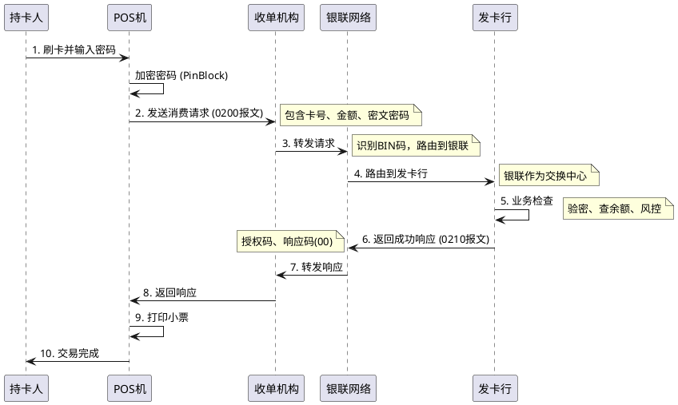

# 银行卡支付的技术原理

> **📖 阅读提示**：本文约 12000 字，预计阅读时间 25 分钟。建议按顺序阅读，本文将深入解析银行卡支付的每一个技术细节。

## 📑 文章目录

1. [引言：从一次刷卡开始](#引言从一次刷卡开始)
2. [银行卡的技术原理](#银行卡的技术原理)
3. [POS机的工作原理](#pos机的工作原理)
4. [跨行交易的技术挑战](#跨行交易的技术挑战)
5. [四方模式详解](#四方模式详解)
6. [交易流程的完整时序](#交易流程的完整时序)
7. [总结与预告](#总结与预告)

---

## 引言：从一次刷卡开始

在上一篇文章[《支付、清算、结算的本质与原理》](/posts/2025-11-15-支付清算结算的本质与原理)中，我们建立了支付清结算体系的宏观认知。今天，我们将镜头拉近，聚焦于我们最熟悉的支付工具——**银行卡**。

想象一下，你在餐厅吃完饭，服务员拿来一台 POS 机。你拿出银行卡，在机器上轻轻一刷（或一插、一挥），输入密码，"滴"的一声，小票打印出来，支付完成。

这个过程通常只需要几秒钟。但你是否想过，在这短短的几秒钟内，你的钱是如何从你的银行账户，经过复杂的网络，最终到达餐厅老板的账户的？

这背后，是一套精密运转的全球金融网络。

本文将带你拆解这台庞大的机器，从卡片的一串数字开始，深入 POS 机的内部，追踪数据报文在光缆中的飞速穿梭，最终揭开**四方模式**的神秘面纱。

---

## 一、银行卡的技术原理

> **📍 当前位置**：第一章 - 银行卡的技术原理  
> **📊 阅读进度**：第 1/6 章（约 15%）  
> **⏱️ 预计剩余时间**：21 分钟

### 1.1 银行卡的进化史：从磁条到芯片

#### 第一层：生活化类比

早期的银行卡就像**磁带**，数据存储在黑色的磁条上，容易被复制，就像磁带容易被翻录一样。现在的银行卡就像**微型电脑**（芯片卡），里面有一个智能芯片，能进行加密运算，很难被破解。

#### 第二层：技术原理解析

**磁条卡（Magnetic Stripe Card）**：
- **原理**：利用磁性材料记录数据。
- **结构**：通常有三条磁道（Track 1, 2, 3）。
  - **磁道1**：存储姓名、卡号等，只读。
  - **磁道2**：存储卡号、有效期、服务代码等，主要用于交易。
  - **磁道3**：读写磁道，用于记录余额等（较少使用）。
- **缺陷**：数据是静态的，容易被侧录器（Skimmer）复制，安全性低。

**IC卡（Integrated Circuit Card）**：
- **原理**：内置微处理器芯片，遵循 **EMV标准**（Europay, Mastercard, Visa）。
- **中国标准**：**PBOC 3.0**（People's Bank of China）。
- **优势**：
  - **动态验证**：每次交易生成唯一的动态验证码（ARQC），即使数据被截获也无法重放。
  - **存储容量大**：可以存储更多应用信息。
  - **智能处理**：卡片本身具有计算能力，可以进行脱机验证。

**NFC支付（Near Field Communication）**：
- **原理**：基于非接触式射频识别（RFID）技术。
- **应用**：云闪付、Apple Pay、华为 Pay。
- **特点**：无需物理接触，通信距离短（<10cm），安全性高。

### 1.2 卡号的秘密：BIN码与校验位

你是否观察过你的银行卡号？它不仅仅是一串随机数字，每一位都有特定的含义。

**卡号结构（遵循 ISO/IEC 7812 标准）**：

```
6222 02 10 0123456789 8
└─┬─┘ └┬┘ └────┬─────┘ └┬┘
  │    │       │        │
  │    │       │        └─ 校验位 (Check Digit)
  │    │       └────────── 个人账号标识 (Account Identifier)
  │    │
  │    └────────────────── 发卡行标识 (Issuer Identifier)
  └─────────────────────── 发卡行识别码 (BIN)
```

1.  **发卡行识别码（BIN - Bank Identification Number）**：
    - 前 6 位（部分新标准为 8 位）代表发卡机构。
    - **62 开头**：中国银联标准卡。
    - **4 开头**：Visa 卡。
    - **5 开头**：Mastercard 卡。
    - **35 开头**：JCB 卡。

2.  **个人账号标识**：
    - 中间的一串数字，由发卡行自定义，用于唯一标识持卡人账户。

3.  **校验位（Check Digit）**：
    - 最后一位数字，用于校验卡号的有效性。
    - **Luhn 算法（模10算法）**：一种简单的校验算法，用于防止输入错误。

> **💡 知识点**：为什么银联卡是 62 开头？
> 早期国内银行卡多以 4 或 5 开头，借用了 Visa 和 Mastercard 的 BIN 号段。随着银联的发展，为了确立自主标准，申请了 62 号段作为中国银联的专属标识。

### 1.3 卡片认证机制：PIN、CVV 与 3D 验证

为了证明"你是这张卡的主人"，银行卡设计了多重认证机制：

1.  **PIN 码（Personal Identification Number）**：
    - **通俗解释**：就是你的取款密码或支付密码。
    - **用途**：线下刷卡、ATM 取款时验证身份。

2.  **CVV2/CVC2（Card Verification Value）**：
    - **通俗解释**：卡背面的末三位数字。
    - **用途**：**无卡交易（CNP - Card Not Present）**，如网上支付、电话支付。
    - **安全警告**：CVV2 等同于密码，绝不能泄露给他人！

3.  **3D Secure 验证**：
    - **通俗解释**：网上支付时跳转到银行页面，需要输入手机验证码。
    - **用途**：增强网上支付的安全性，防止卡号和 CVV2 被盗用。

---

## 二、POS机的工作原理

> **📍 当前位置**：第二章 - POS机的工作原理  
> **📊 阅读进度**：第 2/6 章（约 30%）  
> **⏱️ 预计剩余时间**：18 分钟  
> **📌 相关章节**：[银行卡的技术原理](#银行卡的技术原理)

### 2.1 POS机的硬件架构

**POS机（Point of Sale）**，中文名为"销售点终端"。它不仅仅是一个读卡器，更是一台专用的安全计算机。

**核心组件**：
- **安全模块（Secure Module）**：存储密钥（TMK/TPK），负责数据加密。这是 POS 机的心脏，一旦检测到拆机，会自动自毁（擦除密钥）。
- **读卡器**：磁条读卡器、IC 卡插槽、NFC 读头。
- **通讯模块**：GPRS/4G/5G、Wi-Fi、以太网，用于连接银行网络。
- **打印机**：打印签购单（Receipt）。

### 2.2 交易流程：从插卡到打印小票

当你在 POS 机上插卡消费时，机器内部发生了什么？

1.  **读卡**：POS 机读取卡片芯片中的数据（卡号、有效期、序列号等）。
2.  **输入密码**：你在密码键盘（PinPad）上输入密码。
    - **注意**：密码在键盘内部就会被加密（PinBlock），POS 机的主板都接触不到明文密码。
3.  **组包**：POS 机将卡片信息、金额、加密后的密码等组装成一个报文。
4.  **加密上传**：使用**终端主密钥（TMK）**或**工作密钥（TPK）**对报文进行加密（MAC计算），发送给收单机构。

### 2.3 交易报文格式：ISO8583 协议详解

POS 机与后台系统对话的语言，就是 **ISO8583 协议**。它是金融交易系统的通用语言。

**ISO8583 报文结构**：

```
+----------+----------+----------+----------------------+
| 报文头   | 消息类型 | 位图     | 数据域               |
| (Header) | (MTI)    | (Bitmap) | (Data Elements)      |
+----------+----------+----------+----------------------+
```

1.  **消息类型标识（MTI - Message Type Indicator）**：
    - 4 位数字，表示报文的类型。
    - `0200`：金融交易请求（如消费）。
    - `0210`：金融交易响应（消费成功/失败）。
    - `0800`：网络管理请求（如签到）。
    - `0400`：冲正请求（交易超时，请求撤销）。

2.  **位图（Bitmap）**：
    - 就像一个目录，告诉系统后面有哪些数据域是存在的。
    - 例如：第一位是 1，表示有第 1 域；第二位是 0，表示没有第 2 域。

3.  **数据域（Data Elements）**：
    - 具体的交易信息，共有 128 个或 64 个域。
    - **2域**：主账号（卡号）。
    - **3域**：交易处理码（区分是消费、预授权还是查询）。
    - **4域**：交易金额。
    - **49域**：交易货币代码（156 代表人民币）。
    - **52域**：个人标识码数据（加密后的密码 PinBlock）。

> **💡 技术细节**：ISO8583 报文非常精简，为了节省早期的网络带宽，它使用了大量的压缩编码（BCD 码）。解析 ISO8583 报文是支付开发工程师的基本功。

---

## 三、跨行交易的技术挑战

> **📍 当前位置**：第三章 - 跨行交易的技术挑战  
> **📊 阅读进度**：第 3/6 章（约 45%）  
> **⏱️ 预计剩余时间**：14 分钟

### 3.1 为什么需要清算网络？

假设没有银联这样的清算组织，世界会变成什么样？

**直连模式的困境（N×N 的连接复杂度）**：

如果每家银行都要和所有其他银行直接连接：
- 工商银行要连建设银行、农业银行、中国银行...
- 招商银行要连工商银行、建设银行...
- 商户要摆满几十台 POS 机，工行的卡刷工行的机，招行的卡刷招行的机。

这就导致了 **N×N 的连接复杂度**。如果有 100 家银行，就需要 `100 * 99 / 2 = 4950` 条专线。这在技术上和成本上都是不可接受的。

### 3.2 转接模式的优势：星型拓扑结构

为了解决这个问题，**清算组织（Clearing House）** 应运而生。在中国，就是**中国银联（China UnionPay）**。

**转接模式（Switching Mode）**：
所有银行都只连接到银联，由银联负责转发交易。

- **拓扑结构**：从网状结构变为**星型结构**。
- **连接数**：从 N×N 变为 N。
- **商户体验**：只需要一台 POS 机，就能刷所有银行的卡。

**银联的角色**：
- **路由（Routing）**：看到是工行的卡，就转给工行；看到是招行的卡，就转给招行。
- **标准（Standard）**：制定统一的报文标准（ISO8583 银联变体）和卡片标准。
- **清算（Clearing）**：每天算清楚各家银行之间的账。

---

## 四、四方模式详解

> **📍 当前位置**：第四章 - 四方模式详解  
> **📊 阅读进度**：第 4/6 章（约 60%）  
> **⏱️ 预计剩余时间**：10 分钟

银行卡支付体系的核心商业模式，被称为**四方模式（Four-Party Scheme）**。理解了四方模式，就理解了支付行业的利益分配机制。

### 4.1 四方角色的定义

1.  **持卡人（Cardholder）**：
    - **定义**：手持银行卡消费的消费者（你）。
    - **诉求**：便捷支付，资金安全。

2.  **商户（Merchant）**：
    - **定义**：提供商品或服务，收取资金的商家（餐厅老板）。
    - **诉求**：收到钱，费率低，客源多。

3.  **收单机构（Acquirer）**：
    - **定义**：负责把 POS 机布放给商户，并帮商户收钱的机构。
    - **身份**：可以是银行（如工行收单），也可以是第三方支付公司（如银联商务、拉卡拉）。
    - **职责**：商户审核、POS 机维护、资金结算给商户。
    - **通俗解释**：商户的"管家"，帮商户收钱。

4.  **发卡机构（Issuer）**：
    - **定义**：发行银行卡给持卡人的银行（如你的工资卡所属银行）。
    - **职责**：账户管理、扣款授权、持卡人信用评估。
    - **通俗解释**：持卡人的"管家"，管持卡人的钱。

5.  **卡组织/清算组织（Card Scheme / Network）**：
    - **定义**：连接收单机构和发卡机构的枢纽（如中国银联、Visa）。
    - **职责**：交易转接、资金清算、品牌运营。
    - **通俗解释**：连接两个"管家"的桥梁。

> **📝 注**：虽然叫"四方模式"，但其实有五个角色（加上卡组织）。因为卡组织通常被视为基础设施，所以商业上称为四方。

### 4.2 资金流转与手续费分润

当你刷卡消费 100 元时，商户实际收到的钱通常少于 100 元（例如 99.4 元）。中间的差额（0.6 元）就是**手续费（MDR - Merchant Discount Rate）**。

这 0.6 元手续费去哪了？它被三方瓜分了：

**传统的"721"分配比例（2016年费改前）**：
- **发卡行**：拿走 70%（0.42 元）。因为发卡行承担了资金成本和坏账风险。
- **收单机构**：拿走 20%（0.12 元）。因为收单机构提供了 POS 机和服务。
- **银联**：拿走 10%（0.06 元）。因为银联提供了网络通道。

**96费改后的新机制（2016年后）**：
- **发卡行**：实行封顶制（借记卡）或不封顶（贷记卡），费率固定。
- **银联**：收取网络服务费。
- **收单机构**：实行市场调节价，盈亏自负。

> **💡 思考**：为什么发卡行拿大头？
> 因为发卡行承担了最大的风险（如信用卡透支不还）和成本（免息期资金成本、积分权益成本）。收单机构虽然干活多（装机、巡检），但风险相对较小。

---

## 五、交易流程的完整时序

> **📍 当前位置**：第五章 - 交易流程的完整时序  
> **📊 阅读进度**：第 5/6 章（约 80%）  
> **⏱️ 预计剩余时间**：5 分钟

让我们把所有角色串联起来，看一次完整的刷卡交易是如何完成的。

### 5.1 授权请求（Authorization Request）

这是支付发生的瞬间（T+0 实时）。



**关键步骤解析**：
1.  **加密传输**：从 POS 机出来的密码就是加密的，收单机构和银联都无法解密，只有发卡行能解密验证。
2.  **交易路由**：银联根据卡号前几位（BIN码）判断是哪家银行的卡，将报文转发给对应的银行系统。
3.  **授权**：发卡行冻结或扣除持卡人资金，返回授权成功的信号。

### 5.2 清算与结算（Clearing & Settlement）

这是支付发生后的后台处理（通常是 T+1）。

1.  **日切（Day Cut）**：每天晚上 23:00-24:00（具体时间视系统而定），银联系统进行日切，停止受理当天的清算数据，开始处理。
2.  **清算（Clearing）**：
    - 银联把这一天所有工行的卡在招行 POS 机上的消费找出来。
    - 算出工行该给招行多少钱（扣除手续费后）。
    - 生成**清算文件**，发给各家银行。
3.  **结算（Settlement）**：
    - 次日中午，银联通过**央行大额支付系统**，指令央行从工行的备付金账户扣钱，转入招行的备付金账户。
    - 招行收到钱后，再把钱结算给商户。

---

## 六、总结与预告

> **📊 阅读进度**：第 6/6 章（100%）  
> **🎉 恭喜完成阅读！**

### 核心要点回顾

1.  **银行卡技术**：从磁条到芯片，安全性不断升级。卡号（BIN码）决定了卡片的归属。
2.  **POS机原理**：它是安全的金融终端，使用 ISO8583 协议与后台对话。
3.  **转接清算**：为了解决 N×N 的连接难题，引入了银联作为中心枢纽，形成星型网络。
4.  **四方模式**：持卡人、商户、收单机构、发卡行（+银联）构成了稳定的商业生态，通过手续费分润维持运转。
5.  **交易时序**：实时的授权交易 + 延时的清算结算，构成了完整的资金流转。

### 关键概念速查

| 概念 | 英文 | 通俗解释 | 核心要点 |
|:---|:---|:---|:---|
| **BIN码** | Bank Identification Number | 银行的身份证号 | 卡号前6位，标识发卡行 |
| **ISO8583** | ISO8583 | 金融系统的通用语言 | 交易报文的标准格式 |
| **四方模式** | Four-Party Scheme | 支付行业的商业游戏规则 | 明确了各方职责和分润机制 |
| **收单机构** | Acquirer | 商户的管家 | 帮商户收钱，维护POS机 |
| **发卡行** | Issuer | 持卡人的管家 | 管账户，管扣款 |
| **MDR** | Merchant Discount Rate | 刷卡手续费 | 商户付出的成本，各方分润的来源 |

### 下篇预告

理解了银行卡支付，你可能会问：**银联作为这个网络的核心，它的内部系统是如何设计的？它是如何保证每天亿万笔交易不出错的？**

在下一篇文章[《中国银联的清算原理与技术架构》](#)中，我们将深入银联内部，解析：
- 银联核心系统的架构设计
- 交易路由算法是如何实现的
- 日切与轧差的具体技术实现
- 备付金账户的资金流转细节

敬请期待！

---

## 参考资料

1.  **标准规范**：
    - ISO 8583: Financial transaction card originated messages
    - PBOC 3.0: 中国金融集成电路(IC)卡规范
2.  **行业文档**：
    - 中国银联银行卡联网联合技术规范
    - 银行卡收单业务管理办法

---

**最后更新**：2025-11-19  
**系列文章**：[中国线上支付与清结算体系深度解析系列](/posts/2025-11-15-支付清算结算的本质与原理)  
**下一篇**：[中国银联的清算原理与技术架构](#)（即将发布）

