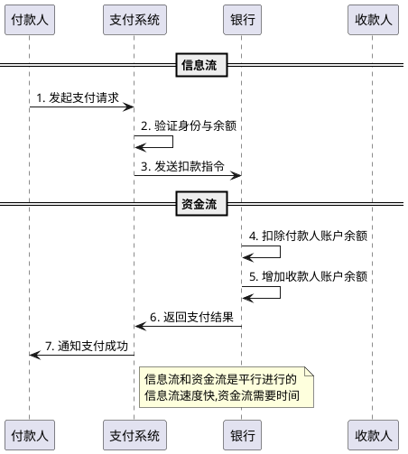
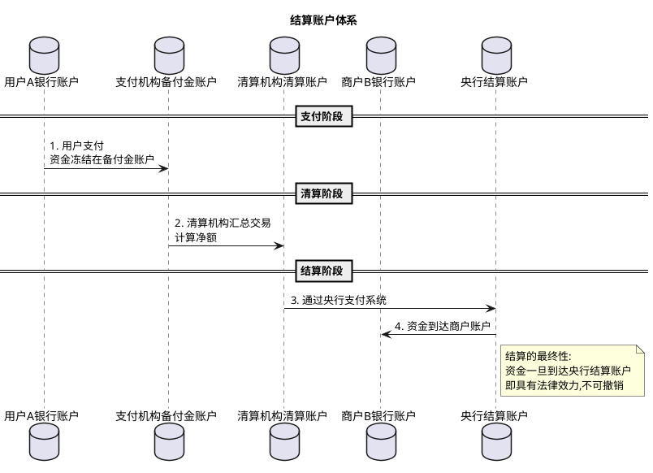
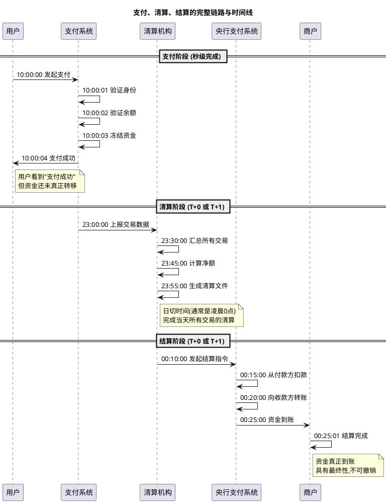
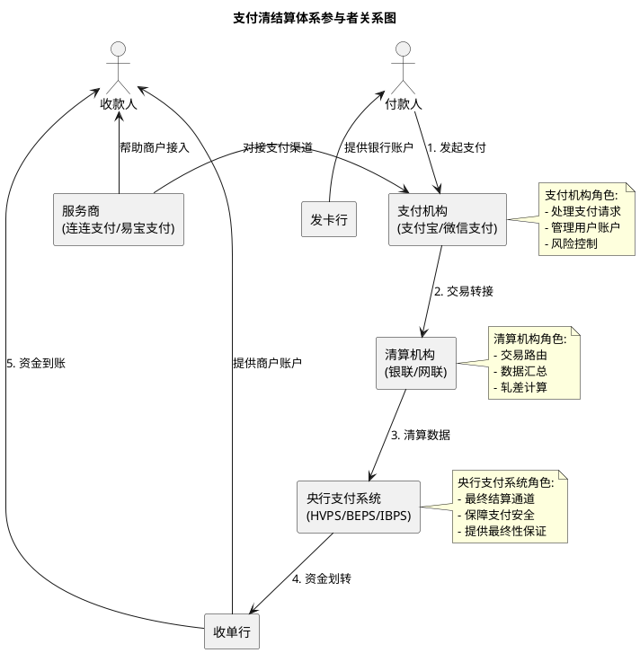

# 支付、清算、结算的本质与原理

> **📖 阅读提示**：本文约 10000 字,预计阅读时间 15 分钟。建议按顺序阅读,每个概念都建立在前一个概念的基础上。本文是《中国线上支付与清结算体系深度解析》系列文章的第一篇,旨在建立对支付清结算体系的原理级认知。

## 📑 文章目录

1. [引言:从生活场景开始](#引言从生活场景开始)
2. [支付的本质](#支付的本质)
3. [清算的原理](#清算的原理)
4. [结算的原理](#结算的原理)
5. [三者的关系](#三者的关系)
6. [支付参与者的角色定位](#支付参与者的角色定位)
7. [总结与预告](#总结与预告)

---

## 引言:从生活场景开始

想象一下,周末你和三个朋友一起聚餐,大家点了很多菜,最后账单总共 800 元。结账时,大家决定 AA 制,每个人应该付 200 元。

小李先垫付了 800 元结账,然后你们三个分别给小李转账 200 元。整个过程看似简单,但实际上包含了三个关键环节:

1. **支付**:你打开微信,给小李转账 200 元,点击"确认支付"
2. **清算**:微信系统汇总所有转账记录,计算出应该从你的账户扣多少钱,给小李的账户加多少钱
3. **结算**:银行真正把 200 元从你的银行卡转到小李的银行卡

这三个环节,就是我们今天要深入理解的**支付、清算、结算**。它们是整个支付体系的核心,理解了这三个概念,就理解了资金流转的完整链路。

> **💡 思考**:为什么不能直接把钱转过去?为什么需要分成三个步骤?这就是支付清结算体系设计的精妙之处。

---

## 支付的本质

### 什么是支付?

**支付(Payment)** 是资金从一方转移到另一方的过程。但这个"转移"并不是真正的现金交付,而是一次**支付指令的传递**和**账户余额的变动**。

想象一下,你给朋友转账 100 元。你可能以为是把 100 元"移动"到了朋友的账户,但实际上发生的是:

1. 你的银行账户余额减少 100 元
2. 朋友的银行账户余额增加 100 元
3. 真实的现金并没有移动,只是两个账本上的数字发生了变化

这就是支付的本质:**账户余额的记账变动**。

### 支付的两个核心过程

支付包含两个平行的过程:

**1. 信息流(支付指令的传递)**

- 你在手机上点击"支付"按钮
- 支付指令通过网络传递给支付系统
- 支付系统验证你的身份和余额
- 支付系统向银行发送扣款指令

**2. 资金流(账户余额的变动)**

- 银行接收到扣款指令
- 从你的账户扣除金额
- 向收款方的账户增加金额
- 完成资金转移



**关键理解**:

- **信息流是快速的**:支付指令几乎是瞬间传递的
- **资金流是相对慢的**:真正的账户变动需要时间
- **支付完成 ≠ 资金到账**:你看到"支付成功",只是信息流完成了,资金流可能还在进行中

### 支付授权与验证机制

为了保证支付的安全性,支付系统需要进行多重验证:

**身份验证**:

- **支付密码**:验证是本人操作
- **生物识别**:指纹、面部识别等
- **短信验证码**:进一步确认身份

**余额验证**:

- 检查账户余额是否足够
- 检查是否有支付限额
- 检查账户状态是否正常

**风险验证**:

- 检测是否有异常交易
- 评估交易风险等级
- 必要时触发人工审核

> **⚠️ 重要**:这些验证都发生在支付阶段,在资金真正转移之前。验证通过后,支付系统才会向银行发送扣款指令。

### 支付的完成标志

在支付清结算体系中,我们说"支付完成"通常指:

- 支付指令已经被接受
- 身份验证已经通过
- 余额验证已经通过
- 支付系统已经记录了这笔交易

**但此时资金并未真正到账,还需要经过清算和结算环节。**

> **💡 思考**:既然支付只是发送指令,为什么不能立即到账?这就引出了我们下一个要理解的概念——清算。

---

## 清算的原理

### 为什么需要清算?

继续我们聚餐的例子。假设:

- 你给小李转账 200 元(吃饭的钱)
- 小李给你转账 150 元(你帮他买书的钱)
- 小张给你转账 100 元(还你上次借的钱)
- 你给小张转账 50 元(请他喝咖啡)

如果每笔交易都单独处理,银行需要处理 4 笔转账。但仔细算算:

- 你和小李之间:你给他 200,他给你 150,**净额是你付给小李 50 元**
- 你和小张之间:你给他 50,他给你 100,**净额是小张付给你 50 元**
- 最终结果:**你的余额不变**(收 50 + 支出 50 = 0)

通过计算净额,原本 4 笔交易可以简化为 2 笔,甚至在你的账户上可以抵消为 0。这就是**清算的核心思想——轧差计算**。

### 什么是清算?

**清算(Clearing)** 是支付机构之间对交易数据进行汇总、轧差,计算应收应付金额的过程。

**通俗解释**:清算就是把所有交易记录汇总起来,算出谁该给谁多少钱的过程。就像朋友聚餐 AA 制,每个人先记录自己付了多少钱、吃了多少菜,最后统一算账,看谁该给谁多少钱。

**专业定义**:清算是对交易数据进行收集、整理、核对、汇总,并计算出参与者之间应收应付净额的过程。清算的结果是一组清算文件,记录了各方之间的资金差额。

### 清算的核心:轧差计算

**轧差(Netting)** 是清算的核心算法,用于计算应收应付的差额。

**双边轧差**:

假设银行 A 和银行 B 之间有以下交易:

- 银行 A 的客户向银行 B 的客户转账:总共 1000 万元
- 银行 B 的客户向银行 A 的客户转账:总共 800 万元

**双边轧差结果**:银行 A 向银行 B 支付 200 万元(1000 - 800 = 200)

**多边轧差**:

假设有 A、B、C 三家银行:

- A → B: 1000 万元
- B → C: 800 万元  
- C → A: 500 万元

通过多边轧差计算,可以找到最优的资金流转路径,减少实际的资金划转次数。

```plantuml
@startuml
!define BANK rectangle

title 轧差计算示例

BANK "银行 A" as BankA
BANK "银行 B" as BankB
BANK "银行 C" as BankC

== 清算前:所有交易 ==
BankA -right-> BankB: 1000万
BankB -right-> BankC: 800万
BankC -up-> BankA: 500万

note bottom of BankA
  清算前需要3笔资金划转
  总金额: 2300万
end note

== 清算后:净额结算 ==
BankA -right-> BankB: 200万
BankB -right-> BankC: 300万

note bottom of BankB
  清算后只需2笔资金划转
  总金额: 500万
  效率提升 78%
end note
@enduml
```

### 清算的时机

清算可以在不同时机进行:

**实时清算(Real-time Clearing)**:

- **定义**:交易完成后立即进行清算
- **优点**:资金到账快,用户体验好
- **缺点**:系统压力大,成本高
- **适用场景**:小额高频交易(如二维码支付)

**批量清算(Batch Clearing)**:

- **定义**:把一段时间内的所有交易汇总后统一清算
- **优点**:效率高,成本低
- **缺点**:资金到账慢
- **适用场景**:大额低频交易(如银行卡刷卡)

**日切(Day Cut)**:

- **定义**:每天结束时的清算时间点,通常在凌晨 0 点或 1 点
- **作用**:作为清算的时间分界点,确定交易归属哪一天
- **类比**:就像商店每天打烊后盘点当天的营业额

### 清算的数据结构

清算过程会生成多种数据文件:

**交易明细文件**:

| 字段 | 说明 | 示例 |
|:---|:---|:---|
| 交易流水号 | 唯一标识一笔交易 | 20251120001234567 |
| 交易时间 | 交易发生的时间 | 2025-11-20 14:30:25 |
| 付款方 | 付款方的标识 | 工商银行 |
| 收款方 | 收款方的标识 | 建设银行 |
| 交易金额 | 交易的金额 | 1000.00 |
| 交易类型 | 交易的类型 | 转账 |

**轧差结果文件**:

| 字段 | 说明 | 示例 |
|:---|:---|:---|
| 机构代码 | 参与清算的机构 | 工商银行 |
| 应收金额 | 该机构应收的总金额 | 5000.00 |
| 应付金额 | 该机构应付的总金额 | 3000.00 |
| 净额 | 应收 - 应付 | 2000.00 |
| 清算日期 | 清算的日期 | 2025-11-20 |

### 清算的算法原理

清算算法的数学原理:

**1. 交易汇总**:

对所有交易按参与方分组:

```
交易集合 T = {t1, t2, t3, ..., tn}
对于参与方 i:
  应收总额 = Σ(所有收款方为 i 的交易金额)
  应付总额 = Σ(所有付款方为 i 的交易金额)
```

**2. 轧差计算**:

计算净额:

```
净额 = 应收总额 - 应付总额
如果净额 > 0: 该参与方应收
如果净额 < 0: 该参与方应付
如果净额 = 0: 收支平衡
```

**3. 多边轧差优化**:

通过图论算法找到最优的资金流转路径:

- 将参与方视为图的节点
- 将应付关系视为图的边
- 使用最小费用最大流算法优化资金路径

> **💡 技术深度**:多边轧差的数学模型可以用线性规划求解,目标函数是最小化资金流转的总笔数和总金额。

### 清算的完成标志

清算完成后,会生成清算文件,包含:

- 所有交易的明细
- 各参与方的应收应付金额
- 净额结算的指令

**但此时资金还未真正划转,还需要结算环节来完成最终的资金转移。**

> **💡 思考**:清算只是算账,算出了谁该给谁多少钱。但钱还没有真正转,这就需要我们下一个要理解的概念——结算。

---

## 结算的原理

### 什么是结算?

**结算(Settlement)** 是根据清算结果,进行实际资金划转的过程。

**通俗解释**:结算就是真正把钱转过去的过程。清算算出了"应该转多少钱",结算就是"真的把钱转过去"。就像朋友聚餐 AA 制,算完账后,该给钱的人真的把钱转给对方,这就是结算。

**专业定义**:结算是根据清算结果,通过资金账户体系,完成参与者之间实际资金划拨的过程。结算的最终性(Finality)意味着资金划转完成后不可撤销。

### 结算的账户体系

结算需要依托账户体系来完成资金划转:

**备付金账户(Reserve Fund Account)**:

- **定义**:支付机构在银行开设的专用账户,用于存放客户的资金
- **通俗解释**:就像你在支付宝的余额,实际上存放在支付宝在银行开设的备付金账户里
- **监管要求**:2019 年起,所有备付金必须集中存管在央行,由央行统一监管

**清算账户(Clearing Account)**:

- **定义**:清算机构(如银联、网联)在银行开设的专用账户,用于清算业务
- **作用**:作为资金流转的中转站,连接各参与方的账户

**结算账户(Settlement Account)**:

- **定义**:银行在央行开设的账户,用于银行间资金结算
- **作用**:通过央行支付系统完成最终的资金划转



### 结算的时效性

结算的时效性决定了资金到账的速度:

**T+0(当天结算)**:

- **含义**:交易当天完成结算
- **优点**:资金到账快,用户体验好
- **缺点**:系统压力大,成本高
- **适用场景**:小额支付、紧急资金需求
- **英文**:Same-day Settlement

**T+1(次日结算)**:

- **含义**:交易次日完成结算(T = Transaction Date,交易日)
- **优点**:平衡效率和成本
- **缺点**:资金到账有延迟
- **适用场景**:大部分支付场景
- **英文**:Next-day Settlement

**D+1(自然日+1结算)**:

- **含义**:交易后第二个自然日结算(D = Day,自然日)
- **区别**:T+1 是工作日,D+1 是自然日(包括周末和节假日)
- **适用场景**:特定业务场景

**时效性示例**:

假设周五下午 3 点发生一笔交易:

- **T+0**:周五当天到账
- **T+1**:下周一到账(因为周六日不是工作日)
- **D+1**:周六到账(自然日)

### 结算的最终性

**最终性(Finality)** 是结算的核心特征,指资金划转完成后具有法律效力,不可撤销。

**为什么需要最终性?**

想象一下,如果资金到账后还能撤销:

- 商户发货后,买家撤销支付,商户损失惨重
- 银行之间的结算互相撤销,整个金融体系陷入混乱

**最终性的法律保障**:

- 通过法律明确结算的不可撤销性
- 通过技术确保结算过程的原子性(要么全部完成,要么全部回滚)
- 通过监管确保参与方遵守规则

**最终性的时间点**:

不同的支付系统,最终性的时间点不同:

- **实时支付系统**:交易完成即具有最终性
- **批量支付系统**:清算完成后具有最终性
- **银行卡支付**:结算完成后具有最终性

### 结算的资金流转

结算过程中的资金流转路径:

**1. 付款方账户扣款**:

- 银行从付款方账户扣除金额
- 资金进入银行的清算账户

**2. 通过清算机构转接**:

- 清算机构根据清算结果,指示银行进行资金划转
- 资金在清算机构的账户中流转

**3. 通过央行支付系统划转**:

- 对于跨行交易,资金通过央行支付系统划转
- 央行支付系统是最终的结算通道

**4. 收款方账户入账**:

- 银行向收款方账户增加金额
- 结算完成,资金到账

```plantuml
@startuml
start

:付款方发起支付;

:支付系统验证;

if (验证通过?) then (是)
  :冻结付款方账户资金;
  
  == 清算阶段 ==
  :清算机构汇总交易;
  :计算净额;
  :生成清算文件;
  
  == 结算阶段 ==
  :从付款方账户扣款;
  :资金进入清算账户;
  
  if (跨行交易?) then (是)
    :通过央行支付系统;
  else (否)
    :银行内部划转;
  endif
  
  :资金到达收款方账户;
  :结算完成,具有最终性;
  
  :通知付款方和收款方;
  
  stop
  
else (否)
  :返回错误;
  stop
endif
@enduml
```

### 结算的风险控制

结算过程中需要控制多种风险:

**流动性风险**:

- **风险**:参与方账户余额不足,无法完成结算
- **控制**:要求参与方在结算前准备足够的资金

**信用风险**:

- **风险**:参与方违约,拒绝支付
- **控制**:通过法律约束和监管要求确保履约

**操作风险**:

- **风险**:系统故障、人为错误导致结算失败
- **控制**:多重验证、备份系统、应急预案

> **⚠️ 重要**:结算是资金流转的最后一环,也是风险最高的一环。一旦结算完成,资金就真正转移了,具有不可撤销性。

---

## 三者的关系

### 支付、清算、结算的完整链路

现在我们把三个环节串起来,看看一笔支付从开始到结束的完整过程:

**1. 支付阶段(Payment)**:

- **时间**:用户点击"支付"按钮的瞬间
- **动作**:发送支付指令,验证身份和余额,冻结资金
- **结果**:用户看到"支付成功",但资金还未真正转移
- **时效**:秒级完成

**2. 清算阶段(Clearing)**:

- **时间**:定期进行(实时清算或日终清算)
- **动作**:汇总交易数据,计算净额,生成清算文件
- **结果**:算出了各方之间应该转多少钱
- **时效**:T+0 或 T+1

**3. 结算阶段(Settlement)**:

- **时间**:根据清算结果进行
- **动作**:真正的资金划转,通过央行支付系统完成
- **结果**:资金真正到账,具有最终性
- **时效**:T+0 或 T+1



### 时间顺序与依赖关系

三个环节之间的依赖关系:

**支付 → 清算**:

- 支付完成后,交易数据进入清算队列
- 清算依赖支付产生的交易数据
- 没有支付就没有清算

**清算 → 结算**:

- 清算完成后,生成结算指令
- 结算依赖清算计算的净额
- 没有清算就没有结算

**完整依赖链**:

```
支付(产生交易) → 清算(计算净额) → 结算(划转资金)
     ↓                 ↓                 ↓
  交易记录         清算文件          资金到账
  (秒级)          (T+0/T+1)        (T+0/T+1)
```

### 各环节的技术实现要点

**支付阶段的技术要点**:

- **API 设计**:统一的支付接口,支持多种支付方式
- **安全机制**:加密传输、签名验证、防重放攻击
- **性能优化**:高并发处理、异步通知
- **用户体验**:支付流程简洁、反馈及时

**清算阶段的技术要点**:

- **数据汇总**:高效的交易数据收集和存储
- **轧差算法**:准确的净额计算,支持双边和多边轧差
- **文件生成**:标准化的清算文件格式
- **容错机制**:交易对账、异常处理

**结算阶段的技术要点**:

- **账户管理**:准确的账户余额管理和资金划转
- **原子性保证**:确保结算的原子性(要么全部成功,要么全部失败)
- **最终性保证**:通过技术和法律确保结算的不可撤销性
- **监控告警**:实时监控结算状态,及时处理异常

### 为什么要分成三个阶段?

你可能会问:为什么不能支付完成后立即结算,非要分成三个阶段呢?

**原因一:效率优化**

- 通过清算的轧差计算,可以大幅减少实际的资金划转次数
- 例如:100 笔交易通过轧差可能只需要 10 笔实际划转

**原因二:成本降低**

- 每次资金划转都有成本(通道费、手续费)
- 通过清算汇总,可以降低总体成本

**原因三:风险控制**

- 清算阶段可以进行全面的风险审查
- 发现异常交易可以在结算前拦截

**原因四:系统稳定**

- 将海量的支付请求与相对少量的结算操作分离
- 避免支付系统直接与银行核心系统对接,降低系统耦合度

> **💡 技术洞察**:支付、清算、结算的三阶段设计,是金融系统在效率、成本、风险、稳定性之间的最优平衡。

---

## 支付参与者的角色定位

在支付清结算体系中,有多个参与者,每个参与者都有明确的角色定位和技术职责。理解各方的身份和职责,是理解整个支付体系的关键。

### 付款人与收款人

**付款人(Payer)**:

- **身份**:支付的发起方,资金流转的起点
- **角色**:发起支付请求,授权扣款
- **技术职责**:
  - 持有支付工具(银行卡、支付账户等)
  - 发起支付指令
  - 承担支付责任

**收款人(Payee)**:

- **身份**:支付的接收方,资金流转的终点
- **角色**:接收支付,提供商品或服务
- **技术职责**:
  - 持有收款账户
  - 接收支付通知
  - 确认交易完成

### 支付机构

**支付机构(Payment Institution)**:

- **身份**:有支付牌照,可以处理支付的公司
- **典型代表**:支付宝、微信支付(财付通)、银联商务
- **角色**:支付指令的处理者,连接用户和银行
- **技术职责**:
  - 接收和处理支付请求
  - 管理用户账户和余额
  - 与银行对接,完成资金划转
  - 提供支付API和SDK
  - 进行风险控制和反欺诈

**监管要求**:

- 必须持有支付牌照(由央行发放)
- 备付金必须集中存管在央行
- 接受央行监管,定期报送数据

### 清算机构

**清算机构(Clearing Organization)**:

- **身份**:负责汇总交易、计算资金差额的机构
- **典型代表**:
  - **银联(China UnionPay)**:银行卡清算组织
  - **网联(NUCC - Non-bank payment institutions' UnionClearingCorporation)**:网络支付清算平台
- **角色**:交易数据的汇总与轧差计算者
- **技术职责**:
  - 交易路由:将交易请求转发到正确的目标
  - 数据汇总:收集所有交易记录
  - 轧差计算:计算各方之间的资金差额
  - 生成清算文件:提供给结算环节使用

**银联与网联的区别**:

| 维度 | 银联 | 网联 |
|:---|:---|:---|
| 成立时间 | 2002年 | 2017年 |
| 业务范围 | 银行卡清算 | 网络支付清算 |
| 服务对象 | 银行 | 支付机构 |
| 典型场景 | POS刷卡、ATM取款 | 扫码支付、APP支付 |

### 结算机构

**结算机构(Settlement Institution)**:

- **身份**:资金的实际划转执行者
- **典型代表**:
  - **央行支付系统**:最终的结算通道
    - 大额支付系统(HVPS - High Value Payment System)
    - 小额支付系统(BEPS - Bulk Electronic Payment System)
    - 网上支付跨行清算系统(IBPS - Internet Banking Payment System)
  - **商业银行**:提供结算账户
- **角色**:完成最终的资金划转
- **技术职责**:
  - 提供结算账户
  - 执行资金划转指令
  - 确保结算的最终性
  - 资金流动性管理

**央行支付系统的作用**:

- 作为银行间资金划转的最终通道
- 保障支付系统的安全稳定
- 提供结算的最终性保证

### 银行

**银行(Bank)**:

- **身份**:资金账户的托管者
- **两种角色**:
  - **发卡行(Issuer)**:持卡人的银行,负责发卡和管理账户
  - **收单行(Acquirer)**:商户的银行,负责接收商户的收款

**发卡行的技术职责**:

- 发行银行卡
- 管理持卡人账户
- 验证持卡人身份
- 授权交易(余额验证、风险控制)
- 从持卡人账户扣款

**收单行的技术职责**:

- 为商户提供收款服务
- 管理商户账户
- 接收支付款项
- 向商户结算资金

### 服务商

**服务商(Service Provider)**:

- **身份**:帮助商户接入支付服务的公司
- **典型代表**:连连支付、易宝支付、拉卡拉
- **角色**:技术服务提供者,连接商户和支付机构
- **技术职责**:
  - 帮助商户接入支付渠道
  - 提供支付技术服务
  - 资金归集与分账(如果有支付牌照)
  - 对账与财务服务

**服务商的合规要求**:

- **有支付牌照的服务商**:可以处理资金,提供完整的支付服务
- **无支付牌照的服务商**:只能提供技术服务,不能触碰资金

### 各参与者的关系图



### 关键理解

**层次结构**:

```
第一层:央行支付系统 (最终结算)
   ↓
第二层:清算机构 (银联/网联)
   ↓
第三层:支付机构 (支付宝/微信支付)
   ↓
第四层:银行 (发卡行/收单行)
   ↓
第五层:用户与商户
```

**资金流向**:

```
用户 → 发卡行 → 支付机构 → 清算机构 → 央行 → 收单行 → 商户
```

**信息流向**:

```
用户 → 支付机构 → 清算机构 → 发卡行/收单行
```

> **💡 关键洞察**:支付清结算体系是一个多层次、多参与者的复杂系统。每个参与者都有明确的角色定位和技术职责,通过层层协作,共同完成资金的安全、高效流转。

---

## 总结与预告

### 本文核心要点

通过本文,我们深入理解了支付清结算体系的三个核心环节:

**1. 支付(Payment)**:

- **本质**:支付指令的传递和账户余额的变动
- **核心**:信息流(快)与资金流(慢)的分离
- **关键**:身份验证、余额验证、风险验证

**2. 清算(Clearing)**:

- **本质**:交易数据的汇总与轧差计算
- **核心**:通过轧差减少实际资金划转次数
- **关键**:交易明细、净额计算、清算文件

**3. 结算(Settlement)**:

- **本质**:根据清算结果进行实际资金划转
- **核心**:通过账户体系完成资金转移
- **关键**:最终性、不可撤销性、时效性(T+0/T+1)

**三者的关系**:

- 支付产生交易数据
- 清算计算资金差额
- 结算完成资金划转
- 三个阶段依次进行,缺一不可

**参与者角色**:

- 付款人/收款人:交易的发起方和接收方
- 支付机构:处理支付请求
- 清算机构:汇总交易、计算净额
- 结算机构:执行资金划转
- 银行:提供账户服务
- 服务商:提供技术服务

### 为什么这三个概念如此重要?

理解支付、清算、结算,就是理解了整个金融支付体系的核心逻辑。无论是:

- 银行卡支付
- 移动支付(微信支付、支付宝)
- 跨境支付
- 数字人民币

所有的支付场景,都遵循这三个基本环节。掌握了这三个概念,就掌握了理解所有支付系统的钥匙。

### 思考题

在继续阅读下一篇文章之前,请思考以下问题:

1. 为什么微信转账可以秒到账,但信用卡还款却需要 T+1?
2. 银行卡刷卡支付时,钱是如何从你的银行卡流转到商户的银行账户的?
3. 如果你的发卡行和商户的收单行是同一家银行,资金流转会有什么不同?
4. 为什么需要银联和网联这样的清算组织?银行之间直接对接不行吗?

这些问题,我们将在接下来的文章中逐一解答。

### 下篇预告

在下一篇文章《银行卡支付的技术原理》中,我们将深入探讨:

- **银行卡的技术原理**:磁条卡、IC卡、NFC的技术差异
- **POS机的工作原理**:从刷卡到资金到账的完整技术链路
- **ISO8583协议**:银行卡交易的通信协议
- **四方模式**:持卡人、商户、收单机构、发卡机构之间的资金流转

我们将从你刷银行卡的那一刻开始,跟踪资金的完整流转路径,深入理解银行卡支付背后的技术奥秘。

---

## 参考资料

1. 中国人民银行,《支付体系概览》
2. 中国银联,《银行卡产业发展报告》
3. 网联清算有限公司,《网络支付清算业务指引》
4. 《非金融机构支付服务管理办法》(中国人民银行令〔2010〕第2号)
5. 国际清算银行(BIS),《支付系统原理与实践》

---

**系列文章导航**:

- **第一篇:支付、清算、结算的本质与原理**(本文)
- 第二篇:银行卡支付的技术原理(即将发布)
- 第三篇:中国银联的清算原理与技术架构(即将发布)
- 第四篇:第三方支付的技术原理与资金流转(即将发布)
- 第五篇:移动支付的技术原理(即将发布)

**最后更新**:2025-11-20  
**作者**:博客维护团队  
**系列**:中国线上支付与清结算体系深度解析

---

> **📢 互动交流**:如果你对本文有任何疑问或建议,欢迎在评论区留言讨论。如果觉得本文对你有帮助,欢迎分享给更多对支付技术感兴趣的朋友!

