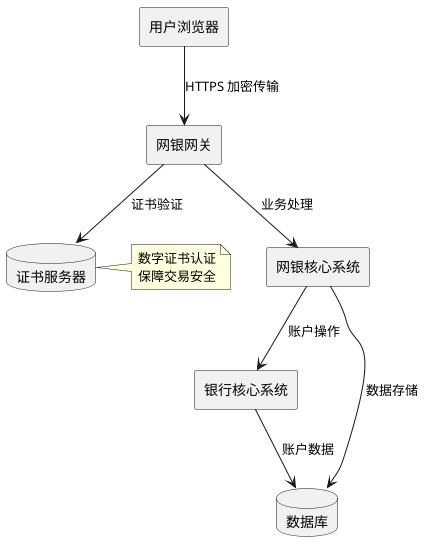
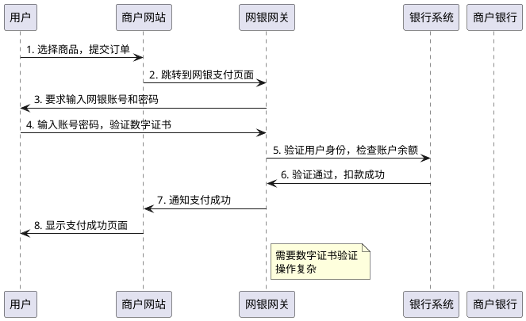
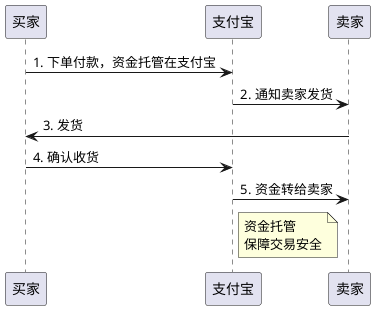
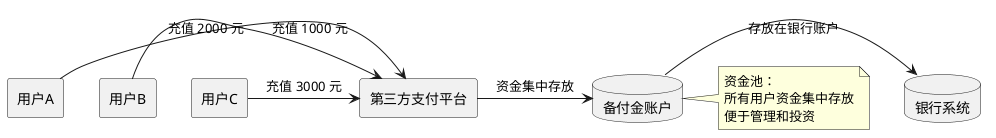
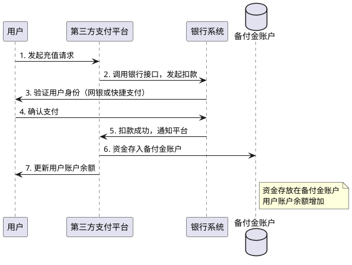
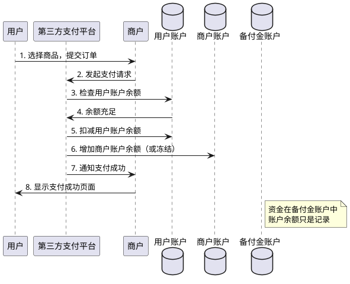
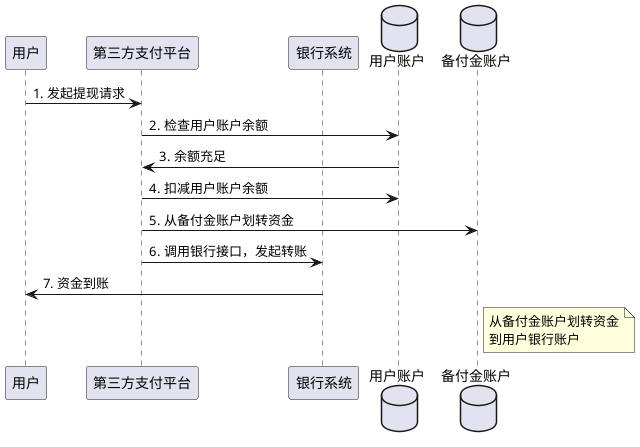
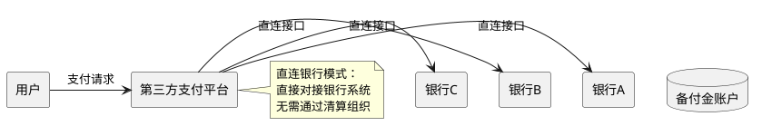
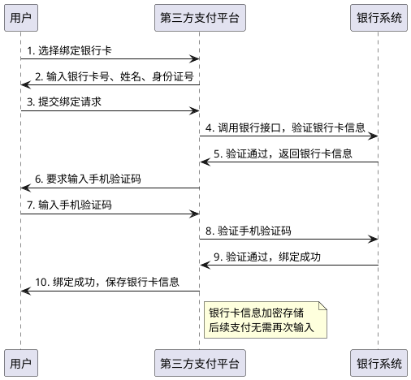
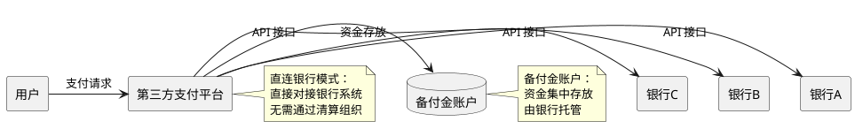

# 第三方支付的技术原理与资金流转

> **📖 阅读提示**：本文约 10000 字，预计阅读时间 18 分钟。建议按顺序阅读，每个概念都建立在前一个概念的基础上。

## 📑 文章目录

1. [引言：从网购支付说起](#引言从网购支付说起)
2. [网上银行的技术实现](#网上银行的技术实现)
3. [第三方支付的诞生背景](#第三方支付的诞生背景)
4. [第三方支付的技术架构](#第三方支付的技术架构)
5. [快捷支付的技术原理](#快捷支付的技术原理)
6. [第三方支付与银行的关系](#第三方支付与银行的关系)
7. [总结与预告](#总结与预告)

---

## 引言：从网购支付说起

想象一下，你在 2003 年的淘宝网上看中了一件商品，想要购买。但是，你面临一个根本问题：**是先付款，还是先收货？**

如果你先付款，卖家可能不发货；如果先收货，卖家可能收不到钱。这就是电商发展初期面临的**信任问题**。

为了解决这个问题，2004 年，马云创立了支付宝，推出了**担保交易模式**。买家付款后，资金暂时存放在支付宝，等确认收货后，支付宝再把钱转给卖家。

这种模式，就是**第三方支付**的雏形。

**第三方支付（Third-party Payment）** 是指独立于交易双方和银行的支付服务机构，为交易双方提供资金转移服务。

通俗来说，第三方支付就像一个"中间人"，帮你暂时保管资金，等交易完成后再转给卖家。就像网购时的"货到付款"服务，但更安全、更方便。

在本文中，我们将深入解析第三方支付的技术原理，从网上银行的技术实现开始，到第三方支付的诞生背景，再到其技术架构和资金流转路径，帮助你全面理解第三方支付的工作原理。

---

## 网上银行的技术实现

在第三方支付出现之前，网上支付主要通过**网上银行（Online Banking）** 实现。理解网银的技术实现，有助于我们理解为什么需要第三方支付。

### 网银的技术架构

**网上银行**是银行通过互联网向客户提供金融服务的系统。从技术架构上看，网银系统主要包括以下几个部分：

**架构说明**：

- **用户浏览器**：用户通过浏览器访问网银系统
- **网银网关**：处理 HTTPS 加密传输，验证数字证书
- **网银核心系统**：处理业务逻辑，如转账、支付等
- **银行核心系统**：处理账户操作，如扣款、入账等
- **证书服务器**：管理数字证书，保障交易安全

### 数字证书认证机制

网银支付的核心安全机制是**数字证书（Digital Certificate）**。

**数字证书**是一种电子身份证明，用于验证用户身份和保障数据传输安全。就像身份证一样，数字证书证明"你就是你"。

**数字证书的工作原理**：

1. **证书申请**：用户向银行申请数字证书，银行验证用户身份后颁发证书
2. **证书安装**：用户将证书安装到浏览器或 USB Key 中
3. **交易验证**：每次交易时，系统验证证书的有效性
4. **加密传输**：使用证书中的公钥加密数据，保障传输安全

**数字证书的优势**：

- **安全性高**：采用非对称加密算法，难以破解
- **身份验证**：确保证书持有人的身份真实性
- **防篡改**：使用数字签名，防止数据被篡改

**数字证书的局限性**：

- **操作复杂**：需要申请、安装、备份证书，普通用户难以操作
- **设备依赖**：需要特定的浏览器或 USB Key，不够灵活
- **用户体验差**：每次支付都需要插入 USB Key 或输入证书密码

### 网银支付的流程

网银支付的完整流程如下：

**流程说明**：

1. **用户下单**：用户在商户网站选择商品，提交订单
2. **跳转网银**：商户网站跳转到银行网银支付页面
3. **身份验证**：用户输入网银账号、密码，验证数字证书
4. **支付处理**：银行验证用户身份，检查账户余额，完成扣款
5. **支付通知**：银行通知商户支付成功，商户更新订单状态

### 网银支付的局限性

虽然网银支付在技术上已经比较成熟，但在实际应用中存在明显的局限性：

**操作复杂**：

- 需要申请和安装数字证书，普通用户难以操作
- 每次支付都需要插入 USB Key 或输入证书密码，流程繁琐
- 不同银行的网银系统操作方式不同，用户需要学习成本

**用户体验差**：

- 支付流程需要跳转到银行网站，打断购物体验
- 支付页面设计不统一，用户需要适应不同银行的界面
- 支付失败时，错误提示不明确，用户不知道如何解决

**安全性问题**：

- 数字证书容易被盗用或丢失
- USB Key 容易损坏或丢失
- 证书管理复杂，用户容易忘记备份

**功能局限**：

- 只能用于本银行的账户，跨行支付需要额外操作
- 不支持小额支付场景，如购买虚拟商品
- 无法提供担保交易功能，无法解决电商信任问题

正是这些局限性，催生了第三方支付的诞生。

---

## 第三方支付的诞生背景

### 历史背景

**2003 年**：淘宝网的成立标志着中国电商的起步。但是，买卖双方面临一个根本问题：**先付款还是先发货？**

如果你先付款，卖家可能不发货；如果先收货，卖家可能收不到钱。这就是电商发展初期面临的**信任问题**。

**传统支付方式的局限性**：

- **银行转账**：需要知道对方账号，操作复杂，无法解决信任问题
- **货到付款**：只适用于线下场景，线上无法实现
- **网银支付**：操作复杂，用户体验差，无法提供担保功能

### 支付宝的诞生（2004 年）

**2004 年**，马云创立支付宝，推出了**担保交易模式**。

**担保交易模式**是指买家付款后，资金暂时存放在第三方支付平台，等确认收货后，第三方支付平台再把钱转给卖家。

**担保交易模式的创新**：

1. **资金托管**：资金暂时存放在第三方支付平台，而不是直接转给卖家
2. **确认收货后放款**：买家确认收货后，资金才转给卖家，保障买家权益
3. **解决信任问题**：通过资金托管，解决了电商的信任问题

**担保交易模式的工作流程**：

**担保交易模式的优势**：

- **解决信任问题**：通过资金托管，解决了电商的信任问题
- **保障买家权益**：买家确认收货后才放款，保障买家权益
- **提升用户体验**：相比网银，操作更简单，体验更好

### 第三方支付的发展历程

**2004-2010 年**：从担保交易到支付工具

- **2004 年**：支付宝推出担保交易模式，解决电商信任问题
- **2005 年**：支付宝推出账户余额功能，用户可以充值到支付宝账户
- **2008 年**：支付宝推出快捷支付，用户无需跳转网银即可完成支付
- **2010 年**：支付宝用户数突破 3 亿，成为主流的支付工具

**2010 年**：支付牌照制度建立

- **2010 年 6 月**：央行发布《非金融机构支付服务管理办法》，支付牌照制度正式建立
- **2011 年 5 月**：央行发放第一批支付牌照，支付宝、财付通等 27 家企业获得牌照
- **行业规范化**：支付牌照制度规范了第三方支付行业，保障了资金安全

**2011-2013 年**：快捷支付的兴起

- **2011 年**：支付宝推出快捷支付，用户无需跳转网银即可完成支付
- **2013 年**：微信支付上线，基于微信生态的支付解决方案
- **支付体验革命**：快捷支付的兴起，彻底改变了支付体验

### 为什么需要第三方支付？

**解决电商信任问题**：

- **担保交易模式**：通过资金托管，解决了电商的信任问题
- **保障交易安全**：买家确认收货后才放款，保障买家权益
- **降低交易风险**：通过第三方支付平台，降低了交易风险

**提升支付体验**：

- **操作简单**：相比网银，操作更简单，无需数字证书
- **支付快捷**：快捷支付无需跳转网银，支付更快捷
- **统一体验**：统一的支付界面，用户体验更好

**降低支付门槛**：

- **无需数字证书**：普通用户无需申请和安装数字证书
- **支持多种支付方式**：支持账户余额、银行卡、快捷支付等多种方式
- **覆盖更多场景**：支持线上、线下、移动等多种支付场景

---

## 第三方支付的技术架构

第三方支付的技术架构是理解其工作原理的关键。本节将深入解析第三方支付的技术架构，包括账户体系、支付流程和资金流转路径。

### 账户体系设计

**虚拟账户 vs 银行账户**

第三方支付的核心是**虚拟账户（Virtual Account）**系统。

**虚拟账户**是第三方支付平台为用户创建的电子账户，用于记录用户的资金余额和交易记录。就像银行账户一样，但只存在于第三方支付平台的系统中。

**虚拟账户与银行账户的区别**：

| 特性 | 虚拟账户 | 银行账户 |
|:---|:---|:---|
| **账户性质** | 电子账户，存在于第三方支付平台 | 真实账户，存在于银行系统 |
| **资金存放** | 资金存放在第三方支付平台的备付金账户 | 资金存放在银行账户 |
| **账户功能** | 主要用于支付和转账 | 支持存款、贷款、理财等多种功能 |
| **监管要求** | 需要支付牌照，受央行监管 | 需要银行牌照，受银监会监管 |

**账户余额管理**

虚拟账户的核心功能是**账户余额管理**。

**账户余额**是指用户在第三方支付平台账户中的可用资金。就像银行账户余额一样，用户可以查看、使用账户余额。

**账户余额的管理机制**：

1. **余额查询**：用户可以实时查询账户余额
2. **余额变动**：每次交易都会更新账户余额
3. **余额冻结**：在特定场景下，可以冻结账户余额（如担保交易）
4. **余额解冻**：交易完成后，解冻账户余额

**资金池管理**

**资金池（Fund Pool）**是指第三方支付平台将所有用户的资金集中存放在银行账户中，形成一个资金池。

**资金池的作用**：

- **资金集中管理**：将所有用户的资金集中存放在银行账户中，便于管理
- **提高资金利用效率**：资金池可以用于投资理财，提高资金利用效率
- **降低资金成本**：通过资金池，可以降低资金管理成本

**资金池的管理机制**：

**资金池的风险**：

- **资金安全风险**：如果第三方支付平台出现问题，用户资金可能受损
- **资金挪用风险**：第三方支付平台可能挪用用户资金
- **监管风险**：资金池需要符合监管要求，否则可能面临处罚

为了保障资金安全，监管要求第三方支付平台将备付金存放在专门的银行账户中，由央行统一监管。

### 支付流程设计

第三方支付的支付流程包括三个核心环节：**充值**、**支付**、**提现**。

**充值流程：银行 → 第三方支付账户**

**充值**是指用户将银行账户中的资金转入第三方支付账户。

**充值流程说明**：

1. **发起充值**：用户在第三方支付平台发起充值请求，输入充值金额
2. **调用银行接口**：第三方支付平台调用银行接口，发起扣款请求
3. **身份验证**：银行验证用户身份（通过网银或快捷支付）
4. **确认支付**：用户确认支付，银行完成扣款
5. **资金到账**：银行通知第三方支付平台扣款成功，平台更新用户账户余额

**支付流程：第三方支付账户 → 商户**

**支付**是指用户使用第三方支付账户余额向商户付款。

**支付流程说明**：

1. **用户下单**：用户在商户网站选择商品，提交订单
2. **发起支付**：商户网站跳转到第三方支付平台，发起支付请求
3. **检查余额**：第三方支付平台检查用户账户余额
4. **完成支付**：如果余额充足，平台扣减用户账户余额，增加商户账户余额（或冻结）
5. **支付通知**：平台通知商户支付成功，商户更新订单状态

**提现流程：第三方支付账户 → 银行**

**提现**是指用户将第三方支付账户中的资金转回银行账户。

**提现流程说明**：

1. **发起提现**：用户在第三方支付平台发起提现请求，输入提现金额和银行账户
2. **检查余额**：平台检查用户账户余额
3. **完成提现**：如果余额充足，平台扣减用户账户余额，从备付金账户划转资金到用户银行账户
4. **资金到账**：银行完成转账，用户收到资金

### 资金流转路径

**直连银行模式的技术实现**

在"断直连"政策实施之前，第三方支付平台通过**直连银行模式**与银行对接。

**直连银行模式**是指第三方支付平台直接与银行系统对接，无需通过清算组织。

**直连银行模式的技术实现**：

1. **API 对接**：第三方支付平台与银行系统通过 API 接口对接
2. **接口协议**：使用银行提供的接口协议，如网银接口、快捷支付接口
3. **资金划转**：通过银行接口完成资金划转，无需通过清算组织

**直连银行模式的优势**：

- **效率高**：直接对接银行，减少中间环节，效率更高
- **成本低**：无需通过清算组织，成本更低
- **灵活性高**：可以根据不同银行的特点，定制化对接

**直连银行模式的问题**：

- **监管盲区**：资金流向不透明，央行无法监控
- **备付金管理风险**：资金沉淀在第三方支付平台，存在风险
- **清算数据缺失**：无法统一清算，清算数据缺失

为了解决这些问题，2017 年央行推动"断直连"政策，要求第三方支付必须通过网联清算（我们将在后续文章中详细讲解）。

**资金在第三方支付平台的停留**

在支付流程中，资金会在第三方支付平台的**备付金账户**中停留一段时间。

**备付金（Reserve Fund）**是第三方支付平台为办理客户委托的支付业务而实际收到的预收待付货币资金。

通俗来说，备付金就是第三方支付平台暂时保管的客户资金。就像你买东西时先付的押金，等交易完成后，再决定是退给你还是给商家。

**资金停留的原因**：

1. **担保交易**：在担保交易模式下，资金需要等待买家确认收货后才转给卖家
2. **批量结算**：为了降低结算成本，第三方支付平台通常采用批量结算
3. **资金池管理**：资金池可以用于投资理财，提高资金利用效率

**资金停留的时间**：

- **担保交易**：从买家付款到确认收货，通常需要 3-7 天
- **批量结算**：从支付到结算，通常需要 T+1（次日结算）
- **提现**：从提现申请到到账，通常需要 1-3 个工作日

**备付金账户的管理**

为了保障资金安全，监管要求第三方支付平台将备付金存放在专门的银行账户中，由央行统一监管。

**备付金账户的管理机制**：

1. **集中存管**：所有备付金必须存放在央行指定的银行账户中
2. **专户管理**：备付金账户与第三方支付平台的自有资金账户分离
3. **监管监控**：央行可以实时监控备付金账户的资金流向
4. **利息归属**：备付金利息归用户所有，第三方支付平台不能使用

**备付金集中存管的影响**：

- **资金安全**：集中存管保障了资金安全，降低了资金挪用风险
- **监管透明**：央行可以实时监控资金流向，提高了监管透明度
- **资金成本**：第三方支付平台无法使用备付金进行投资，资金成本增加

---

## 快捷支付的技术原理

**快捷支付**是第三方支付的重要创新，它彻底改变了支付体验。本节将深入解析快捷支付的技术原理。

### 快捷支付的定义

**快捷支付（Quick Payment）**是指用户无需跳转网银，只需输入支付密码即可完成支付。

通俗来说，快捷支付就像"一键支付"，用户无需每次都输入银行卡号和密码，只需输入支付密码即可完成支付。

**快捷支付与网银支付的区别**：

| 特性 | 快捷支付 | 网银支付 |
|:---|:---|:---|
| **支付方式** | 无需跳转网银 | 需要跳转网银 |
| **身份验证** | 支付密码 | 数字证书 + 网银密码 |
| **操作复杂度** | 简单 | 复杂 |
| **用户体验** | 好 | 差 |

### 银行卡绑定的技术实现

快捷支付的核心是**银行卡绑定（Bank Card Binding）**。

**银行卡绑定**是指用户将银行卡与第三方支付账户关联，后续支付时无需再次输入银行卡信息。

**银行卡绑定的流程**：

**银行卡绑定的技术要点**：

1. **信息验证**：验证银行卡号、姓名、身份证号是否匹配
2. **手机验证**：通过手机验证码验证用户身份
3. **信息加密**：银行卡信息加密存储，保障数据安全
4. **代扣协议**：签订代扣协议，授权第三方支付平台代扣

### 支付密码 vs 银行卡密码

快捷支付使用**支付密码**，而不是银行卡密码。

**支付密码**是用户在第三方支付平台设置的密码，用于验证支付操作。

**支付密码与银行卡密码的区别**：

| 特性 | 支付密码 | 银行卡密码 |
|:---|:---|:---|
| **设置位置** | 第三方支付平台 | 银行系统 |
| **使用场景** | 第三方支付平台内的支付操作 | 银行 ATM、POS 机等场景 |
| **验证方式** | 第三方支付平台验证 | 银行系统验证 |
| **安全性** | 相对较低（第三方支付平台验证） | 相对较高（银行系统验证） |

**为什么使用支付密码？**

1. **用户体验**：支付密码更简单，用户体验更好
2. **安全性**：虽然安全性相对较低，但通过其他安全措施（如手机验证码、风控系统）可以保障安全
3. **灵活性**：支付密码可以用于多种支付场景，而银行卡密码只能用于银行系统

### 代扣协议的法律基础

快捷支付的核心是**代扣协议（Deduction Agreement）**。

**代扣协议**是指用户授权第三方支付平台从银行卡中扣款的协议。

**代扣协议的法律基础**：

1. **合同法**：代扣协议是用户与第三方支付平台之间的合同关系
2. **电子签名法**：代扣协议可以通过电子签名方式签订
3. **支付服务管理办法**：代扣协议需要符合监管要求

**代扣协议的内容**：

- **授权范围**：授权第三方支付平台从指定银行卡中扣款
- **扣款限额**：设置单笔和日累计扣款限额
- **有效期**：代扣协议的有效期
- **撤销方式**：用户可以随时撤销代扣协议

**代扣协议的技术实现**：

1. **协议签订**：用户在绑定银行卡时签订代扣协议
2. **协议存储**：代扣协议加密存储，保障数据安全
3. **协议验证**：每次支付时，验证代扣协议的有效性
4. **协议撤销**：用户可以随时撤销代扣协议，停止代扣

### 快捷支付的加密与安全

快捷支付的安全性是通过多层安全机制保障的。

**加密机制**：

1. **传输加密**：使用 HTTPS 协议，保障数据传输安全
2. **数据加密**：银行卡信息加密存储，防止数据泄露
3. **密码加密**：支付密码加密存储，使用哈希算法

**安全机制**：

1. **手机验证码**：重要操作需要手机验证码验证
2. **风控系统**：实时监控异常交易，及时拦截风险交易
3. **限额控制**：设置单笔和日累计限额，降低风险
4. **异常检测**：检测异常登录、异常交易等，及时通知用户

**快捷支付的安全风险**：

- **密码泄露**：支付密码可能被泄露或破解
- **手机丢失**：手机丢失可能导致账户被盗
- **网络攻击**：网络攻击可能导致数据泄露

为了降低安全风险，第三方支付平台采用了多种安全措施，如手机验证码、风控系统、限额控制等。

---

## 第三方支付与银行的关系

第三方支付与银行的关系是复杂的，既有合作，也有竞争。本节将深入解析第三方支付与银行的关系。

### 合作：支付通道与资金托管

**支付通道**

第三方支付平台需要与银行合作，获得**支付通道（Payment Channel）**。

**支付通道**是指第三方支付平台与银行系统对接的接口，用于完成资金划转。

**支付通道的作用**：

- **资金划转**：通过支付通道完成资金划转
- **账户查询**：查询银行账户余额和交易记录
- **身份验证**：验证用户身份和银行卡信息

**支付通道的类型**：

1. **网银接口**：通过网银接口完成支付，需要用户跳转网银
2. **快捷支付接口**：通过快捷支付接口完成支付，无需跳转网银
3. **代扣接口**：通过代扣接口完成自动扣款

**资金托管**

第三方支付平台需要将备付金存放在银行账户中，由银行提供**资金托管（Fund Custody）**服务。

**资金托管的作用**：

- **资金安全**：银行提供资金托管服务，保障资金安全
- **监管合规**：符合监管要求，备付金必须存放在银行账户中
- **资金管理**：银行提供资金管理服务，如账户管理、资金划转等

### 竞争：账户功能与资金沉淀

**账户功能**

第三方支付平台的虚拟账户功能与银行的账户功能存在竞争。

**虚拟账户的功能**：

- **支付功能**：支持多种支付场景，如线上支付、线下支付、移动支付
- **转账功能**：支持用户之间的转账
- **理财功能**：提供余额宝等理财产品

**银行账户的功能**：

- **存款功能**：支持活期存款、定期存款
- **贷款功能**：支持个人贷款、企业贷款
- **理财功能**：提供银行理财产品

**竞争点**：

- **支付场景**：第三方支付平台在移动支付场景中占据优势
- **用户体验**：第三方支付平台的用户体验更好
- **功能创新**：第三方支付平台的功能创新更快

**资金沉淀**

**资金沉淀（Fund Settlement）**是指资金在第三方支付平台的备付金账户中停留，形成资金沉淀。

**资金沉淀的影响**：

- **对第三方支付平台**：资金沉淀可以用于投资理财，提高资金利用效率
- **对银行**：资金沉淀减少了银行的存款，影响了银行的资金来源
- **对用户**：资金沉淀可能影响用户的资金流动性

**资金沉淀的监管**：

- **备付金集中存管**：监管要求第三方支付平台将备付金存放在央行指定的银行账户中
- **利息归属**：备付金利息归用户所有，第三方支付平台不能使用
- **资金用途限制**：备付金只能用于支付业务，不能用于其他用途

### 直连银行的技术架构

在"断直连"政策实施之前，第三方支付平台通过**直连银行模式**与银行对接。

**直连银行模式的技术架构**：

**直连银行模式的技术实现**：

1. **API 对接**：第三方支付平台与银行系统通过 API 接口对接
2. **接口协议**：使用银行提供的接口协议，如网银接口、快捷支付接口
3. **资金划转**：通过银行接口完成资金划转，无需通过清算组织

**直连银行模式的问题**：

- **监管盲区**：资金流向不透明，央行无法监控
- **备付金管理风险**：资金沉淀在第三方支付平台，存在风险
- **清算数据缺失**：无法统一清算，清算数据缺失

为了解决这些问题，2017 年央行推动"断直连"政策，要求第三方支付必须通过网联清算（我们将在后续文章中详细讲解）。

---

## 总结与预告

### 本文核心要点

通过本文的学习，我们深入理解了第三方支付的技术原理与资金流转：

1. **网上银行的技术实现**：
   - 网银采用数字证书认证机制，保障交易安全
   - 网银支付操作复杂，用户体验差，存在明显局限性

2. **第三方支付的诞生背景**：
   - 2004 年支付宝推出担保交易模式，解决电商信任问题
   - 第三方支付通过资金托管，保障交易安全，提升用户体验

3. **第三方支付的技术架构**：
   - **虚拟账户系统**：为用户创建电子账户，记录资金余额和交易记录
   - **资金池管理**：将所有用户资金集中存放在备付金账户中
   - **支付流程**：包括充值、支付、提现三个核心环节

4. **快捷支付的技术原理**：
   - 快捷支付通过银行卡绑定和代扣协议，实现无需跳转网银的支付
   - 使用支付密码而非银行卡密码，提升用户体验

5. **第三方支付与银行的关系**：
   - **合作**：支付通道、资金托管
   - **竞争**：账户功能、资金沉淀

### 关键概念回顾

- **第三方支付（Third-party Payment）**：独立于交易双方和银行的支付服务机构
- **虚拟账户（Virtual Account）**：第三方支付平台为用户创建的电子账户
- **备付金（Reserve Fund）**：第三方支付平台暂时保管的客户资金
- **资金池（Fund Pool）**：将所有用户资金集中存放在银行账户中
- **快捷支付（Quick Payment）**：无需跳转网银，只需输入支付密码即可完成支付
- **代扣协议（Deduction Agreement）**：用户授权第三方支付平台从银行卡中扣款的协议

### 下篇预告

在本文中，我们深入理解了第三方支付的技术架构和资金流转路径。但是，我们还没有涉及一个重要的问题：**第三方支付如何与银行完成资金清算？**

在下一篇文章《移动支付的技术原理》中，我们将深入解析：

- 移动支付的技术基础：智能手机、移动网络、生物识别技术
- 二维码支付的技术原理：编码规则、支付流程、安全机制
- NFC 支付的技术原理：NFC 技术标准、HCE 技术、云闪付的实现
- 移动支付对支付生态的影响：支付场景的扩展、支付习惯的改变

通过下一篇文章的学习，我们将全面理解移动支付的技术原理，为后续学习微信支付的技术架构打下基础。

---

## 参考资料

- 《非金融机构支付服务管理办法》（中国人民银行，2010 年）
- 《支付机构客户备付金存管办法》（中国人民银行，2013 年）
- 支付宝官方技术文档
- 财付通官方技术文档
- 支付行业发展报告

---

**最后更新**：2025-11-21  
**系列文章**：[中国线上支付与清结算体系深度解析](../支付系列文章/线上支付系列文章框架.md)

