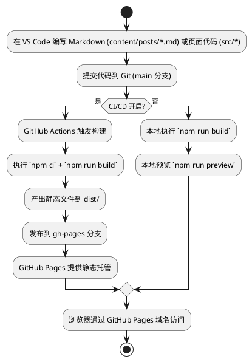

# 项目原理与发布流程

本文面向后端 Java 工程师，系统性解释本博客项目如何通过 VS Code 编写 Markdown 内容，经过 Vite 构建和 Git Actions/Pages 部署，最终在浏览器展示。

## 总体架构概览

- 前端框架：Vue 3 + Vue Router + Pinia
- 构建工具：Vite
- 样式方案：Tailwind CSS
- Markdown 解析：marked + gray-matter（Front Matter 元数据解析）
- 内容来源：`content/` 目录（或 CMS/接口），本项目示例使用 `src/utils/posts.js` 的模拟数据
- 部署：GitHub Actions（构建） + GitHub Pages（静态托管）

## 从编写到展示的全流程（PlantUML 流程图）

## 关键组件与原理

- Vue 单页应用（SPA）：
  - `index.html` 挂载点 `#app`
  - `src/main.js` 初始化 Vue、Pinia、Router
  - `src/router/index.js` 定义路由与历史模式（生产环境 base 路径为 `/blog/`）
- 路由与页面：
  - 主页 `/`、项目 `/projects`、关于 `/about`、联系 `/contact`、文章详情 `/post/:slug`
  - 组件按路由懒加载，提升首屏加载性能
- 状态管理（Pinia）：
  - `src/stores/theme.js` 控制深浅色模式，使用 `localStorage` 持久化主题
- 内容解析：
  - `gray-matter` 解析 Markdown Front Matter，`marked` 将 Markdown 转 HTML
  - 示例数据来自 `src/utils/posts.js`（真实项目可改为从 `content/posts/*.md` 读取或接入 CMS）
- 样式：
  - Tailwind 原子类 + `@tailwindcss/typography`/`forms` 插件
  - `darkMode: 'class'` 通过 html 的 `dark` 类切换深色模式

## 构建与部署

- 本地开发：
  - `npm run dev` 启动 Vite 开发服务器，热更新
- 构建：
  - `npm run build` 生成 `dist/`
  - `vite.config.js` 设置 `base` 为生产 `/blog/`，确保 GitHub Pages 子路径正常
- 部署：
  - GitHub Actions 构建后推送到 `gh-pages` 分支
  - 仓库 Settings → Pages 指向 `gh-pages` 分支

## 运行时路径与静态资源

- 生产环境路由历史基于 `/blog/` 子路径，需保证静态资源引用相对路径兼容该 base。
- 图片等资源建议放 `public/images` 或使用 CDN，组件中以相对/绝对路径引用。

## 安全与性能要点

- 路由懒加载减少首屏体积
- 主题状态持久化避免闪烁
- Markdown 渲染使用 `v-html`，生产注意 XSS 防护（对来自外部的内容进行安全过滤）。
