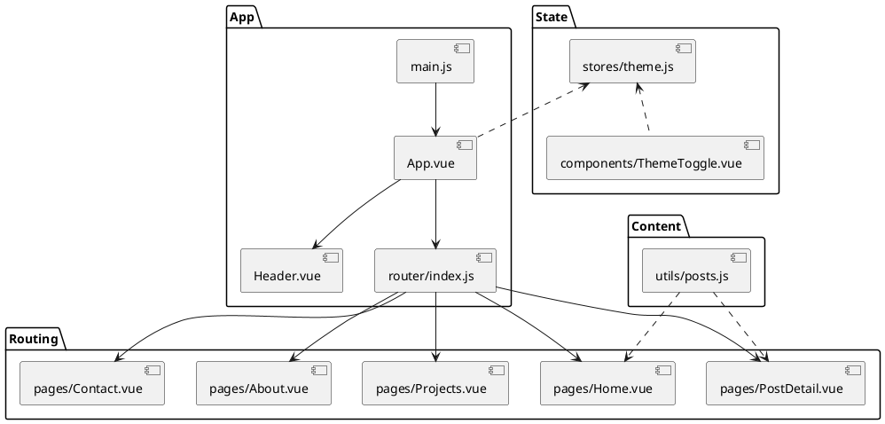

# 项目结构与目录说明

结合项目实际文件，逐目录说明用途与关键点。

```
myBlog/
├─ index.html               # 入口 HTML，挂载点 #app
├─ vite.config.js           # Vite 配置，生产 base=/blog/
├─ tailwind.config.js       # Tailwind 配置与插件
├─ package.json             # 依赖与脚本 dev/build/preview
├─ public/                  # 静态资源（不经打包直接拷贝）
│  ├─ admin/                # CMS 管理端页面（Decap CMS 示例）
│  └─ images/               # 图片资源
├─ src/                     # 前端源码
│  ├─ assets/               # 样式与静态资源（如 main.css）
│  ├─ components/           # 复用组件（Header/Footer/Sidebar 等）
│  ├─ layouts/              # 页面布局（DefaultLayout）
│  ├─ pages/                # 路由页面（Home/Projects/About/Contact/PostDetail）
│  ├─ stores/               # Pinia 状态（theme 深浅色）
│  ├─ utils/                # 工具方法（posts 读取/解析）
│  ├─ router/               # 路由配置（index.js）
│  └─ main.js               # 应用入口，注册 Pinia 与 Router
├─ content/                 # Markdown 内容（文章等）
├─ dist/                    # 构建输出（生产静态文件）
└─ README.md                # 项目概览与使用说明
```

## 关键文件逐项说明

- `index.html`：含 Google Fonts 引用、`<div id="app">`，引入 `src/main.js`。
- `src/main.js`：创建 Vue 应用，注册 Pinia 与 Router，挂载到 `#app`。
- `src/router/index.js`：定义路由表；生产环境使用 `createWebHistory('/blog/')` 保证子路径部署正常。
- `src/stores/theme.js`：
  - 通过 `isDark` 控制主题，`localStorage` 记录用户选择；`document.documentElement.classList` 切换 `dark` 类。
- `src/utils/posts.js`：
  - 示例文章数据 `mockPosts`；`loadPosts()` 模拟异步加载；`getPostBySlug()` 查找文章；`parseMarkdown()` 用 `gray-matter` 解析 Front Matter。
- `src/components/*`：
  - `Header.vue`：导航栏、移动端菜单、主题切换；根据 `$route.name` 高亮当前项。
  - `Footer.vue`：版权与社交链接区域。
  - `PostCard.vue`：文章卡片，显示封面、标题、摘要、标签，跳转详情。
  - `Sidebar.vue`：最近内容与标签云，向父组件抛出 `tagClick` 事件。
  - `ThemeToggle.vue`：深浅色切换按钮，调用 Pinia 的 `toggleTheme()`。
- `src/pages/*`：
  - `Home.vue`：展示精选与全部文章，分页区域为静态示例。
  - `Projects.vue`：项目网格，分类筛选（本地 Mock）。
  - `About.vue`：个人简介、技能、经历、侧边信息卡片。
  - `Contact.vue`：联系表单（本地模拟提交），联系信息与社交媒体。
  - `PostDetail.vue`：根据 `slug` 渲染文章详情，使用 `marked` 渲染 Markdown，提供前后篇导航与侧边栏。
- `tailwind.config.js`：启用 `typography/forms` 插件，定义品牌色与暗色主题变量。
- `vite.config.js`：插件 `@vitejs/plugin-vue`，生产 `base='/blog/'`，`outDir='dist'`。

## 模块依赖与交互（PlantUML 组件图）


