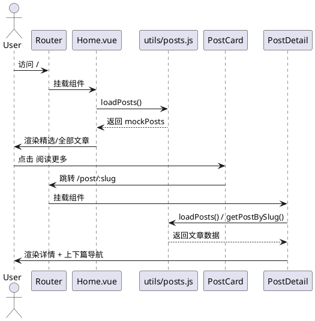

# 页面逻辑与代码详解

以下从路由到页面组件，逐一讲解交互与数据流，帮助从整体到细节全面理解。

## 路由与入口

- `src/router/index.js` 定义 5 个页面；生产环境设置 `history` 的 `base` 为 `/blog/`。
- `src/main.js` 创建应用，注册 `Pinia` 与 `Router`，并引入 `assets/main.css`（Tailwind）。

## 页面：Home.vue

- 数据来源：`loadPosts()`（模拟异步，返回 `mockPosts`）。
- 逻辑：`onMounted` 加载数据，前两篇作为精选（`featuredPosts`），全部文章为 `allPosts`。
- 视图：
  - 顶部 Hero 标题区
  - 精选文章网格（2 列）
  - 全部文章网格（3 列）
  - 底部分页区（静态按钮示例）
- 组件：`PostCard` 负责每篇文章卡片渲染与跳转。

## 页面：Projects.vue

- 分类筛选：`activeCategory` + `filteredProjects`（computed）；
- 数据：本地 `projects`（Mock），含图片、技术栈、链接；
- 交互：点击顶部分类按钮切换当前类别；
- 空状态：无项目时显示占位提示；

## 页面：About.vue

- 结构：个人简介 + 技能列表 + 工作经历时间线 + 右侧信息卡；
- 重点：使用 `prose`（typography 插件）优化富文本排版；
- 交互：主要为静态内容展示；

## 页面：Contact.vue

- 表单模型：`form`（`name/email/subject/message`）；
- 提交逻辑：本地 `await setTimeout` 模拟请求，打印日志后重置表单并弹出提示；
- 样式：Tailwind 表单样式 + `@tailwindcss/forms` 增强；

## 页面：PostDetail.vue

- 路由参数：`slug`（文章唯一标识）；
- 数据加载：
  - `loadPosts()` 获取全部文章；
  - `getPostBySlug()` 定位当前文章；
- Markdown 渲染：
  - `marked(currentPost.body)` 转 HTML，赋给 `postContent`；
  - 通过 `v-html` 插入到页面；
- 上下篇导航：通过 `currentPostIndex` 计算 `prevPost` 和 `nextPost`；
- 侧边信息：最近文章（前 5 篇）与标签汇总（Set 去重后转数组）；

## 组件：Header.vue

- 当前路由高亮：根据 `$route.name` 动态设置样式；
- 移动端菜单：`isMobileMenuOpen` 控制显示；
- 主题切换：嵌入 `ThemeToggle`；

## 组件：Sidebar.vue

- 最近内容：点击卡片跳转到对应 `PostDetail`；
- 标签云：`tagClick` 事件向父组件抛出选中的标签（当前示例仅打印）。

## 组件：PostCard.vue

- 日期格式化：`toLocaleDateString('zh-CN', { year, month, day })`；
- 标签样式：根据首字符计算颜色索引；
- 跳转：`router-link` 到 `PostDetail`；

## 主题与样式

- 主题状态：`stores/theme.js`；`initTheme()` 读取系统与本地存储；`toggleTheme()` 切换并持久化；
- Tailwind：`darkMode: 'class'`；`typography/forms` 插件；`brand` 和 `dark` 自定义色；

## 关键交互时序（PlantUML 时序图）

