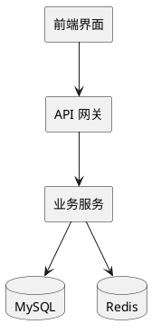
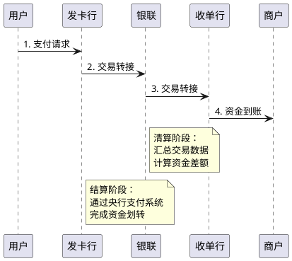
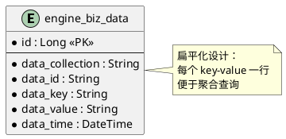
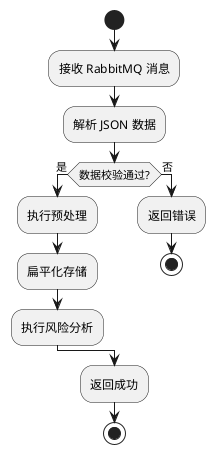

# 如何编写优美的 Markdown 长文章

> **目标**：编写出视觉美观、层次清晰、易于阅读的专业技术长文章。本指南专注于长文章的美学设计和可读性优化，特别适用于支付清结算系列等深度技术文章。

**适用场景**：
- 深度技术解析文章（5000-15000字）
- 系列文章（多篇关联文章）
- 原理讲解类文章（需要大量背景和类比）
- 历史发展类文章（时间线清晰）

---

## 📋 目录

1. [长文章结构设计](#长文章结构设计)
2. [视觉层次设计](#视觉层次设计)
3. [排版美学](#排版美学)
4. [内容组织技巧](#内容组织技巧)
5. [可读性优化](#可读性优化)
6. [视觉元素运用](#视觉元素运用)
7. [长文章特殊技巧](#长文章特殊技巧)
8. [写作风格](#写作风格)
9. [完整示例对比](#完整示例对比)

---

## 长文章结构设计

### 1. 文章前置信息（Front Matter）

长文章需要在开头提供清晰的元信息：

```markdown
---
title: 支付、清算、结算的本质与原理
date: 2025-11-15T10:30:00.000+08:00
tags:
  - 支付清结算
  - 基础原理
excerpt: 深入理解资金流转的三个核心环节，从生活场景到技术原理，全面解析支付、清算、结算的本质与关系。
heroImage: /images/payment-clearing-settlement.png
draft: false
readingTime: 15
---

# 支付、清算、结算的本质与原理

> **📖 阅读提示**：本文约 8000 字，预计阅读时间 15 分钟。建议按顺序阅读，每个概念都建立在前一个概念的基础上。

## 📑 文章目录

1. [引言：从生活场景开始](#引言从生活场景开始)
2. [支付的本质](#支付的本质)
3. [清算的原理](#清算的原理)
4. [结算的原理](#结算的原理)
5. [三者的关系](#三者的关系)
6. [总结与预告](#总结与预告)
```

**设计原则**：
- **excerpt**：提供文章核心内容的简要说明，帮助读者判断是否阅读
- **readingTime**：预估阅读时间，让读者有心理准备
- **文章目录**：长文章必须提供目录，方便快速导航
- **阅读提示**：在文章开头提供阅读建议

### 2. 章节导航设计

长文章需要在关键位置提供导航：

```markdown
## 一、支付的本质

> **📍 当前位置**：第一章 - 支付的本质  
> **📌 相关章节**：[清算的原理](#清算的原理) | [结算的原理](#结算的原理)

想象一下，你给朋友转账 100 元...

---

## 二、清算的原理

> **📍 当前位置**：第二章 - 清算的原理  
> **📌 相关章节**：[支付的本质](#支付的本质) | [结算的原理](#结算的原理)

在理解了支付之后，我们来看看清算...

---

## 三、结算的原理

> **📍 当前位置**：第三章 - 结算的原理  
> **📌 相关章节**：[支付的本质](#支付的本质) | [清算的原理](#清算的原理)

最后，我们来理解结算...
```

**设计原则**：
- 在主要章节之间提供当前位置提示
- 提供相关章节链接，方便跳转
- 使用分隔线清晰划分章节

### 3. 章节总结与过渡

长文章需要在章节之间提供总结和过渡：

```markdown
## 一、支付的本质

...（详细内容）...

**本章小结**：

- **支付的定义**：资金转移的过程，包括物理过程和信息过程
- **支付的核心**：支付指令的生成、传递、授权和验证
- **支付的特点**：实时性、不可逆性、安全性

> **💡 思考**：理解了支付后，你是否想过，如果每笔支付都立即结算，会发生什么？这就是我们下一章要讨论的"清算"。

---

## 二、清算的原理

在上一章中，我们理解了支付是资金转移的过程。但是，如果每笔支付都立即结算，效率会非常低。就像朋友聚餐 AA 制，如果每次付钱都要当场算账，会很麻烦。

所以，我们需要一个机制，把所有交易汇总起来，统一算账。这就是"清算"。
```

**设计原则**：
- 每个主要章节结束时提供小结
- 使用思考题或疑问句过渡到下一章节
- 下一章节开头简要回顾上一章节内容

---

## 视觉层次设计

### 1. 标题层级的美学运用

#### ❌ 不好的做法

```markdown
# 标题
## 标题
### 标题
#### 标题
```

#### ✅ 优美的做法

```markdown
# 文档主标题（仅一个，作为文档入口）

## 主要章节（2-4个，构成文档骨架）

### 子章节（详细展开，每个主要章节下2-5个）

#### 细分内容（尽量少用，仅在必要时使用）
```

**设计原则**：
- **一级标题**：作为文档的视觉入口，应该简洁有力（仅一个）
- **二级标题**：构成文档的主要骨架，长文章建议 5-8 个主要章节
- **三级标题**：详细展开，每个二级标题下 3-7 个子章节
- **四级标题**：仅在复杂内容中细分使用，尽量少用

**长文章标题层级示例**：

```markdown
# 支付、清算、结算的本质与原理（一级标题）

## 一、引言：从生活场景开始（二级标题 - 主要章节）

### 1.1 生活场景引入（三级标题 - 子章节）

#### 1.1.1 朋友聚餐 AA 制（四级标题 - 细分内容，尽量少用）

## 二、支付的本质（二级标题 - 主要章节）

### 2.1 支付的定义（三级标题 - 子章节）

### 2.2 支付的过程（三级标题 - 子章节）
```

### 2. 使用分隔线创造视觉节奏

#### ✅ 优美的分隔线使用

```markdown
## 1. 概述

文档的背景介绍...

---

## 2. 核心内容

详细内容...

---

## 3. 总结

总结性内容...
```

**设计原则**：
- **长文章**：在主要章节（二级标题）之间使用分隔线，创造视觉节奏
- **短文章**：不要在每个二级标题后都加分隔线（过于密集）
- 分隔线前后各空一行，保持呼吸感
- 在重要转折点使用分隔线，如：历史背景 → 技术原理 → 实际应用

**长文章分隔线使用示例**：

```markdown
## 一、支付的本质

...（内容）...

---

## 二、清算的原理

...（内容）...

---

## 三、结算的原理

...（内容）...
```

### 3. 使用引用块突出重要信息

#### ✅ 优美的引用块使用

```markdown
## 配置说明

系统支持以下配置项...

> **💡 提示**：在生产环境中，建议启用所有安全检查功能。

继续其他内容...
```

**设计原则**：
- 使用引用块突出重要提示、注意事项
- 可以配合 emoji 增加视觉吸引力
- 引用块内容要简洁，不超过 3 行

---

## 排版美学

### 1. 空白的艺术

#### ❌ 拥挤的排版

```markdown
## 标题
这是第一段内容。这是第一段内容。这是第一段内容。
这是第二段内容。这是第二段内容。这是第二段内容。
- 列表项一
- 列表项二
```

#### ✅ 优美的排版

```markdown
## 标题

这是第一段内容。段落应该包含完整的句子，表达一个完整的思想。

这是第二段内容。段落之间必须有空行，创造视觉呼吸感。

- 列表项一
- 列表项二
```

**设计原则**：
- **段落之间**：必须空一行，创造视觉呼吸感
- **标题前后**：各空一行，突出标题
- **代码块前后**：各空一行，与正文分离
- **表格前后**：各空一行，突出表格
- **图片前后**：各空一行，突出图片

### 2. 段落长度控制

#### ✅ 优美的段落长度

```markdown
风险引擎系统是核心业务模块，负责实时分析交易风险。系统通过扁平化存储设计，将 JSON 数据转换为行式存储，支持高效的聚合查询。

系统支持多种聚合类型，包括 COUNT、SUM、AVG、MAX、MIN 等。每种聚合类型都有对应的 SQL 实现，确保查询性能。

特征抽象引擎是系统的核心能力。它通过对历史数据的聚合计算，生成用于风险判断的统计特征。
```

**设计原则**：
- **短段落**：每段 3-5 句话，不超过 150 字（适合技术文档）
- **长文章段落**：每段 2-4 句话，不超过 120 字（更适合长文章阅读）
- 每段表达一个完整的思想
- 段落之间逻辑连贯，过渡自然
- 在长文章中，适当使用短段落创造节奏感

**长文章段落示例**：

```markdown
想象一下，你和几个朋友一起聚餐，每个人都付了一些钱。最后要 AA 制，大家需要算清楚：总共花了多少钱？每个人应该付多少钱？谁多付了？谁少付了？

这个过程，在支付行业里就叫做"清算"。

**清算是什么？**

清算就是把所有交易记录汇总起来，算出谁该给谁多少钱的过程。就像朋友聚餐 AA 制一样，先把所有账单汇总，然后算出每个人应该付多少钱。

**为什么需要清算？**

如果每笔交易都单独结算，就像每次聚餐都要当场算账一样，效率太低了。通过清算，可以把一天的所有交易汇总起来，一次性算清楚，效率大大提高。
```

### 3. 列表的美学设计

#### ❌ 拥挤的列表

```markdown
系统支持以下功能：- 功能一 - 功能二 - 功能三
```

#### ✅ 优美的列表

```markdown
系统支持以下核心功能：

- **数据预处理**：IP 归属地查询、手机号归属地查询等
- **特征计算**：支持 COUNT、SUM、AVG 等多种聚合类型
- **规则引擎**：使用 Groovy 脚本实现灵活的规则匹配
- **动态计分**：根据特征值动态计算风险分数
```

**设计原则**：
- 列表前添加简短说明，引导读者
- 列表项使用粗体突出关键词
- 列表项可以多行，详细说明
- 列表前后各空一行

---

## 内容组织技巧

### 1. 使用数字编号创造逻辑感

#### ✅ 优美的编号组织

```markdown
## 1. 概述

## 2. 核心模块

### 2.1 数据模型

### 2.2 消息接收

## 3. 总结
```

**设计原则**：
- 使用数字编号，让文档结构清晰
- 编号要连续，不要跳号
- 可以配合中文序号使用（一、二、三）

### 2. 使用表格展示结构化信息

#### ✅ 优美的表格设计

```markdown
### 配置项说明

系统支持以下配置项，用于控制风险引擎的行为：

| 配置项 | 类型 | 必填 | 说明 | 默认值 |
|:---|:---|:---|:---|:---|
| `modelId` | Long | ✅ | 模型 ID，唯一标识一个风控场景 | - |
| `modelName` | String | ✅ | 模型名称，用于界面显示 | - |
| `status` | Integer | ⚪ | 状态：0=初始化, 1=未激活, 2=激活 | `0` |
| `fieldValidate` | Boolean | ⚪ | 是否启用字段校验 | `false` |

> **💡 提示**：配置修改后需要重启服务才能生效。
```

**设计原则**：
- 表格前添加说明文字，引导读者
- 表格列数控制在 5 列以内
- 使用对齐方式：左对齐（默认）、居中对齐（数字）、右对齐（数字）
- 表格后可以添加补充说明

### 3. 使用代码块展示技术细节

#### ✅ 优美的代码块设计

```markdown
### 核心方法实现

`RiskAnalysisEngineServiceImpl.riskAnalysis()` 是风险分析的核心入口方法：

```java
public CommonResult riskAnalysis(Long modelId, String reqId, String jsonInfo) {
    // 1. 解析 JSON 数据
    JSONObject eventJson = JSON.parseObject(jsonInfo);
    
    // 2. 模型校验
    ModelVO model = modelService.getModelById(modelId);
    if (model == null) {
        return CommonResult.faild("模型不存在");
    }
    
    // 3. 执行风险分析
    return antiFraudService.process(modelId, context);
}
```

**方法说明**：
- **参数**：`modelId` 模型 ID，`reqId` 请求 ID，`jsonInfo` JSON 数据
- **返回值**：`CommonResult` 包含风险分析结果
- **异常处理**：方法内部已处理异常，返回错误结果
```

**设计原则**：
- 代码块前添加方法名和简要说明
- 代码中添加清晰的注释
- 代码块后添加详细说明（参数、返回值、异常等）
- 代码块长度控制在 30 行以内

---

## 可读性优化

### 1. 使用粗体突出关键词

#### ✅ 优美的关键词突出

```markdown
系统通过 **扁平化存储** 设计，将 JSON 数据转换为行式存储。

**特征抽象引擎** 是系统的核心能力，它通过对历史数据的聚合计算，生成用于风险判断的统计特征。

**规则引擎** 使用 Groovy 脚本实现灵活的规则匹配，支持复杂的业务逻辑。
```

**设计原则**：
- 首次出现的专业术语使用粗体
- 重要概念使用粗体强调
- 不要过度使用粗体（每段不超过 2-3 处）

### 2. 使用行内代码突出技术术语

#### ✅ 优美的技术术语突出

```markdown
系统通过 `engine_biz_data` 表存储业务数据，支持高效的聚合查询。

配置项 `modelId` 用于唯一标识一个风控场景。

方法 `riskAnalysis()` 是风险分析的核心入口。
```

**设计原则**：
- 文件名、配置项、方法名使用行内代码
- 数据库表名、字段名使用行内代码
- 命令、路径使用行内代码

### 3. 使用列表组织信息

#### ✅ 优美的列表组织

```markdown
系统支持以下聚合类型：

- **COUNT**：统计记录数量，适用于计算交易次数、访问次数等
- **SUM**：求和计算，适用于计算累计金额、累计积分等
- **AVG**：平均值计算，适用于计算平均金额、平均评分等
- **MAX/MIN**：最大值/最小值，适用于查找最大金额、最小时间等
```

**设计原则**：
- 列表项使用粗体突出关键词
- 列表项可以多行，详细说明
- 列表前添加引导文字

---

## 长文章特殊技巧

### 1. 专业名词解释的格式

长文章中首次出现的专业名词需要详细解释：

```markdown
## 清算的原理

### 什么是清算？

**清算（Clearing）** 是支付机构之间对交易数据进行汇总、轧差，计算应收应付金额的过程。

**通俗解释**：清算就是把所有交易记录汇总起来，算出谁该给谁多少钱的过程。就像朋友聚餐 AA 制，每个人先记录自己付了多少钱，最后统一算账，看谁该给谁多少钱。

**类比说明**：
- **生活类比**：朋友聚餐 AA 制
- **业务类比**：银行每天对账
- **技术类比**：数据库汇总查询

**相关概念**：结算、轧差、日切

---

### 清算的时机

清算可以在不同时机进行...
```

**设计原则**：
- 专业名词首次出现时，使用粗体标注
- 提供通俗解释、类比说明、专业定义
- 列出相关概念，帮助读者建立知识网络
- 使用分隔线或空行区分不同解释层次

### 2. 历史背景的叙述格式

长文章中的历史背景需要清晰的时间线：

```markdown
## 第三方支付的诞生背景

### 历史背景

**2003 年**：淘宝网的成立标志着中国电商的起步。但是，买卖双方面临一个根本问题：**先付款还是先发货？**

**2004 年**：马云创立支付宝，推出**担保交易模式**。买家付款后，资金暂时存放在支付宝，等确认收货后，支付宝再把钱转给卖家。

**2010 年**：央行发布《非金融机构支付服务管理办法》，支付牌照制度正式建立。

**2011-2013 年**：快捷支付兴起，用户无需跳转网银即可完成支付。

### 为什么需要第三方支付？

1. **解决信任问题**：担保交易模式解决了电商的信任问题
2. **提升支付体验**：相比网银，支付流程更简单
3. **降低支付门槛**：无需复杂的数字证书，普通用户也能使用
```

**设计原则**：
- 使用时间节点标注关键事件
- 使用粗体突出重要概念
- 使用列表组织原因分析
- 时间线要清晰，便于理解发展脉络

### 3. 原理讲解的层次结构

长文章中的原理讲解需要由浅入深：

```markdown
## 清算的原理

### 第一层：生活化类比

想象一下，你和几个朋友一起聚餐，每个人都付了一些钱。最后要 AA 制，大家需要算清楚：总共花了多少钱？每个人应该付多少钱？谁多付了？谁少付了？

这个过程，在支付行业里就叫做"清算"。

### 第二层：通俗概念解释

**清算是什么？**

清算就是把所有交易记录汇总起来，算出谁该给谁多少钱的过程。就像朋友聚餐 AA 制一样，先把所有账单汇总，然后算出每个人应该付多少钱。

**为什么需要清算？**

如果每笔交易都单独结算，就像每次聚餐都要当场算账一样，效率太低了。通过清算，可以把一天的所有交易汇总起来，一次性算清楚，效率大大提高。

### 第三层：技术原理解析

**清算是怎么做的？**

清算包括三个步骤：

1. **交易数据汇总**：收集所有交易记录，就像收集所有聚餐的账单
2. **轧差计算**：计算应收应付的差额，就像计算每个人应该付多少钱
3. **生成清算文件**：生成最终的清算结果，就像生成 AA 制的账单

### 第四层：实际应用场景

在支付行业，银联每天都会对银行卡交易进行清算，计算出各银行之间的资金差额。这个过程通常在每天结束后的固定时间（日切时间）进行。
```

**设计原则**：
- 明确标注层次（第一层、第二层等）
- 从生活场景逐步深入到技术原理
- 每个层次都要有清晰的说明
- 最后回到实际应用场景

### 4. 对比内容的格式

长文章中的对比内容需要清晰的格式：

```markdown
## "断直连"前后的对比

### 断直连前的支付模式

**资金流转路径**：用户 → 支付机构 → 银行（直连）→ 商户

**清算方式**：支付机构与银行直接清算

**监管情况**：资金流向不透明，央行无法监控

**优势**：
- 效率高：直接对接，减少中间环节
- 成本低：无需通过清算组织

**问题**：
- 监管盲区：资金流向不透明
- 备付金管理风险：资金沉淀在支付机构
- 清算数据缺失：无法统一清算

---

### 断直连后的支付模式

**资金流转路径**：用户 → 支付机构 → 网联 → 银行 → 商户

**清算方式**：统一通过网联清算

**监管情况**：资金流向透明，可监控

**优势**：
- 监管透明：央行可以监控所有资金流向
- 风险可控：统一清算，降低系统性风险
- 标准化：统一接口，规范行业

**变化**：
- 效率：略有降低（增加网联环节）
- 成本：略有增加（清算费用）
```

**设计原则**：
- 使用分隔线清晰区分对比项
- 使用粗体突出关键信息
- 使用列表组织优势和问题
- 提供清晰的对比总结

### 5. 长文章中的进度提示

长文章需要在关键位置提供进度提示：

```markdown
## 一、支付的本质

> **📊 阅读进度**：第 1/6 章（约 17%）  
> **⏱️ 预计剩余时间**：12 分钟

...（内容）...

---

## 二、清算的原理

> **📊 阅读进度**：第 2/6 章（约 33%）  
> **⏱️ 预计剩余时间**：10 分钟

...（内容）...
```

**设计原则**：
- 在主要章节开头提供进度提示
- 使用百分比和剩余时间帮助读者规划阅读
- 进度提示要简洁，不干扰阅读

---

## 视觉元素运用

### 1. 使用 PlantUML 图表增强理解

#### ✅ 优美的图表设计

```markdown
### 系统架构图

系统采用分层架构设计，各层职责清晰：



**架构说明**：
- **前端界面**：提供用户交互界面
- **API 网关**：统一入口，处理认证和路由
- **业务服务**：核心业务逻辑处理
- **MySQL**：持久化存储
- **Redis**：缓存和会话存储
```

**设计原则**：
- 图表前添加说明，引导读者
- 图表后添加详细说明，解释各个组件
- 图表要简洁清晰，不要过于复杂
- **长文章中的图表**：每 2000-3000 字至少有一个图表，帮助读者理解
- 复杂流程使用 PlantUML 时序图，架构使用架构图，对比使用表格

**长文章图表使用示例**：

```markdown
## 资金流转的完整路径

### 银行卡支付的资金流转

银行卡支付的资金流转路径如下：



**流程说明**：

1. **支付阶段**：用户发起支付，资金从发卡行转出
2. **清算阶段**：银联汇总交易，计算各银行之间的资金差额
3. **结算阶段**：通过央行支付系统，完成最终的资金划转

**时间节点**：
- **支付**：实时完成（T+0）
- **清算**：T+1（次日清算）
- **结算**：T+1（次日结算）
```

### 2. 使用表格展示对比信息

#### ✅ 优美的对比表格

```markdown
### 方案对比

我们对比了三种实现方案：

| 方案 | 优点 | 缺点 | 适用场景 |
|:---|:---|:---|:---|
| **方案 A** | 实现简单，性能好 | 扩展性差 | 小型项目 |
| **方案 B** | 扩展性强，灵活 | 实现复杂 | 大型项目 |
| **方案 C** | 平衡性能和扩展性 | 需要额外组件 | 中型项目 |

**推荐**：根据项目规模选择合适的方案。
```

**设计原则**：
- 使用粗体突出方案名称
- 表格后添加推荐或总结
- 列数控制在 4 列以内

### 3. 使用引用块突出重要信息

#### ✅ 优美的引用块设计

```markdown
## 配置说明

系统支持多种配置项...

> **⚠️ 警告**：修改配置后必须重启服务，否则配置不会生效。

继续其他内容...

> **💡 提示**：在生产环境中，建议启用所有安全检查功能。

> **📝 注意**：此功能在 v2.0 版本中已废弃，请使用新功能替代。
```

**设计原则**：
- 使用 emoji 增加视觉吸引力（⚠️ 警告、💡 提示、📝 注意）
- 引用块内容要简洁，不超过 3 行
- 引用块前后各空一行

---

## 写作风格

### 1. 使用主动语态

#### ❌ 被动语态

```markdown
数据被系统处理。
配置被用户修改。
```

#### ✅ 主动语态

```markdown
系统处理数据。
用户修改配置。
```

**设计原则**：
- 优先使用主动语态，更直接有力
- 被动语态仅在必要时使用

### 2. 使用简洁的句子

#### ❌ 冗长的句子

```markdown
系统通过使用扁平化存储设计的方式，将原本是 JSON 格式的数据转换为可以在关系型数据库中高效存储和查询的行式存储格式。
```

#### ✅ 简洁的句子

```markdown
系统通过扁平化存储设计，将 JSON 数据转换为行式存储，支持高效查询。
```

**设计原则**：
- 句子长度控制在 20 字以内
- 避免嵌套的从句
- 使用短句，更易理解

### 3. 使用具体的例子

#### ❌ 抽象的描述

```markdown
系统支持多种聚合类型。
```

#### ✅ 具体的例子

```markdown
系统支持多种聚合类型，例如：
- 计算用户 7 天内的交易次数（COUNT）
- 计算用户 7 天内的累计金额（SUM）
- 计算用户 7 天内的平均金额（AVG）
```

**设计原则**：
- 使用具体例子说明抽象概念
- 例子要贴近实际业务场景
- 例子要简洁明了

---

## 完整示例对比

### ❌ 不优美的文档

```markdown
---
title: 风险引擎系统
date: 2025-11-15T10:30:00.000+08:00
tags:
  - 风控
excerpt: 风险引擎系统说明
draft: false
---
# 风险引擎系统
## 概述
风险引擎系统是核心业务模块。系统通过扁平化存储设计，将JSON数据转换为行式存储，支持高效的聚合查询。系统支持多种聚合类型，包括COUNT、SUM、AVG、MAX、MIN等。特征抽象引擎是系统的核心能力，它通过对历史数据的聚合计算，生成用于风险判断的统计特征。规则引擎使用Groovy脚本实现灵活的规则匹配。
## 核心模块
### 数据模型
系统使用engine_biz_data表存储数据。
### 消息接收
系统通过RabbitMQ接收消息。
## 总结
系统功能强大。
```

### ✅ 优美的文档

```markdown
---
title: 风险引擎系统解析
date: 2025-11-15T10:30:00.000+08:00
tags:
  - 风控
  - 系统设计
excerpt: 本文档深入解析风险引擎系统的核心设计，包括数据模型、消息接收、特征计算等关键模块，帮助开发者全面理解系统架构和实现原理。
heroImage: /smy-blog.github.io/images/risk_engine.png
draft: false
---

# 风险引擎系统解析

## 概述

风险引擎系统是核心业务模块，负责实时分析交易风险。系统通过**扁平化存储**设计，将 JSON 数据转换为行式存储，支持高效的聚合查询。

**核心能力**：

- **特征抽象**：通过对历史数据的聚合计算，生成用于风险判断的统计特征
- **规则引擎**：使用 Groovy 脚本实现灵活的规则匹配
- **动态计分**：根据特征值动态计算风险分数

---

## 核心模块

### 数据模型

系统使用 `engine_biz_data` 表存储业务数据，采用扁平化设计：



**设计优势**：

- 支持任意字段的聚合查询，无需预先定义表结构
- 查询性能高，可以高效计算 COUNT、SUM、AVG 等
- 扩展性强，新增字段无需修改表结构

### 消息接收

系统通过 **RabbitMQ** 接收业务消息，处理流程如下：



**关键步骤**：

1. **消息接收**：从 `RISK_COLLECT` 队列消费消息
2. **数据预处理**：执行 IP 归属地查询、手机号归属地查询等
3. **数据存储**：将数据扁平化存储到 `engine_biz_data` 表
4. **风险分析**：执行特征计算和规则匹配

> **💡 提示**：消息处理采用异步方式，提高系统吞吐量。

---

## 总结

风险引擎系统通过以下核心技术实现高效的风险分析：

1. **扁平化存储**：将 JSON 数据转换为行式存储，支持高效聚合查询
2. **特征工程**：通过 SQL 聚合计算生成风险特征
3. **规则引擎**：使用 Groovy 脚本实现灵活的规则匹配

> **📝 性能优化建议**：在生产环境中，建议对 `(data_collection, data_key, data_value, data_time)` 建立联合索引，提高查询性能。

---

## 参考资料

- [PlantUML 官方文档](https://plantuml.com/)
- [Groovy 脚本指南](https://groovy-lang.org/)
```

---

## ✅ 长文章检查清单

在完成长文章后，检查以下项目：

### 文章结构
- [ ] 文章开头有清晰的元信息（title、excerpt、readingTime）
- [ ] 提供了文章目录，方便导航
- [ ] 主要章节之间有分隔线和进度提示
- [ ] 每个主要章节有小结和过渡

### 视觉层次
- [ ] 标题层级清晰，不超过 4 级
- [ ] 主要章节（二级标题）5-8 个，结构合理
- [ ] 主要章节之间使用分隔线
- [ ] 重要信息使用引用块突出

### 排版美学
- [ ] 段落之间有空行
- [ ] 标题前后各空一行
- [ ] 代码块、表格、图片前后各空一行
- [ ] 段落长度控制在 120 字以内（长文章）

### 内容组织
- [ ] 使用数字编号组织章节（一、二、三或 1、2、3）
- [ ] 列表前有引导文字
- [ ] 表格前有说明文字
- [ ] 代码块后有详细说明
- [ ] 历史背景有时间线标注

### 可读性
- [ ] 专业术语首次出现时详细解释（通俗解释+类比+专业定义）
- [ ] 句子简洁，不超过 20 字
- [ ] 使用具体例子说明抽象概念
- [ ] 使用主动语态
- [ ] 原理讲解由浅入深（生活场景→通俗解释→技术原理→实际应用）

### 视觉元素
- [ ] 每 2000-3000 字至少有一个图表
- [ ] 使用 PlantUML 图表增强理解（时序图、架构图）
- [ ] 使用表格展示结构化信息和对比
- [ ] 使用引用块突出重要信息
- [ ] 使用 emoji 增加视觉吸引力（适度，每段不超过 1-2 个）

### 长文章特殊要求
- [ ] 专业名词解释格式统一（粗体+通俗解释+类比+专业定义）
- [ ] 历史背景有时间节点标注
- [ ] 原理讲解有层次标注（第一层、第二层等）
- [ ] 对比内容格式清晰（使用分隔线区分）
- [ ] 关键位置有进度提示（可选）

---

## 📚 参考资源

### 优秀的文档示例

- **Stripe 文档**：https://stripe.com/docs - 清晰的结构、优美的排版
- **Vercel 文档**：https://vercel.com/docs - 简洁的设计、良好的可读性
- **Vue.js 文档**：https://vuejs.org/guide/ - 专业的组织、详细的说明
- **React 文档**：https://react.dev/ - 清晰的层次、丰富的示例

### 设计原则

- **视觉层次**：通过标题、空白、强调创造清晰的视觉层次
- **呼吸感**：适当的空白让文档更易读
- **一致性**：统一的格式风格让文档更专业
- **简洁性**：简洁的句子和段落让内容更易理解

---

## 📝 长文章写作流程建议

### 第一步：规划结构

1. **确定文章主题和核心内容**
2. **规划主要章节**（5-8 个二级标题）
3. **规划每个章节的子内容**（3-7 个三级标题）
4. **确定关键图表位置**（每 2000-3000 字一个）

### 第二步：撰写内容

1. **撰写引言**：生活化场景引入，提出疑问
2. **撰写各章节**：按照"由浅入深"的原则
3. **插入图表**：在关键位置插入 PlantUML 图表
4. **添加小结**：每个主要章节结束时添加小结

### 第三步：优化格式

1. **检查标题层级**：确保层级清晰
2. **检查段落长度**：控制在 120 字以内
3. **检查专业名词**：确保首次出现时详细解释
4. **检查图表说明**：确保图表前后有说明文字

### 第四步：最终检查

1. **使用检查清单**：逐项检查
2. **阅读体验测试**：从头到尾阅读一遍
3. **格式统一性**：确保格式风格统一
4. **内容完整性**：确保没有遗漏重要内容

---

**最后更新**：2025-11-15  
**维护者**：博客维护团队  
**适用场景**：支付清结算系列文章、深度技术解析文章

